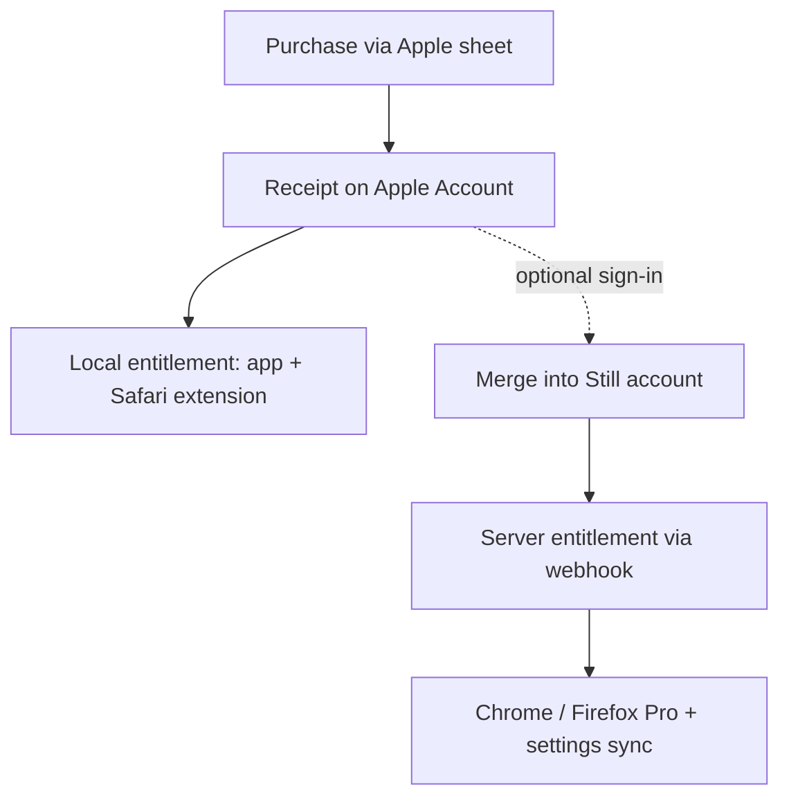

# Apple purchase-first Pro flow (Guideline 5.1.1 compliance)

## Summary

Restructure the Apple app's Still Pro flow to purchase-first: "Upgrade to Still Pro" opens the
native purchase sheet directly and unlocks Pro from the Apple receipt with no account involved; a
post-purchase success screen offers optional email sign-in that attaches the purchase to a Still
account for cross-surface Pro and settings sync. Browser-extension purchase mechanics are
unchanged; only the account story and copy align across surfaces.

---

## Problem Frame

Apple rejected macOS 1.0 (3) under Guideline 5.1.1(v): the app requires users to register with
personal information (email) before purchasing an In-App Purchase that is not account based.
Apple's remedy is explicit — purchase must work without registration, and registration must be
optional even when it enables multi-device access.

The requirement-to-register is structural in the current code, not cosmetic. RevenueCat is keyed
to the signed-in Supabase UUID (KTD5) and configured only after a session exists
(`packages/core/src/native/bridge.ts`); the purchase pre-flight returns `notConfigured` without a
real app-user id (`apps/apple/StillKit/Sources/StillKit/PurchaseDecision.swift`); the paywall's
purchase intent resumes only after email-code verification
(`packages/core/src/sync/apple-session.ts`); and the App Group entitlement stamp that unlocks the
Safari extension is written only after a server reconcile
(`apps/apple/StillKit/Sources/StillKit/EntitlementBridge.swift`), which itself requires a session.

The app has zero production users (1.0 was never released), so the flow can be restructured
without any migration of existing purchasers.

---

## Key Decisions

- **Purchase-first on Apple.** The purchase is anchored to the buyer's Apple Account via the
  StoreKit receipt — a stronger, more durable identity at purchase time than a collected email.
  Entitlement is granted from the receipt immediately.
- **Email is pitched post-purchase and always optional.** The success screen sells sign-in as
  "use Still Pro across your surfaces and sync your settings" — the one capability that genuinely
  requires an account. No email step ever gates the purchase sheet.
- **Account association is an ID-level merge on the entitled device.** When the buyer later signs
  in, RevenueCat merges the anonymous purchaser identity into the Still account identity from the
  device that holds the receipt. Association is never inferred by matching email strings.
- **The standalone "Sign in" entry serves returning Pro users and sync.** Copy targets "already
  have Still Pro or a Still account" — restoring a web-side purchase onto this device and turning
  on settings sync.
- **Web mechanics are unchanged; alignment is story-only.** In browsers the Still account is the
  delivery mechanism for the entitlement (there is no receipt in Chrome/Firefox), so sign-in-first
  remains correct there. Checkout and account copy aligns to the unified story: "your Still
  account carries Pro and your settings across surfaces."
- **Entitlement never downgrades below the receipt.** Signing in, signing out, or a failed/absent
  server reconcile must never remove Pro that the device's current receipt proves. Only Apple-side
  revocation (refund, receipt invalidation) removes receipt-based Pro.

---

## Actors

- A1. Anonymous buyer — the default Apple-platform purchaser; has no Still account.
- A2. Returning Pro user — owns Pro via a Still account (web purchase or prior merge) and signs in
  on a new surface.
- A3. App Review reviewer — must be able to purchase and verify Pro with no account.
- A4. Safari extension — consumes the App Group entitlement stamp; must unlock for A1.
- A5. Still backend (Supabase + RevenueCat webhook) — authority for account-linked entitlement and
  cross-surface delivery.

---

## Key Flows

- F1. Anonymous upgrade
  - **Trigger:** User taps "Upgrade to Still Pro" (signed out — the default).
  - **Steps:** Native purchase sheet opens immediately → purchase completes against an anonymous
    RevenueCat identity → entitlement granted from the receipt → app and Safari extension unlock →
    success screen offers optional sign-in with the cross-surface pitch.
  - **Outcome:** Paying user has full Pro on this device with zero personal information collected.

- F2. Post-purchase account attach
  - **Trigger:** User opts into sign-in from the success screen (or later from the Sign in entry).
  - **Steps:** Email-code sign-in (existing flow) → RevenueCat merges the anonymous purchase into
    the Still account identity from the entitled device → webhook records the entitlement
    server-side → existing reconcile/sync spine proceeds unchanged.
  - **Outcome:** The same purchase now also unlocks Chrome/Firefox on sign-in, and settings sync
    is active.

- F3. Returning Pro sign-in
  - **Trigger:** User taps "Sign in" (bought elsewhere, or previously merged).
  - **Steps:** Email-code sign-in → server profile delivers entitlement → sync starts.
  - **Outcome:** Existing behavior preserved.

- F4. Account-free recovery
  - **Trigger:** Reinstall or new Apple device, no Still account.
  - **Steps:** "Already purchased? Restore" (paywall footer link; also a settings row) → Apple
    ledger replays the purchase → Pro unlocked.
  - **Outcome:** Anonymous buyers are never stranded from what they paid for.

- F5. Refund revocation
  - **Trigger:** Apple-side refund.
  - **Steps:** RevenueCat revokes the entitlement → local entitlement clears on next check.
  - **Outcome:** Never-downgrade does not conflict — the receipt itself is no longer valid.

---

## Requirements

**Purchase flow (Apple)**

- R1. "Upgrade to Still Pro" opens the native purchase sheet directly, fully signed out, with no
  email or registration step anywhere before purchase completion.
- R2. Purchases proceed on an anonymous RevenueCat identity when no session exists; RevenueCat is
  keyed to the Still account identity only at or after sign-in (KTD5 timing moves, its trust model
  does not).
- R3. The post-purchase success screen offers optional sign-in with cross-surface framing ("use
  Still Pro across your surfaces and sync your settings") and is dismissible without any input.
- R4. "Restore Purchases" is available signed out — as a quiet paywall link ("Already purchased?
  Restore") and a settings row — and fully restores receipt-based Pro with no account.

**Entitlement behavior**

- R5. Receipt-proven entitlement unlocks Pro in both the app and the Safari extension without an
  account: the App Group stamp honors device-local receipt state, not only server-confirmed state.
- R6. Never-downgrade: sign-in, sign-out, account deletion, and failed or absent server reconciles
  never remove Pro proven by the device's current receipt. Only Apple-side revocation does.
- R7. Signing in on an entitled device attaches the purchase to the Still account via ID-level
  merge; the existing webhook → Supabase → reconcile spine then records and distributes the
  entitlement unchanged.
- R8. Signing in on a device that never purchased delivers entitlement from the server profile
  (existing behavior preserved).

**Sign-in and story alignment**

- R9. The standalone "Sign in" entry's copy targets returning Pro users and sync ("Already have
  Still Pro or a Still account?").
- R10. Web/extension purchase mechanics are unchanged; their checkout and account copy aligns to
  the unified story that the Still account carries Pro and settings across surfaces.
- R11. Product-truth statements in repo docs (`AGENTS.md`, `STRATEGY.md`, store listing copy where
  applicable) are updated: sign-in is optional for Apple-platform purchase, required for sync and
  for Pro in Chrome/Firefox.

**Compliance**

- R12. The resubmitted flow satisfies Guideline 5.1.1(v) as written: no personal information is
  required before purchase, and the optional registration is explained in the terms Apple
  suggests (extends access to additional devices/surfaces). App Review notes describe the new
  flow and point out that Pro is verifiable via sandbox purchase with no demo account.

---

## Acceptance Examples

- AE1. **Covers R1, R2, R5.** Given a fresh, signed-out install, when the user buys Still Pro,
  then Reels/TikTok blocking activates in Safari without an email ever being entered.
- AE2. **Covers R6, R7.** Given an anonymous purchaser, when they sign in to a brand-new Still
  account, then Pro remains active locally, and the account now owns the entitlement server-side;
  when they subsequently sign out, Pro remains active locally.
- AE3. **Covers R7, R10.** Given the merged account from AE2, when the user signs in on Chrome
  with the same email, then Pro unlocks there.
- AE4. **Covers R4.** Given an anonymous purchaser who deletes and reinstalls the app, when they
  tap "Already purchased? Restore", then Pro returns with no account.
- AE5. **Covers R8.** Given a web-side purchaser with a Still account, when they sign in on the
  Mac app, then Pro unlocks from the server profile.
- AE6. **Covers R6 boundary.** Given an Apple-side refund, when RevenueCat revokes the
  entitlement, then Pro deactivates on next check — never-downgrade protects only valid receipts.

---

## Scope Boundaries

- The other three rejection items — demo account provisioning, the IAP promotional image, and the
  OTP verification error bug — ride the same resubmission but are separate work items, not part of
  this flow restructure. (This redesign softens the demo-account item: reviewers can sandbox-
  purchase Pro with no account.)
- No web purchase-first restructure — rejected because the account is the delivery mechanism in
  browsers; anonymous web purchase would strand a paid entitlement behind fragile email matching.
- No revival of the dormant Sign in with Apple path; email-code sign-in remains the sole auth.
- No marketing email capture beyond the post-purchase pitch.

---

## Dependencies / Assumptions

- RevenueCat anonymous app-user IDs and sign-in-time merge behave as documented; the
  restore/transfer behavior setting for "same receipt, second account" is decided during planning.
- The RevenueCat webhook may now receive events keyed to anonymous IDs before any account exists;
  the Edge Function must tolerate them without error (record-unattached or ignore is a planning
  decision).
- iOS and macOS share the flow (universal purchase, shared webview UI) — one restructure covers
  both platforms.
- Zero production users on Apple platforms; no purchaser migration path is needed.

---

## Outstanding Questions

**Deferred to Planning**

- RevenueCat restore/transfer behavior configuration for the rare "same receipt, second Still
  account" case.
- Mechanism for receipt-based and server-confirmed entitlement coexistence in the App Group stamp
  (dual-authority design; the deferred never-downgrade entitlement-home concept from
  `docs/plans/2026-07-14-001-architecture-deepening-index.md` is directly relevant).
- Handling of anonymous-ID webhook events in `supabase/functions/revenuecat-webhook`.
- Exact success-screen and paywall copy.

---

## Sources

- `packages/core/src/native/bridge.ts` — KTD5: RevenueCat keyed to the Supabase UUID, configured
  only after a session exists.
- `packages/core/src/sync/apple-session.ts` — email-code sign-in as the sole live auth path;
  purchase-intent continuation after verification.
- `apps/apple/StillKit/Sources/StillKit/PurchaseDecision.swift` — purchase pre-flight returns
  `notConfigured` without a real app-user id.
- `apps/apple/StillKit/Sources/StillKit/EntitlementBridge.swift` — App Group stamp currently
  written only after a server reconcile.
- `docs/plans/2026-07-13-001-fix-reinstall-entitlement-purge-plan.md` and
  `docs/plans/2026-07-14-010-apple-teardown-generation-plan.md` — prior entitlement-lifecycle
  work the new stamp behavior must not regress.
- Apple rejection, macOS 1.0 (3), July 15 2026: Guideline 5.1.1(v) — registration required before
  non-account-based IAP; remedy text mandates optional registration.
