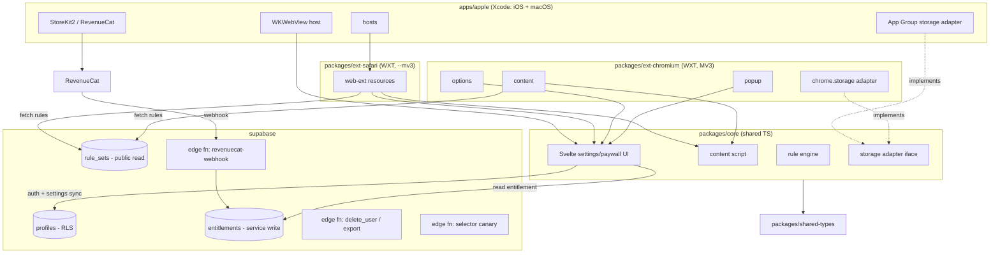

# feat: Build Still — short-form video remover (extension + Apple app + Supabase)

## Summary

Build Still end to end: a data-driven content script that surgically removes short-form video (YouTube Shorts, Instagram/Facebook Reels, all of TikTok) across Chromium and Safari, a single shared Svelte settings/paywall UI, a Supabase backend (rule hosting, auth, per-user settings, entitlement bridge), and an Apple app that hosts the Safari Web Extension and runs the StoreKit 2 / RevenueCat purchase. The plan is sequenced around one constraint: maximize what an autonomous `/loop` agent can build and verify with **zero Apple credentials**, and batch the unavoidable human-gated Apple/store work into explicit, late checkpoints.

## Problem Frame

The product surface is large (extension × 2 engines + native app + backend + payments), but the value-bearing core is small and the riskiest dependency is operational, not technical: four platforms whose markup changes constantly, and an Apple toolchain that is human- and credential-gated by design. The founder wants Claude to build "as autonomously as possible with no human permission interruptions." That is achievable for ~70% of the work and impossible for the rest — Xcode signing, App Store Connect, IAP product config, and the real sandbox purchase cannot be done unattended. This plan makes that boundary a first-class structural seam (Phase A autonomous, Phase B human-gated) rather than letting the agent discover it mid-loop.

---

## Autonomy boundary (read first)

**Phase A — fully autonomous, CI-green, no Apple credentials.** Monorepo, shared core + rule engine, content script, Chromium extension, the entire Supabase backend including the RevenueCat webhook bridge (verified with a *faked* payload sourced from RevenueCat's published samples plus mocked subscriber lookups — this proves projection logic, not live StoreKit wire-format, which is first confirmed at the U19 checkpoint), and the full test harness. The Chromium extension is runtime-verified via Playwright; the **Safari WebExtension assets build, but Safari runtime/package validation is Phase B only** (needs macOS/Xcode). An agent can build, test, and iterate the rest unattended via `/loop`.

**Phase B — human-gated, batched.** The agent writes 100% of the Swift / StoreKit / RevenueCat integration code and a local `.storekit` test config, but a human on a Mac with Apple credentials must: create the App Store Connect IAP product, generate the In-App Purchase Key (.p8) and ASC API key, create sandbox testers, configure RevenueCat, run the Safari `safari-web-extension-packager` + Xcode build/sign, and run the real purchase test. These are the only steps an agent cannot complete; they are checkpoints, not loop work.

The agent must never claim to have performed a Phase B human step (origin: docs/brainstorms/2026-06-23-still-second-pass-requirements.md, Approach assessment).

---

## Requirements

### Blocking core
R1. Short-form surfaces and their navigation entry points are removed across YouTube, Instagram, Facebook, and TikTok on both desktop and mobile web, flash-free for static page chrome, with no broken layouts.
R2. A Shorts URL with a video id redirects to the standard watch page; on a hard navigation no Shorts player paints (network-layer redirect on Chromium), and on an in-app SPA navigation the Shorts surface is removed under the accepted-flash ceiling (KTD2). A Shorts URL with no id shows the Still placeholder.
R3. Direct Instagram/Facebook Reels URLs and every `tiktok.com` page show the Still placeholder.
R4. The content script re-applies rules on SPA route changes (History API + popstate) and via MutationObserver for lazily injected content; every client ships both desktop and mobile selector sets regardless of platform.
R5. Blocking is driven by a versioned JSON rule set; the user-facing control is one master toggle per service; a rules update adds new surfaces under an enabled service immediately and defaults a brand-new service off until enabled.

### Settings & sync
R6. There is one settings set per account (global on/off, four service toggles, per-site pauses); the local on-device cache is always the read path so blocking applies with no network wait.
R7. Free (sync-off) users transmit nothing — local is the only copy; paid (sync-on) users treat the cloud as source of truth, mirrored into the local cache.

### Accounts, purchase, entitlement
R8. Email magic link is the universal cross-platform sign-in; Sign in with Apple is offered only on Apple devices.
R9. "Still Sync" is a single non-consumable StoreKit 2 IAP via RevenueCat; the entitlement is tied to the Still account, and any device signed into that account reads it to enable sync.
R10. In-app account deletion and data export are available (App Store Guideline 5.1.1).
R18. Entitlement state self-heals: a dropped webhook is recovered by a login/restore reconcile, and any accidental/pre-login anonymous purchase is handled as a recovery case. The shipped purchase UI requires sign-in before purchase.
R19. On hosts with no purchase path (non-Apple desktop), the paywall shows an explanatory state, never a purchasable CTA.

### Rules hosting & ops
R11. The backend hosts the canonical rule set; clients fetch it at runtime, cache it, and fall back to the cached-then-bundled set offline; rule updates reach clients without an app-store resubmission.
R12. A scheduled selector-health canary fetches each service and flags when live markup no longer matches the current selectors.

### Platforms & packaging
R13. The same WebExtension ships as a Chromium MV3 extension (Chrome/Edge/Brave/Arc) and as a Safari Web Extension hosted in one Xcode project with native iOS and macOS targets.
R14. Host permissions are limited to the four service domains (`*://*.youtube.com/*`, `*://*.instagram.com/*`, `*://*.facebook.com/*`, `*://*.tiktok.com/*`), never `<all_urls>`; both stores' privacy disclosures declare zero data collection.

### Autonomy & delivery
R15. Phase A is buildable and CI-testable with zero Apple credentials; the entitlement bridge is verified end to end with a faked RevenueCat payload.
R16. Human-gated Apple/store steps are batched into explicit checkpoints with generated code/config and clear handoff instructions.
R17. The repo is connected to GitHub with a CI workflow, a hands-off `/loop` permission config, and a documented external-service connection checklist.

---

## Key Technical Decisions

KTD1. **Redirect: DNR-primary on Chromium, content-script fallback on Safari.** On Chromium the Shorts→watch redirect is a static `declarativeNetRequestWithHostAccess` rule (network-layer, zero paint — this matches origin D7). On Safari, which does not reliably support `regexSubstitution` redirects, the redirect is a `document_start` content-script `location.replace`. Both engines hook in-app SPA navigations via the History API, `popstate`, AND the Navigation API (`navigation` event), with the MutationObserver owning same-URL cases (e.g. an Instagram Reel opening in a same-URL modal the History hook never sees). The "no paint" hard-navigation guarantee is **Chromium-only** unless Phase B proves an equivalent Safari network-layer redirect on device; Safari's v1 acceptance target is earliest-possible replace/placeholder with measured flash budget. An in-app SPA navigation into a Short falls under the accepted-flash ceiling (KTD2), not the no-paint guarantee (research: Apple forums 700769/721258/763505; MDN BCD).

KTD2. **Flash-free is a CSS guarantee, not a JS one — and only for packaged critical CSS.** Static chrome that must never paint is hidden via the manifest `content_scripts[].css` array at `document_start`, generated from the bundled seed rule set. Runtime-fetched selector updates cannot change manifest CSS until an extension/app update; they are injected from the last-good cached rule set at `document_start` where possible and may have a one-load flash after first fetch or after a rule update. User off/pause states are honored by the only flash-correct mechanism available: manifest CSS scopes its hide rules under a root class (e.g. `html.still-active`) that is NOT present by default; the content script reads the synchronous settings snapshot at `document_start` and adds that class only when the service is on and the site is unpaused. The on-state therefore shares the same brief pre-hydration window as the off-state (symmetric and honest), and an off/paused user never sees content hidden-then-revealed. Dynamically injected feed items are hidden by a pre-emptive *container* CSS rule plus a MutationObserver as best-effort; a transient sub-frame flash on infinite-scroll injection is the accepted ceiling (origin R1; research: Chrome content_scripts manifest docs).

KTD3. **WXT for the build.** One Vite-based config emits Chromium MV3 and Safari resources with per-browser manifests and Svelte support; pass `--mv3` for the Safari build (WXT defaults Safari to MV2). Always build the `dist/` and load that, never source.

KTD4. **One UI, per-host storage adapter — including the Safari bridge.** The shared Svelte UI persists through an injected adapter: `chrome.storage` in the Chromium/Safari extension contexts; `WKScriptMessageHandler` → native Swift → a shared App Group container in the Apple app's WKWebView. On Safari the content script reads WebExtension storage, so app-set settings must reach it through an explicit extension-owned sync protocol: native writes to the App Group container, the Safari app extension imports those values into `browser.storage` on activation/message, and the extension writes back a version/updatedAt acknowledgment. The bridge must define conflict behavior, wakeup limitations, and stale-read UX before the WKWebView UI is considered complete. "Build once" holds for markup/logic; storage — and this Safari bridge — is the riskiest seam (origin D8).

KTD5. **Entitlement bridge — webhook + server-side reconcile, not webhook-only.** `app_user_id` = the Supabase `auth.users` UUID. The shipped paywall requires sign-in before purchase, configures RevenueCat only with the custom Supabase UUID, and avoids anonymous purchase/aliasing in the normal path; anonymous alias handling remains a recovery path for development mistakes or StoreKit edge cases, not the intended flow. RevenueCat → webhook → Supabase Edge Function with `verify_jwt = false`, a constant-time compare of a static `Authorization` token as the primary gate (a RevenueCat source-IP allowlist is optional defense-in-depth only — RC rotates its egress IPs — never the sole gate), an idempotent event log keyed on the event id, and a **server-side RevenueCat subscriber lookup** by `app_user_id` before writing entitlement state. Webhooks are treated as invalidation triggers, not as the canonical entitlement payload, so refund/transfer/family-sharing/cancellation/re-purchase order races collapse to the current RevenueCat state. The reconcile path is a **separate Edge Function with `verify_jwt = true`** (NOT the webhook function's `verify_jwt = false`): the subject UUID is taken only from the verified JWT (`auth.uid()`), never from the request body, so a user can reconcile only their own entitlement. It queries RevenueCat with the secret API key and writes via the same **narrow RPC/custom Postgres role** as the webhook, never the full service-role key, and never trusts client-posted `customerInfo`. Credentials use an **In-App Purchase Key (.p8)** — the shared secret is deprecated for StoreKit 2 (research: RevenueCat docs).

KTD6. **Single settings set.** No `scope` enum; one `profiles` row per user; last-write-wins, timestamped (origin D4).

KTD7. **Per-service toggles; surfaces internal.** Four user toggles; surfaces are authoring/QA units grouped under a service; the safety model is per-service, not per-surface (origin D2/D3).

KTD8. **Supabase RLS, explicit; rule sets are signed with an asymmetric key.** RLS enabled on every table; `rule_sets` public read is exposed through a current-only view/RPC (`is_current = true`) rather than raw history enumeration; no public write policy; `entitlements` user-read / RPC-write only; `profiles` user read+write own row; wrap `auth.uid()` in `(select auth.uid())` and index `user_id` (research: Supabase RLS perf docs; CVE-2025-48757). Because clients execute fetched rules against the DOM, each published rule set carries an **Ed25519 signature with a key id (`kid`)**: the private signing key is never shipped to clients / never readable by the public role; clients ship with an **allowlist of valid public keys (current + next)** plus a minimum-acceptable version floor. Clients verify the signature and reject an unknown `kid` or a rolled-back older-but-validly-signed set below the floor before swapping a rule set in — so a leaked database write credential alone cannot publish a trusted malicious rule set, and a planned key rotation needs no store resubmission. Hard revocation of a *compromised signing key* still requires a client update — stated as a known limitation with a documented rotation runbook. Aliases resolved in the webhook are never stored in user-readable columns.

KTD9. **Custom SMTP is a launch blocker.** Supabase's built-in auth email is capped at ~2/hour; magic link in production needs Resend (or SMTP) with a verified sending domain (research: Supabase rate-limit docs).

KTD10. **Test strategy.** Pure-TS rule-engine unit tests + Playwright-against-local-HTML-fixtures (`channel: 'chromium'`, persistent context, extension id derived from the service-worker URL) as the autonomous CI gate; a small real-site smoke layer is non-gating (research: Playwright extension docs).

KTD11. **Apple project shape.** Native iOS + native macOS targets sharing SwiftUI and a *referenced* (not copied) web-extension Resources folder produced by `safari-web-extension-packager` (not Mac Catalyst). The build/archive/upload loop is `xcodebuild`-scriptable with an ASC API key; first-run provisioning and store metadata are GUI/human-gated (research: Apple converter docs).

KTD12. **Autonomy posture.** Project-scoped `bypassPermissions` for hands-off `/loop`, with loops run on a dedicated per-task branch. Because a bypass-mode agent can override any *convention*, the real guardrail is server-side: GitHub **branch protection on `main`** (require PR + green CI, no force-push, no direct push) enabled as a Phase 0 checkpoint, so a runaway loop cannot reach `main` or rewrite history even with all local prompts disabled (origin: distinct-branch practice).

KTD13. **Remote rule sets are data, not remote code.** The packaged extension contains the complete interpreter and the finite list of supported action semantics. Runtime-fetched rule sets may only supply validated data: service ids, URL match patterns, selectors, action enum values already implemented locally, versions, and signatures. They must not contain JavaScript, expression strings, arbitrary command graphs, or any field that changes control flow beyond the packaged enum semantics. Selector strings are additionally validated against a safe-CSS allowlist (element/class/id/attribute/combinators and `:not()`/`:is()`/`:has()` only) and reject `url()`, `@import`, and `:visited`-style side channels, so even a validly-signed rule set cannot exfiltrate via injected CSS. This is both a security boundary and a Chrome Web Store review boundary.

---

## High-Level Technical Design

Component topology — one shared core feeding three thin shells and a backend:



Entitlement bridge — how a purchase on iPhone unlocks sync on a desktop Chromium install:

```mermaid
sequenceDiagram
  participant U as User (iOS app)
  participant SB as Supabase Auth
  participant RC as RevenueCat
  participant WH as Edge Fn (webhook)
  participant EN as entitlements table
  participant DX as Desktop Chromium ext
  U->>SB: magic-link sign in → user UUID
  U->>RC: Purchases.configure(appUserID: UUID) + buy still_sync
  RC->>WH: webhook (NON_RENEWING_PURCHASE, static auth header)
  WH->>WH: constant-time token check; resolve aliases[] → UUID; idempotent on event id
  WH->>RC: GET subscriber by UUID
  RC-->>WH: canonical entitlement state
  WH->>EN: narrow RPC write {user_id: UUID, still_sync: true}
  DX->>SB: magic-link sign in (same UUID)
  DX->>EN: select own row (RLS) → still_sync = true → enable sync
```

---

## Output Structure

```
still-app/
  pnpm-workspace.yaml
  package.json
  .claude/settings.json            # bypassPermissions (Phase 0)
  .github/workflows/ci.yml         # lint + unit + Playwright-on-fixtures
  .env.example
  packages/
    shared-types/                  # rule set, settings, entitlement types
    core/
      src/rules/                   # rule engine
      src/content/                 # content script + redirect + observer
      src/ui/                      # Svelte settings/paywall UI
      src/storage/                 # storage adapter interface
      rules/seed.json              # bundled default rule set
    ext-chromium/                  # WXT entrypoints (popup, options, content, background)
    ext-safari/                    # WXT --mv3 build → resources for Xcode
    ext-firefox/                   # scaffold only (deferred)
  apps/
    apple/                         # Xcode project (Phase B): iOS + macOS targets
  supabase/
    config.toml
    migrations/                    # schema + RLS
    functions/
      revenuecat-webhook/
      reconcile-entitlement/        # separate fn, verify_jwt=true
      delete-user/
      export-user-data/
      selector-canary/
  tests/
    fixtures/                      # recorded HTML per service for Playwright
  docs/
    Still-Spec-v1.md
    brainstorms/2026-06-23-still-second-pass-requirements.md
    plans/2026-06-23-001-feat-still-build-plan.md
    CONNECTIONS.md                 # external-service checklist (Phase 0)
```

The tree is a scope declaration; the per-unit Files lists are authoritative.

---

## Implementation Units

### Phase 0 — Connections, repo, and autonomy config

### U1. GitHub repository, remote, and CI skeleton
**Goal:** Connect the repo to GitHub, establish the branch model, and stand up a CI workflow that the autonomous loop's commits run against.
**Requirements:** R17.
**Dependencies:** none.
**Files:** `.github/workflows/ci.yml`, `.gitignore`, `README.md`, `docs/CONNECTIONS.md` (CI section).
**Approach:** Create a private GitHub repo (human provides auth/`gh login`; agent runs `gh repo create` once authed) and push `main`. Branch model: all `/loop` work on a dedicated `build/<task>` branch, PR to `main`. **Enable GitHub branch protection on `main`** (require PR + green CI, block force-push and direct push) via the GitHub API as a Phase 0 checkpoint — this is the enforceable guardrail behind the bypass posture (KTD12). CI runs lint + typecheck + rule-engine unit tests + Playwright-on-fixtures on every push; it must be green before merge. No deploy steps in CI yet (Supabase/Apple deploys are human-gated).
**Patterns to follow:** standard pnpm + Playwright GitHub Actions matrix.
**Test scenarios:** Test expectation: none — CI config; validated by the first green run on a throwaway commit.
**Verification:** `gh repo view` resolves; a pushed branch triggers a CI run that passes on the scaffold.

### U2. Claude Code autonomy config for hands-off `/loop`
**Goal:** Configure project-scoped permissions so `/loop` runs without prompts, with blast radius contained to the repo and a dedicated branch.
**Requirements:** R17.
**Dependencies:** U1.
**Files:** `.claude/settings.json`.
**Approach:** Set `defaultMode: bypassPermissions` in project `.claude/settings.json` (per the founder's chosen posture). Contain blast radius with enforceable setup, documented in `docs/CONNECTIONS.md`: run loops only on a `build/*` branch, keep production secrets out of the loop environment (the **rule-set signing private key in particular is never loaded into any loop-accessible `.env`** — signing is a separate human-only deploy step), require branch protection + human PR review for `main`, and enable secret scanning. Note the explicit tradeoff in the file's comment block — bypass removes local prompts, so destructive commands can still damage the working tree/branch even if `main` is protected.
**Patterns to follow:** Claude Code settings.json schema (use the `update-config` skill if adjusting later).
**Test scenarios:** Test expectation: none — config; validated by a no-prompt tool call in a subsequent loop.
**Verification:** A subsequent agent run executes Bash/Edit without a permission prompt; settings are project-scoped (not in `~/.claude`).

### U3. Environment & secrets scaffolding + connection checklist
**Goal:** Create the config surface the agent fills once humans connect services, and document every external connection in one place.
**Requirements:** R17, R16.
**Dependencies:** U1.
**Files:** `.env.example`, `supabase/config.toml`, `docs/CONNECTIONS.md`.
**Approach:** Enumerate every secret as a named, empty `.env.example` key (Supabase URL/anon, migration-only service-role or DB URL, narrow entitlement-write credentials/RPC secret, RevenueCat public/secret keys + webhook token, rule-set signing private key (human deploy-only — never loaded into the loop environment; see U2), Resend API key + sender domain, Sentry DSN). `docs/CONNECTIONS.md` is the human checklist (see the External Services section of this plan) marking who connects what and when it blocks. `supabase/config.toml` declares `[functions.revenuecat-webhook] verify_jwt = false`.
**Patterns to follow:** Supabase `config.toml` function-auth pattern.
**Test scenarios:** Test expectation: none — scaffolding.
**Verification:** `.env.example` lists every secret referenced anywhere in the codebase; no real secret is committed.

---

### Phase A — Autonomous build (no Apple credentials; CI-green)

### U4. Monorepo scaffold + WXT + tooling
**Goal:** Stand up the pnpm workspace, WXT, TypeScript, lint/format, and the empty package boundaries.
**Requirements:** R13, R15.
**Dependencies:** U1.
**Files:** `pnpm-workspace.yaml`, `package.json`, `tsconfig.base.json`, `packages/shared-types/package.json`, `packages/core/package.json`, `packages/ext-chromium/wxt.config.ts`, `packages/ext-safari/wxt.config.ts`, `packages/ext-firefox/.gitkeep`.
**Approach:** `core` and `shared-types` are libraries consumed via `workspace:*`. `ext-chromium` and `ext-safari` are WXT projects targeting the same entrypoints; Safari config passes `--mv3`. Firefox is a scaffold-only folder (deferred).
**Patterns to follow:** WXT monorepo + pnpm `workspace:*` deps.
**Test scenarios:** Test expectation: none — scaffolding; a `wxt build` smoke produces a `dist/` for both targets.
**Verification:** `pnpm -r build` succeeds; both extension `dist/` folders are produced.

### U5. Rule-set schema + seed rule set (four services)
**Goal:** Define the versioned rule-set type and a hand-authored seed set covering every surface in spec Sections 4.1–4.4.
**Requirements:** R5, R11.
**Dependencies:** U4.
**Files:** `packages/shared-types/src/rules.ts`, `packages/core/rules/seed.json`, `packages/shared-types/src/settings.ts`, `packages/shared-types/src/entitlement.ts`.
**Approach:** Schema: `{ version, services: { [id]: { matches[], surfaces: [{ id, label, action, selectors[], redirect?, enabledByDefault }] } }, signature }`. Actions are a finite packaged enum only: `hide`, `remove`, `redirect`, `placeholder`, `blockSite`; remote rule sets never carry executable code or expression strings (KTD13). Seed includes YouTube (sidebar, home shelf, search, subscriptions, channel tab, chips, redirect), Instagram (nav, inline, explore, search, suggested, profile tab, placeholder), TikTok (`blockSite`), Facebook (feed, left menu, watch, search, groups, suggested, placeholder). Include both desktop and `m.`/mobile selectors (R4). Published rule sets are signed with Ed25519 and carry a key id (`kid`); tests use a deterministic test keypair, while the production signing key is a human deploy-only secret never loaded into the loop (U2).
**Patterns to follow:** the rule-set shape in spec Section 4.5.
**Test scenarios:** Schema validation: a well-formed seed parses; a malformed set (missing `version`, unknown `action`) is rejected; JavaScript/expression-like fields are rejected; a selector containing `url()`, `@import`, or `:visited` is rejected (safe-CSS allowlist, KTD13); an invalid signature, an unknown signing `kid`, or a version below the client floor is rejected. Each service has at least one surface and a `matches` pattern. `blockSite` is only on TikTok.
**Verification:** A schema validator accepts `seed.json`; unit tests assert per-service surface coverage.

### U6. Rule engine (pure TS)
**Goal:** The framework-agnostic engine that, given a rule set + settings + a DOM, applies hide/remove/placeholder/blockSite and computes redirects.
**Requirements:** R1, R3, R5.
**Dependencies:** U5.
**Files:** `packages/core/src/rules/engine.ts`, `packages/core/src/rules/match.ts`, `packages/core/src/rules/__tests__/engine.test.ts`.
**Approach:** Pure functions over a DOM (jsdom-testable): resolve which service matches a URL, filter surfaces by the per-service toggle (KTD7), apply actions. `placeholder`/`blockSite` swap document body for the Still placeholder. Redirect computation returns a target URL or null (no DOM side effects here — the content script performs navigation). Generate the CSS string for `hide` surfaces for the manifest-CSS path (KTD2).
**Patterns to follow:** keep DOM mutation injectable so the engine is unit-testable without a browser.
**Test scenarios:** `youtube.com/shorts/abc` → redirect target `…/watch?v=abc` (Covers AE1); `youtube.com/shorts/` (no id) → placeholder (Covers AE2); a disabled service toggle → no surfaces applied; an unknown URL → no-op; a `tiktok.com` URL → blockSite/placeholder; new surface under an enabled service applies, brand-new service stays off (Covers AE4); generated CSS hides the expected selectors.
**Verification:** Unit tests green in jsdom across all four services and the toggle matrix.

### U7. Content script — injection, redirect, SPA + observer
**Goal:** The `document_start` content script that wires the engine to a live page flash-free, handles SPA navigation, and performs the Shorts redirect.
**Requirements:** R1, R2, R4.
**Dependencies:** U6.
**Files:** `packages/core/src/content/index.ts`, `packages/core/src/content/redirect.ts`, `packages/core/src/content/observer.ts`, `packages/core/src/content/__tests__/redirect.test.ts`, `packages/core/src/content/__tests__/observer.test.ts`.
**Approach:** Critical static-chrome CSS is shipped via the manifest `content_scripts[].css` from the bundled seed rule set only, so the packaged defaults can apply pre-paint (KTD2). Runtime-fetched selector CSS is injected from the last-good cached rule set at `document_start` where available, but first fetch / changed rule updates may have a one-load flash and must be documented in the acceptance notes. The script reads settings from a **synchronous in-memory snapshot** hydrated from the storage adapter (U8) — it never awaits the adapter on the injection path. Early CSS must not permanently override a user off/pause state: either bootstrap a settings class before CSS selectors match, or restrict irreversible manifest CSS to defaults that can be cleanly undone after hydration. Redirect (KTD1): Chromium relies on the static DNR rule (U10) for hard-nav; Safari uses a `document_start` `location.replace` with measured best-effort behavior, not a zero-paint guarantee until proven on device. Both hook in-app navigations via History API (`pushState`/`replaceState`/`popstate`) AND the Navigation API (`navigation` event); the MutationObserver (rAF-coalesced) owns same-URL cases (e.g. a Reel opening in a same-URL modal) plus lazily injected feed items, with pre-emptive container CSS to minimize flash.
**Execution note:** Start with a failing test for the redirect URL transform and the History-hook re-fire.
**Test scenarios:** Chromium hard-nav Shorts URL with id → DNR redirect, no paint; Safari hard-nav → `location.replace` redirect with a measured flash budget in Phase B; History pushState into a Short re-fires; Navigation-API route change re-fires; popstate back out does not loop; same-URL Reel modal is caught by the observer (no URL change); observer removes a feed item injected after load and disconnects on teardown; no redirect when id absent (→ placeholder path); content script never awaits the adapter at document_start (reads the snapshot); with the service off or the site paused, NO static chrome is hidden at `document_start` (the `still-active` root class is absent), not merely after hydration.
**Verification:** jsdom + fake-DOM tests green; Playwright fixture test (U16) confirms flash-free static hide.

### U8. Settings model + per-host storage adapter
**Goal:** The single-settings-set model, the local cache that the content script reads, and the storage-adapter interface with the extension implementation.
**Requirements:** R6, R7.
**Dependencies:** U4.
**Files:** `packages/core/src/storage/adapter.ts`, `packages/core/src/storage/chrome-adapter.ts`, `packages/core/src/storage/cache.ts`, `packages/core/src/storage/__tests__/cache.test.ts`.
**Approach:** Adapter interface: `get()/set()/subscribe()` (all async). `chrome-adapter` uses `chrome.storage.local`. The content script never reads the adapter directly on the injection path — it reads a **synchronous in-memory snapshot** hydrated from the adapter at startup, with the bundled defaults applied for the pre-hydration window. Settings shape: `{ globalOn, services: {yt,ig,tt,fb: boolean}, pauses: string[], updatedAt }` — one set, no scope (KTD6). Per-site pause key is the eTLD+1 (e.g. `youtube.com`). Writes update the snapshot + adapter immediately, then (when sync on) push to Supabase. The WKWebView/App-Group adapter is U17 (Phase B).
**Patterns to follow:** storage-abstraction so the same UI runs in three hosts (KTD4).
**Test scenarios:** write-then-read round-trips; subscribe fires on change; per-site pause add/remove; LWW resolves a stale write by `updatedAt`; free-user write never calls the network (Covers AE6); paused site short-circuits engine application (Covers AE5).
**Verification:** Unit tests green; chrome-adapter validated in the Playwright harness.

### U9. Shared settings/paywall web UI (Svelte)
**Goal:** Build the one UI: global toggle, four service cards, per-site pause, sync/account section, paywall sheet, Still placeholder, light/dark tokens, drafted copy.
**Requirements:** R6, R8, R9, R14 (UI strings), R1 (placeholder).
**Dependencies:** U8.
**Files:** `packages/core/src/ui/App.svelte`, `packages/core/src/ui/components/*.svelte` (Toggle, SettingsRow, ServiceCard, PaywallSheet, Placeholder), `packages/core/src/ui/tokens.css`, `packages/core/src/ui/strings.ts`, `packages/core/src/ui/__tests__/App.test.ts`.
**Approach:** Tokens from spec Section 3.3 (Still Blue `#2A47E8` working value — see Open Questions). Sentence case, outcome-phrased copy from the brainstorm's drafted-copy section. The UI talks only to the injected storage adapter + an auth/sync client (U13); it is host-agnostic. The UI specifies behavior per state (a **UI state matrix**), not just the component inventory: popup (signed-out / signed-in-not-entitled / entitlement-pending — a time-boxed "checking your account…" state shown while reconcile is in flight, distinct from the network-down "cloud-unreachable" state which shows cached settings with a muted "sync paused — no connection" note / entitled-syncing / cloud-unreachable); magic-link sign-in (idle → sending → check-your-email → error, with a resend cooldown); paywall (dismiss leaves a persistent "Get Still Sync" row; the full sheet only re-opens on tap); settings signed-out empty state; per-site pause (button toggles Pause/Resume by current-site state); a one-time "your settings now match your other devices" notice on first cloud sync; and the Still placeholder (one string across the Shorts-no-id / Reels / TikTok contexts). **On non-Apple hosts the paywall renders an explanatory state** ("buy once on iPhone, iPad, or Mac — sync turns on here when you sign in") inline in the sync section with no sheet or dismiss (nothing to dismiss), never a purchasable CTA (R19); on sign-in it transitions to entitlement-pending → entitled. Full light/dark, keyboard-reachable controls, and a focus-trapped paywall sheet.
**Patterns to follow:** brainstorm drafted copy; design tokens in spec Section 3.
**Test scenarios:** toggling a service card writes the right settings key; global off disables all; paywall shows unlock when not entitled, account state when entitled; light/dark follows `prefers-color-scheme`; placeholder renders glyph + one calm line, no buttons.
**Verification:** Component tests green; visual check in the Chromium options page (U10).

### U10. Chromium extension assembly (WXT MV3)
**Goal:** Wire core into a loadable MV3 extension: popup, options page, content-script registration, manifest, host permissions, and the static DNR redirect rule (primary redirect path on Chromium per KTD1).
**Requirements:** R13, R14, R1, R2.
**Dependencies:** U7, U9.
**Files:** `packages/ext-chromium/entrypoints/popup/*`, `packages/ext-chromium/entrypoints/options/*`, `packages/ext-chromium/entrypoints/content.ts`, `packages/ext-chromium/entrypoints/background.ts`, `packages/ext-chromium/wxt.config.ts`, `packages/ext-chromium/rules/dnr-youtube.json`.
**Approach:** Popup = global on/off + pause-here + open options + state-at-a-glance, rendering the popup state matrix from U9 (signed-out / not-entitled / entitled / offline; pause button reads Pause vs Resume by current-site state). Options = the full shared UI. Content entrypoint imports core's content script; manifest `css` contains only packaged critical CSS from the bundled seed rule set, with runtime fetched selectors injected by the content script from cache (KTD2); `matches`/`host_permissions` = the four domains (R14). The static `declarativeNetRequestWithHostAccess` Shorts redirect rule is the **primary** redirect path on Chromium (KTD1); the content-script redirect is the Safari path.
**Patterns to follow:** WXT entrypoints; manifest content_scripts CSS at document_start.
**Test scenarios:** extension loads unpacked in Playwright; service worker registers; options page renders the UI; popup pause toggles per-site state; host permissions exactly the four domains; no `<all_urls>`.
**Verification:** Playwright loads `dist/`, derives the extension id from the SW URL, asserts UI + permissions (U16).

### U11. Supabase schema + RLS migrations
**Goal:** Create `profiles`, `entitlements`, `revenuecat_events`, `rule_sets`, and the current-rule-set view/RPC with correct RLS and indexes. (`devices` is dropped from v1 — no consumer under the single-settings model; defer to a future migration if per-device tracking is ever needed.)
**Requirements:** R6, R7, R9, R11, R14.
**Dependencies:** U3, U5.
**Files:** `supabase/migrations/0001_init.sql`, `supabase/migrations/0002_rls.sql`, `supabase/migrations/0003_indexes.sql`.
**Approach:** `profiles(id uuid pk→auth.users, settings jsonb, updated_at)` — one row per user, no scope (KTD6). `entitlements(user_id uuid pk→auth.users, still_sync bool, source text, revenuecat_subscriber_id text, updated_at)`. `revenuecat_events(event_id text pk, app_user_id text, processed_at timestamptz, payload jsonb)` for webhook idempotency/audit, not user-readable. `rule_sets(version text pk, payload jsonb, signature text, is_current bool, published_at)`, plus a `current_rule_set` view/RPC exposing only the current published payload. RLS per KTD8: enable on all; `current_rule_set` public read, raw `rule_sets` not public; `entitlements` user read-only / narrow RPC-write only; `revenuecat_events` an explicit `USING (false)` deny-all to anon + authenticated (writable only by the webhook role); `profiles` user read+write own; `(select auth.uid())` wrapping; index `entitlements.user_id`, `profiles.id`, `revenuecat_events.event_id`. `on delete cascade` FKs to `auth.users` for U15 where applicable.
**Patterns to follow:** Supabase RLS perf best practices (research).
**Test scenarios:** anon can select only the current rule-set view/RPC, cannot enumerate raw `rule_sets`, and cannot insert; user A `SELECT ... WHERE user_id = <B>` returns zero rows (no cross-user read, no UUID enumeration); any authenticated or anon `SELECT` on `revenuecat_events` returns zero rows; resolved aliases are not stored in any user-readable column; user cannot write own entitlement; only the narrow entitlement RPC/write role can; cascade delete removes profile + entitlement rows while webhook event audit behavior is explicit.
**Verification:** Migrations apply on local Supabase (CLI/Docker); RLS asserted via the local test suite against anon + two user JWTs.

### U12. Rule-set hosting + runtime fetch with bundled fallback
**Goal:** Serve the current rule set publicly and have every client fetch-with-fallback at runtime.
**Requirements:** R11.
**Dependencies:** U6, U11.
**Files:** `packages/core/src/rules/fetch.ts`, `packages/core/src/rules/fetch.test.ts`, `supabase/migrations/0004_seed_rule_set.sql`.
**Approach:** Client fetches the current rule set through a current-only RPC/view with a short timeout, schema-validates (incl. the safe-CSS selector allowlist, KTD13), size-caps, and verifies the Ed25519 signature against the client's key allowlist by `kid` — rejecting unknown keys and any version below the client floor — before swapping only on a newer well-formed version; on failure uses cache → bundled `seed.json`. Seed migration publishes the U5 seed as `is_current`; rule history/drafts remain private. Remote rule sets are treated strictly as data per KTD13.
**Test scenarios:** offline → bundled set used (Covers AE3); fetch newer valid signed version → swap + cache; fetch malformed/unsigned/bad-signature version → keep last good; signed with an unknown `kid` → reject; version below the client floor → reject (rollback defense); fetch older current version → ignore; oversized payload → reject; payload with executable fields or a `url()`/`@import` selector → reject.
**Verification:** Unit tests with mocked fetch green; integration against local Supabase returns the seeded set.

### U13. Auth (magic link) + settings sync
**Goal:** Magic-link sign-in, profile read/write sync, and local-cache mirroring gated by the entitlement.
**Requirements:** R6, R7, R8.
**Dependencies:** U8, U11.
**Files:** `packages/core/src/sync/auth.ts`, `packages/core/src/sync/profile.ts`, `packages/core/src/sync/__tests__/sync.test.ts`.
**Approach:** Supabase JS client; magic-link sign-in returns the user UUID (used later as RevenueCat `app_user_id`). **On every successful sign-in (all hosts, including desktop), call the `reconcile-entitlement` Edge Function (U14) before reading the entitlements row, then re-read** — so a dropped webhook self-heals on the desktop path the bridge targets, not only on Apple restore; while reconcile is in flight the UI shows the entitlement-pending state (U9). When entitled + signed in: cloud `profiles.settings` is source of truth, mirrored to local cache; edits write cloud + cache (LWW). When not entitled or signed out: local only (R7). SIWA is wired in the Apple app only (U19).
**Test scenarios:** sign-in stores session; sign-in triggers reconcile before the entitlement read; a stale/false entitlement row at desktop sign-in becomes true after reconcile and enables sync with no Apple involvement; entitled user's cloud settings overwrite local on load; edit writes both; sign-out reverts to local-only; un-entitled signed-in user does NOT sync (gating); concurrent edits resolve by `updatedAt`.
**Verification:** Tests against local Supabase with two sessions; sync path proven without Apple.

### U14. RevenueCat webhook Edge Function (entitlement bridge)
**Goal:** Receive RevenueCat webhooks and project entitlement state onto the Supabase user — the keystone of the cross-device unlock, verified with a faked payload.
**Requirements:** R9, R15.
**Dependencies:** U11.
**Files:** `supabase/functions/revenuecat-webhook/index.ts`, `supabase/functions/revenuecat-webhook/__tests__/webhook.test.ts`, `supabase/functions/reconcile-entitlement/index.ts`, `supabase/functions/reconcile-entitlement/__tests__/reconcile.test.ts`.
**Approach:** Per KTD5, the webhook function runs `verify_jwt=false` + constant-time compare of `Authorization` vs `REVENUECAT_WEBHOOK_TOKEN` (token never logged; an IP allowlist is optional defense-in-depth, not the primary gate); it writes an idempotent event log keyed on event id, resolves candidate `app_user_id`/`original_app_user_id`/`aliases[]` only to identify the affected Supabase UUID, then queries RevenueCat `GET /subscribers/{app_user_id}` server-side and derives entitlement from the canonical subscriber state. Never grant from raw webhook fields or client-posted `customerInfo`. Writes go through a narrow RPC/custom Postgres role, not the full service-role key. **`reconcile-entitlement` is a SEPARATE function with `verify_jwt=true`**: it derives the subject UUID only from the verified JWT (`auth.uid()`), never the request body, so a user can reconcile only their own entitlement; it performs the same server-side RevenueCat lookup + narrow-role write. The app triggers it on login/restore (all hosts).
**Execution note:** Test-first against faked RevenueCat payloads — this path must be provable with zero Apple involvement (R15).
**Test scenarios:** valid webhook + RevenueCat subscriber active → entitlement true; valid webhook + subscriber inactive/refunded → entitlement false; bad token → 401, no write; duplicate event id → single event row (idempotent); out-of-order grant/cancel events still produce the subscriber's current state; `TRANSFER` causes both affected UUIDs to reconcile; alias-only `app_user_id` resolves to the canonical UUID where RevenueCat reports it; **reconcile authenticated as user A cannot write user B's entitlement (subject is JWT-derived; any body UUID is ignored); unauthenticated reconcile → 401, no write;** webhook dropped then user login → reconcile writes entitlement true; client-posted forged `customerInfo` cannot grant; malformed body → 4xx.
**Verification:** Local function test POSTs faked payloads with the right/wrong token and asserts `entitlements` state end to end.

### U15. Account deletion + data export Edge Functions
**Goal:** In-app account deletion and data export for App Store 5.1.1 / GDPR.
**Requirements:** R10.
**Dependencies:** U11.
**Files:** `supabase/functions/delete-user/index.ts`, `supabase/functions/export-user-data/index.ts`, `supabase/functions/__tests__/account.test.ts`.
**Approach:** `delete-user` (service role) deletes the `auth.users` row; `on delete cascade` removes profile + entitlement. `export-user-data` returns the user's profile + entitlement as JSON. Document that the Apple purchase record persists with Apple/RevenueCat (restore re-links on re-signup).
**Test scenarios:** delete removes profile + entitlement (cascade); delete is idempotent; export returns only the caller's data; unauthenticated calls rejected.
**Verification:** Local function tests green against local Supabase.

### U16. Test harness — unit + Playwright-on-fixtures + smoke + CI
**Goal:** The autonomous test gate: rule-engine unit tests, content-script DOM assertions against recorded fixtures, a non-gating real-site smoke, all wired into CI.
**Requirements:** R15, R1.
**Dependencies:** U7, U10.
**Files:** `tests/fixtures/{youtube,instagram,facebook,tiktok}.html`, `tests/playwright/extension.spec.ts`, `tests/playwright/fixtures.spec.ts`, `tests/smoke/real-sites.spec.ts`, `playwright.config.ts`, `.github/workflows/ci.yml` (extend).
**Approach:** Per KTD10: Playwright `launchPersistentContext({ channel: 'chromium', args: [--load-extension] })`, derive id from the SW URL, serve recorded HTML fixtures locally, assert target nodes removed + static chrome hidden flash-free. Real-site smoke is a separate, retry-allowed, non-gating job. Capture fixtures from saved page HTML (recorded once; refreshed when selectors break).
**Test scenarios:** each service fixture: target surfaces removed, page otherwise intact; Shorts fixture: redirect attempted; static chrome hidden before first paint (no flash); smoke job runs but never gates merge.
**Verification:** CI green on fixtures; smoke job reports separately.

### U21. Selector-health canary Edge Function
**Goal:** The scheduled canary that fetches each service and flags when live markup no longer matches the current selectors — the operational early-warning for selector rot (origin D10: a requirement, not optional).
**Requirements:** R12.
**Dependencies:** U5, U11, U12.
**Files:** `supabase/functions/selector-canary/index.ts`, `supabase/functions/selector-canary/__tests__/canary.test.ts`.
**Approach:** A scheduled function (Supabase cron) fetches each service's representative public page where terms and bot protections allow it, runs the current rule set's selectors against the fetched HTML, and counts matches per surface. The canary classifies login walls, consent pages, bot challenges, empty pages, and locale mismatches separately from selector failures; it must not report those as clean passes. Authenticated or automation-hostile surfaces are covered by fixture refresh/manual smoke rather than pretending cron can validate them. Zero matches for a previously-matching surface → flag. **Persistent indeterminate is its own alert condition**: track per-surface consecutive-indeterminate runs and fire a distinct "N runs unverifiable — needs manual check" notification past a threshold, so a login-walled service (e.g. Instagram) cannot rot silently behind a permanent indeterminate. Emit one outbound notification (a webhook/email URL stored as an env secret) naming the broken or unverifiable service + surface. Elaborate routing/dashboards are follow-up, but a minimal alert ships in v1.
**Test scenarios:** a fixture whose markup matches → no flag; a fixture with a renamed selector → flag naming the surface; login-wall/bot-challenge HTML → indeterminate, not pass; a surface indeterminate for > threshold consecutive runs → distinct manual-check alert; notification fires once per newly-broken or newly-unverifiable surface; missing notify secret → logs and no-ops without crashing.
**Verification:** Local function test flags a deliberately-broken fixture and fires a mock notification.

---

### Phase B — Human-gated Apple/store (agent writes code; human runs Apple gates)

### U17. Apple Xcode project — iOS + macOS, Safari ext host, WKWebView + storage bridge
**Goal:** Generate the single Xcode project with native iOS + macOS targets that host the Safari Web Extension and the shared UI, including the App-Group storage adapter.
**Requirements:** R13, R6, R10 (delete entry).
**Dependencies:** U4 (produces the ext-safari `dist/`), U9.
**Files:** `apps/apple/Still.xcodeproj`, `apps/apple/Shared/*.swift`, `apps/apple/iOS/*.swift`, `apps/apple/macOS/*.swift`, `apps/apple/Shared/StorageBridge.swift`, `docs/CONNECTIONS.md` (Apple build section).
**Approach:** Run `xcrun safari-web-extension-packager` against `packages/ext-safari` `dist/` to scaffold native iOS + macOS targets sharing a *referenced* Resources folder (KTD11). WKWebView hosts the shared UI; `WKScriptMessageHandler` ↔ native ↔ App Group container implements the native side of the storage adapter, while the Safari app extension imports App Group changes into WebExtension storage and writes back an acknowledgment/version (KTD4). Concrete freshness rule: the content script compares an `updatedAt` token against the App Group on activation and reconciles before applying rules, so a stale `browser.storage` cannot silently win; and the popup shows an "Updating… — open Still to sync" state (deep-linking into the app) whenever its acknowledged version lags the app's. The bridge handles app-open, extension-activation, stale value, conflict, and no-wakeup cases explicitly. **Human checkpoint:** first-run signing/provisioning in Xcode.
**Test scenarios:** Test expectation: limited — Swift unit test for the storage bridge encode/decode; extension-side tests for version conflict and stale acknowledgments where possible; full validation is the human Xcode build (checkpoint).
**Verification:** Project opens and builds in Xcode (human); the WKWebView loads the shared UI; a setting written in the app is observed by the Safari content script after extension activation; an app-set toggle with the extension cold is reflected (not stale) on the first Safari page load; a setting written in the extension is reflected in the app or produces a defined conflict outcome.

### U18. Guided "enable the Safari extension" onboarding
**Goal:** The illustrated walkthrough + live detection of whether the Safari extension is enabled.
**Requirements:** R13.
**Dependencies:** U17.
**Files:** `apps/apple/Shared/Onboarding/*.swift`.
**Approach:** Four onboarding screens (brainstorm drafted copy); screen 3 is the guided enable-extension flow with `SFSafariExtensionManager`/state detection reflecting enabled/disabled. Lands on Settings when done.
**Test scenarios:** Test expectation: limited — state-detection logic unit-tested where possible; UX validated on-device (human).
**Verification:** On-device, the onboarding reflects real extension state (human checkpoint).

### U19. StoreKit 2 / RevenueCat purchase + entitlement gating + SIWA
**Goal:** The native purchase flow, `.storekit` local test config, entitlement gating, and Sign in with Apple.
**Requirements:** R8, R9.
**Dependencies:** U13, U14, U17.
**Files:** `apps/apple/Shared/Purchases/*.swift`, `apps/apple/Still.storekit`, `apps/apple/Shared/Auth/SignInWithApple.swift`.
**Approach:** RevenueCat via SPM (`purchases-ios-spm`); require a Supabase session before showing a buy CTA; configure RevenueCat with `Purchases.configure(appUserID: supabaseUUID)` only after sign-in and avoid anonymous purchase in the shipped UI (KTD5). On restore/account switch, call `Purchases.logIn(supabaseUUID)` only as a recovery path and immediately trigger server-side reconcile; do not trust client `customerInfo` to write Supabase entitlement. Gate local UI on RevenueCat `CustomerInfo` for immediate feedback, but gate cross-device sync on Supabase entitlement written by U14. Visible restore button; a local `.storekit` config lets purchase flows be exercised without App Store Connect. **Human checkpoints:** ASC product creation, .p8 key, sandbox testers, RevenueCat dashboard, real purchase test.
**Test scenarios:** Test expectation: limited — purchase/entitlement logic exercised against the local `.storekit` config (human runs in Xcode); buy is impossible before sign-in; restore triggers server-side reconcile for the current UUID; account switch cannot leak a previous account's sync. The webhook/reconcile→entitlement projection is already proven in U14 without Apple.
**Verification:** Sandbox purchase unlocks sync on the device and, via the webhook, on a desktop Chromium install signed into the same account (human checkpoint).

### U20. Safari packaging + build/sign pipeline + handoff doc
**Goal:** Scriptable build/archive/upload pipeline and the consolidated human-checkpoint handoff.
**Requirements:** R16.
**Dependencies:** U17, U19.
**Files:** `apps/apple/scripts/build.sh`, `apps/apple/scripts/archive.sh`, `docs/CONNECTIONS.md` (store-submission section).
**Approach:** `xcodebuild` scripts for build/archive/export using an ASC API key (the recurring loop is scriptable; first-run provisioning + store metadata are GUI). Handoff doc enumerates the exact human steps and the order. Chrome Web Store submission for the Chromium extension is a parallel human checkpoint.
**Test scenarios:** Test expectation: none — pipeline scripts; validated by a human archive run.
**Verification:** Scripts produce a signed archive given valid credentials (human); handoff doc lists every gate.

---

## Scope Boundaries

**Deferred for later (planned, not v1):** Firefox add-on (scaffold only); Android; Stripe / web checkout; whole-app native blocking (Screen Time / VPN); per-device settings profiles; a usage counter; behavioral analytics.

**Outside this product's identity:** whole-site blocking of anything except TikTok; timers / streaks / locks / willpower mechanics; ad-blocking; parental controls; de-infinite-ing the regular (non-short-form) feeds; short-form on Google Search/Video results and third-party TikTok/Reel embeds (Still runs only on the four service domains).

**Deferred to follow-up work (this build, separate sequencing):** Sentry beyond DSN wiring; a marketing site / privacy-policy hosting; CDN caching in front of `rule_sets`; elaborate selector-canary routing/dashboards (a minimal alert ships in U21; richer alerting is follow-up).

---

## Risks & Dependencies

- **Selector rot (highest ongoing risk).** Four adversarial platforms change markup constantly; the rule set + canary (R12) + fixture refresh are the mitigation, but this is perpetual operational cost, not one-time (origin: Approach assessment).
- **Custom SMTP is a launch blocker (R8/KTD9).** Without Resend + a verified domain, magic links cap at ~2/hour and land in spam. Schedule early.
- **Apple human gates block Phase B only.** Phase A must stay fully green and shippable (desktop) independent of any Apple step (R15). Do not let Phase B work creep into Phase A's loop.
- **bypassPermissions blast radius.** No local prompts on commands; mitigated by branch protection, human PR review, secret scanning, no production secrets in the loop environment, and repo/worktree scoping (KTD12). A bad loop can still rewrite the working branch or leak any secret present in its environment; the rule-set signing key is therefore kept entirely out of the loop env and signing is a separate human-only step (U2/U3).
- **WXT Safari defaults to MV2.** Must pass `--mv3` and verify `declarativeNetRequest`/`scripting` behavior on Safari (KTD3); the content-script redirect (KTD1) is the safety net.
- **Buy-before-login orphaned entitlement.** The shipped UI prevents anonymous purchase; any accidental anonymous purchase is a recovery path via `aliases[]` + server-side reconcile-on-login (KTD5), covered in U14/U19 tests.

---

## External Services & Connections (human checklist)

Lives in `docs/CONNECTIONS.md`; summarized here. "Blocks" = which phase cannot complete without it.

| Service | Why | Who connects | Provides | Blocks |
|---|---|---|---|---|
| GitHub | version control, CI, the autonomous loop's remote | human (`gh auth login`) | repo + Actions | Phase 0 |
| Supabase project | Postgres, Auth, Realtime, Edge Functions, rule hosting | human creates project | URL, anon key, migration-only service-role/DB credentials, narrow function write credentials | Phase A deploy (local dev unblocked via CLI/Docker) |
| Resend (or SMTP) | production magic-link email | human + DNS | API key, verified sender domain | sync launch (R8) |
| Sentry | crash reporting | human | DSN | optional |
| Apple Developer Program ($99/yr) | app, Safari ext, SIWA, IAP | human | team, certs, entitlements | Phase B |
| App Store Connect | IAP product "Still Sync", In-App Purchase Key (.p8), ASC API key, sandbox testers, submission | human | product, .p8, API key | Phase B purchase |
| RevenueCat | entitlement management + webhook | human (dashboard) | public/secret keys, webhook token | Phase B purchase (webhook testable with faked payload in Phase A) |
| Chrome Web Store ($5 one-time) | publish the Chromium extension | human | developer account | Chromium store launch |
| Domain | rule endpoint alias, privacy policy, marketing | human | DNS | optional v1 |
| Mac + Xcode + Apple device(s) | Safari build/sign, sandbox purchase test | human | local toolchain | Phase B |

Local development needs: Node + pnpm, the Supabase CLI + Docker (local Postgres/functions), Playwright (Chromium channel), and `gh`. All agent-installable.

---

## Open Questions

**Resolve before Phase B (human/asset):**
- Canonical Still Blue hex from the founder's source asset (working value `#2A47E8`; swap one token).
- Legal entity for the Apple account (individual vs company) — gates App Store Connect setup.

**Deferred to implementation:**
- Exact per-service selectors and locale-subdomain match list (authored in U5, refreshed against live markup; verified by U16 fixtures).
- The Safari content-script redirect timing vs YouTube's own `document_start` boot (KTD1 fallback path) — verify the race on-device in Phase B.

**Product sequencing (decide before Phase A completes):**
- Ship the Chromium extension to the Chrome Web Store as a standalone free launch at the end of Phase A (before the Phase B Apple work), to gather a desktop-demand signal before committing to the perpetual Apple/Safari + selector-maintenance investment? Phase A produces a fully verified, loadable MV3 extension with complete blocking, the full UI, and backend integration. Cost if yes: one human-gated Chrome Web Store submission ($5). Default if unresolved: hold all launch until Phase B ships. (Surfaced by review; do not silently drop again.)

## Sources & Research

- Origin requirements: `docs/brainstorms/2026-06-23-still-second-pass-requirements.md`; product spec: `docs/Still-Spec-v1.md`.
- MV3 `declarativeNetRequest` redirect shape + `declarativeNetRequestWithHostAccess`: developer.chrome.com declarativeNetRequest reference; MDN.
- Safari DNR redirect gaps (`regexSubstitution` unsupported, `transform` buggy): Apple forums 700769 / 721258 / 763505; MDN browser-compat-data.
- `document_start` manifest CSS pre-paint guarantee: developer.chrome.com content_scripts manifest; Apple "Using injected style sheets and scripts".
- Safari packaging (`safari-web-extension-packager`, native iOS+macOS, referenced resources): developer.apple.com "Converting a web extension for Safari".
- Entitlement bridge (app_user_id = UUID, static webhook auth, .p8 not shared secret, idempotency, aliases/TRANSFER): RevenueCat Identifying Customers + Webhooks + In-App Purchase Key docs.
- Supabase RLS (explicit enable, public-read policy, `(select auth.uid())`, index user_id, CVE-2025-48757), custom SMTP rate limits, account-deletion 5.1.1: supabase.com docs; developer.apple.com review guidelines.
- Build tooling (WXT dual-target, Safari `--mv3` default caveat): wxt.dev target-different-browsers; 2025 State of Browser Extension Frameworks.
- Headless extension testing (Playwright `channel: 'chromium'`, persistent context, SW-derived id): playwright.dev/docs/chrome-extensions.
