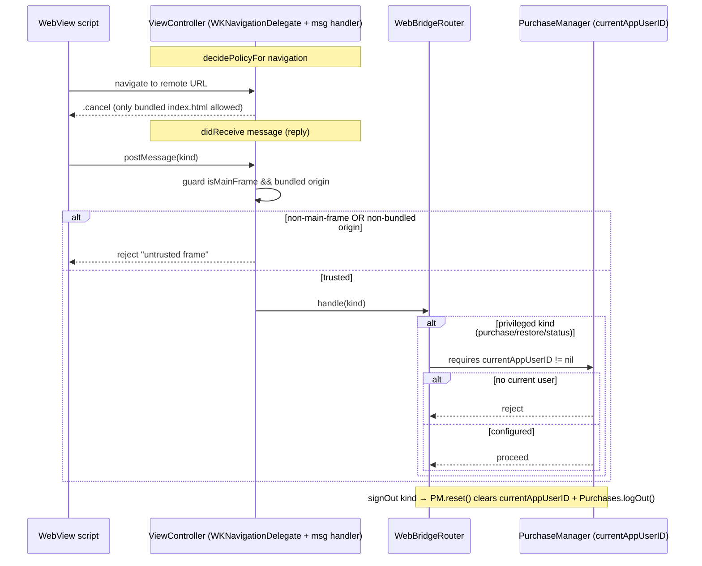
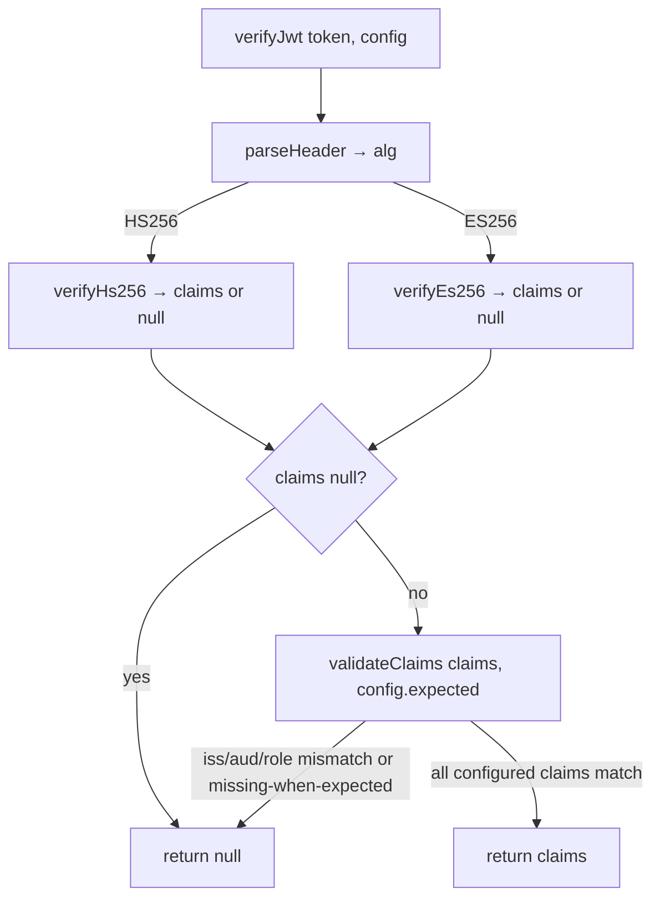

# fix: App Store Submission-Readiness Hardening

**Origin:** `docs/brainstorms/2026-06-24-app-store-submission-readiness-requirements.md`
**Depth:** Deep — 8 implementation units across Supabase edge functions (Deno/TS), web/Svelte core, and native Swift.
**Mode:** Authored autonomously (headless). Inferred bets are recorded in [Assumptions](#assumptions) rather than confirmed interactively.

---

## Summary

An adversarial Codex review found the Still app **not submit-ready**: 3 App Store rejection risks (no in-app account deletion / privacy link, missing privacy manifest) and 5 security/correctness gaps (native bridge trusts any script, RevenueCat identity not reset on sign-out, purchase outcomes dropped, unwired production rule-set path, a SIWA race, incomplete JWT claim validation). This plan resolves all 8 in dependency order, keeping the full workspace gate green (lint, typecheck, core + ext-safari + StillKit tests, web/app builds), with tests per unit.

All 8 findings were verified against the working tree at `main@4e128fb`. Each unit below cites the verified evidence and the acceptance bar from the origin doc.

---

## Problem Frame

Two failure classes:

1. **App Store rejection (hard stops):** Guideline 5.1.1 requires in-app account deletion + a privacy-policy link; modern SDKs + required-reason APIs require `PrivacyInfo.xcprivacy`. Without these, the build is rejected at review or upload.
2. **Security & correctness:** the WKWebView native bridge has no frame/origin/navigation guard and accepts privileged messages from any script; RevenueCat identity survives sign-out; the paywall ignores purchase outcomes; the production signed rule-set path is unwired; SIWA has a concurrency race; JWT verification omits `iss`/`aud`/`role`.

Scope is **remediation within the existing architecture** — no re-architecture of sync, RLS, the settings bridge, or the purchase model.

---

## Requirements Traceability

| Origin success criterion | Unit |
|---|---|
| JWT validates iss/aud/role | U1 |
| Sign-out resets native RevenueCat; privileged calls rejected with no current user | U2 |
| Native bridge rejects non-main-frame/non-bundled-origin messages; blocks navigation away from bundle | U3 |
| In-app Delete account (confirm → delete-user → local sign-out) + privacy-policy link | U4 |
| Paywall surfaces purchased/cancelled/pending/failed/no-offering; duplicate taps disabled | U5 |
| Concurrent SIWA fails in-flight cleanly | U6 |
| PrivacyInfo.xcprivacy on app+extension with UserDefaults reason + tracking=false | U7 |
| Production signed rule-set fetch/verify/cache wired into Safari, gated on prod keys | U8 |
| Full workspace gate green; new behavior tested | all |

---

## Key Technical Decisions

**KTD-A — JWT claim validation lives centrally in `verifyJwt`, not duplicated per-alg.** `verifyHs256`/`verifyEs256` stay signature+exp only (they are exported and unit-tested directly). `verifyJwt` awaits the per-alg claims, then runs one shared `validateClaims(claims, expected, now)` gate. Expected claims are an optional `expected?: { iss?; aud?; role? }` on `JwtVerifyConfig`; when a field is set it must match (mismatch/absent → reject), when unset it's skipped (backward-compatible for any caller that doesn't opt in). The three edge functions always pass `expected` derived from env; tests mint tokens carrying the claims. (origin P2 #8)

**KTD-B — Native "current verified user" is the shared gate for U2 + U3.** `PurchaseManager` tracks `currentAppUserID` (set on `configure`, cleared on `reset`). Privileged purchase/restore/status reject when it's nil. `WebBridgeRouter` reuses that same state to gate privileged message kinds — so U3's message-origin guard and U2's identity reset are one coherent state machine, not two. (origin P0 #1 §3, P1 #4)

**KTD-C — Account deletion calls the edge function directly from the web client** with the Supabase session bearer token (the function already authenticates the user JWT and derives the subject from it — never the body). No native round-trip. A new `deleteAccount()` on `BackendPort`/`SupabaseBackendPort` invokes the function URL; `SyncService.deleteAccount()` wraps delete-then-local-sign-out; the controller exposes the action; `App.svelte` renders it behind a confirm step. (origin P0 #2)

**KTD-D — Safari rule-set wiring reuses core U12 verbatim.** `fetchCurrentRuleSet` + `resolveRuleSet` already exist and are fully tested in `packages/core/src/rules/`. U8 adds only: a `SignedRuleSet` cache in `browser.storage.local`, an endpoint config, build-time selection of `PRODUCTION_RULE_SET_KEYS` vs `DEV_RULE_SET_KEYS`, and the startup call. No new crypto/fetch logic. With prod keys empty, behavior degrades safely to the bundled seed (never trusts the dev key in a prod build). (origin P1 #6)

**KTD-E — Privacy manifest reason code `CA92.1`** for `NSPrivacyAccessedAPICategoryUserDefaults` — the "app accesses UserDefaults to read/write data shared with other apps in the same App Group" reason, which exactly matches the App-Group container shared between the app and the Safari extension. `NSPrivacyTracking=false`, empty `NSPrivacyTrackingDomains`. (origin P0 #3)

---

## High-Level Technical Design

### Native bridge trust boundary (U2 + U3 combined state)

### JWT claim-validation flow (U1)

---

## Implementation Units

Sequenced per origin (`#8 → #4 → #1 → #2 → #5 → #7 → #3 → #6`), re-expressed as U1…U8. U1 (JWT) is isolated and first; U3 depends on U2 (shared native state); U7 (manifest) is placed after the identity/purchase work so it reflects final data flows.

---

### U1. Harden JWT verification with iss/aud/role validation

**Goal:** `verifyJwt` validates issuer, audience, and role in addition to signature/expiry/sub, across all three edge-function consumers, without breaking local (HS256) or hosted (ES256) paths. (origin P2 #8)

**Requirements:** JWT validates iss/aud/role.

**Dependencies:** none.

**Files:**
- `supabase/functions/_shared/jwt.ts` — add `expected?: { iss?: string; aud?: string; role?: string }` to `JwtVerifyConfig`; add internal `validateClaims(claims, expected, now)`; restructure `verifyJwt` to await per-alg claims then run the gate.
- `supabase/functions/delete-user/index.ts` — derive expected claims from env, pass into deps.
- `supabase/functions/export-user-data/index.ts` — same.
- `supabase/functions/reconcile-entitlement/index.ts` — same.
- `supabase/functions/delete-user/handler.ts`, `export-user-data/handler.ts`, `reconcile-entitlement/handler.ts` — thread `expected` (or a pre-built config) through the `verifyJwt` call; `AccountDeps`/`ReconcileDeps` gain the expected-claims fields.
- `supabase/functions/_shared/jwt.test.ts` — new cases for iss/aud/role accept + reject.
- `supabase/functions/__tests__/account.test.ts`, `reconcile-entitlement/handler.test.ts` — update minted tokens to carry iss/aud/role; add a shared mint helper.
- `supabase/functions/_shared/test-helpers.ts` *(new)* — `mintUserToken(payload, {secret|privateKey})` minting a fully-claimed user token, to de-duplicate test setup.
- `.env.example` — document that `SUPABASE_URL` now also derives the expected issuer; note expected aud/role are constants.

**Approach:**
- Expected values: `iss = ${SUPABASE_URL}/auth/v1`, `aud = "authenticated"`, `role = "authenticated"`. Derive `iss` from `SUPABASE_URL` at each `index.ts` (same place `jwksUrl` is built); `aud`/`role` are shared constants in `_shared/jwt.ts` (e.g., `SUPABASE_AUTHENTICATED_AUD`, `SUPABASE_AUTHENTICATED_ROLE`).
- `validateClaims`: for each present `expected.*`, compare against `claims.*`; reject (return null) on mismatch or when the claim is absent but expected. `aud` may be a string or array in JWTs — accept when expected ∈ aud (handle both shapes).
- Backward-compat: if `expected` is undefined, skip claim checks entirely (keeps `verifyHs256`/`verifyEs256` direct-call tests untouched).
- **Fail-closed-in-production nuance:** the index.ts always derives `expected.iss` when `SUPABASE_URL` is set (it always is on hosted). If `SUPABASE_URL` is unset (shouldn't happen in prod), `iss` is simply not enforced — document this; do not hard-crash the function on boot.

**Patterns to follow:** existing `verifyJwt` dispatch and the `jwksUrl` derivation in each `index.ts`; existing test token minting via `signHs256`/`signEs256`.

**Test scenarios** (`_shared/jwt.test.ts`, `account.test.ts`, `reconcile-entitlement/handler.test.ts`):
- HS256 token with correct iss/aud/role → verified.
- HS256 token with wrong `iss` → rejected (null / 401).
- HS256 token with wrong `aud` → rejected.
- HS256 token with `role: "anon"` → rejected.
- HS256 token missing `iss` while config expects it → rejected.
- `aud` as array containing `"authenticated"` → accepted; array without it → rejected.
- ES256 token with correct claims → verified (hosted path).
- `expected` undefined (legacy call) → signature+exp behavior unchanged (existing tests still green).
- delete-user / export-user-data / reconcile handlers: a token with wrong issuer returns 401 and performs no mutation.

**Verification:** all three handlers reject wrong-iss/aud/role tokens with 401 and no side effect; correct tokens still succeed; `deno test` for `supabase/functions/**` green.

---

### U2. Native RevenueCat identity reset + current-user gate + signOut bridge

**Goal:** Sign-out resets the native RevenueCat identity; privileged purchase/restore/status reject when no verified user is configured; a `signOut` message exists end-to-end. (origin P1 #4)

**Requirements:** Sign-out resets native RevenueCat; privileged calls rejected with no current user.

**Dependencies:** none (but U3 depends on this).

**Files:**
- `apps/apple/Still/Shared (App)/Purchases/PurchaseManager.swift` — add `private(set) var currentAppUserID: String?`; set it in `configure`; add `func reset()` calling `Purchases.shared.logOut { _,_ in }` (when configured) and clearing `currentAppUserID`; make `purchaseStillSync`/`restore`/`hasStillSync` return failed/false when `currentAppUserID == nil`.
- `apps/apple/Still/Shared (App)/WebBridgeRouter.swift` — add `case "signOut"` → `purchases.reset()` → `reply({ ok: true })`; (origin-aligned) keep privileged kinds gated on configured state.
- `packages/core/src/native/bridge.ts` — add `{ kind: "signOut" }` to `NativeMessage`; add `async signOut(): Promise<void>`.
- `packages/core/src/sync/service.ts` — `signOut()` already calls `auth.signOut()`; add an optional injected `onSignOut?` / native hook so the entrypoint can reset the bridge (keep core host-agnostic — do not import NativeBridge into core/sync).
- `packages/app-webview/src/main.ts` — in the `auth.signOut` closure (or via a sync hook), call `bridge.signOut()` when `bridge.available`, before/after `sync.signOut()`.
- `apps/apple/StillKit/Tests/StillKitTests/` *(or a Purchases-targeted test)* — `PurchaseManagerTests` for reset/gate behavior.
- `packages/core/src/native/__tests__/bridge.test.ts` — cover the new `signOut` kind.

**Approach:**
- Keep core/sync host-agnostic: the cleanest wiring is for `main.ts` to pass a `signOut` that does `await bridge.signOut()` (when available) then `await sync.signOut()`. Avoid importing `NativeBridge` into `@still/core/sync`.
- `PurchaseManager.reset()` is safe to call when unconfigured (no-op beyond clearing the id).
- The "reject when no current user" guard is the same `currentAppUserID != nil` check U3 will reuse at the router layer.

**Patterns to follow:** existing `configure(appUserID:)` re-key path; existing bridge message shapes and `bridge.test.ts` mock-port pattern.

**Test scenarios:**
- Swift: after `configure(appUserID:)`, `currentAppUserID` is set; after `reset()`, it's nil and `purchaseStillSync()`/`restore()`/`hasStillSync()` return `.failed`/`false`.
- Swift: `purchaseStillSync()` with no prior configure → `.failed("not configured")` (existing) AND with nil current user → rejected.
- Web: `bridge.signOut()` posts `{ kind: "signOut" }` and resolves; on a host with no port it no-ops.
- Web: the entrypoint sign-out path invokes `bridge.signOut()` when available (assert via mock bridge).

**Verification:** StillKit tests green; core native tests green; after sign-out the native layer holds no configured user.

---

### U3. Native bridge trust boundary — navigation lockdown + frame/origin guard

**Goal:** The WKWebView cancels navigations away from the bundled app, and the message handler rejects privileged messages from non-main-frame or non-bundled origins; privileged actions additionally require the U2 current-user state. (origin P0 #1)

**Requirements:** Bridge rejects untrusted frames/origins; blocks navigation away from bundle.

**Dependencies:** U2 (reuses `currentAppUserID` gate).

**Files:**
- `apps/apple/Still/Shared (App)/ViewController.swift` — implement `webView(_:decidePolicyFor:decisionHandler:)`: allow the initial bundled `file://` load + same-document/reload; cancel any top-level navigation whose URL isn't the bundled index (esp. remote `http(s)`). In `userContentController(_:didReceive:replyHandler:)`, validate `message.frameInfo.isMainFrame` and that the frame's request URL / security origin is the bundled file origin before dispatching; reject otherwise.
- `apps/apple/Still/Shared (App)/WebBridgeRouter.swift` — accept an injected predicate or check so privileged kinds (`signInWithApple`, `configurePurchases`, `purchase`, `restore`, `purchaseStatus`, `signOut`) are only honored from trusted frames; settings `get`/`set` ride the same guard.
- `apps/apple/StillKit/Tests/StillKitTests/BridgeTests.swift` — extend with frame/origin rejection cases (router-level, using a seam that doesn't require a live WKWebView).

**Approach:**
- The bundled origin for `loadFileURL` is a `file://` URL; capture the bundled index URL once and compare `navigationAction.request.url` against it (allow `about:blank`/fragment/reload as needed for the SPA, deny everything else). Prefer an allowlist (only the bundled file) over a denylist.
- Frame validation: `WKScriptMessage.frameInfo.isMainFrame` must be true; `frameInfo.securityOrigin` / `frameInfo.request.url` must be the bundled file origin. Because `WKFrameInfo` is hard to construct in unit tests, put the *decision* in a small testable function (e.g., `BridgeTrust.isTrusted(isMainFrame:url:bundledURL:)`) that `ViewController` calls with values pulled from `frameInfo`, and unit-test that function + the router gating directly.
- This is defense-in-depth: the app only ever loads local content, so in practice every message is main-frame/bundled — but the guard makes injection/navigation non-exploitable.

**Patterns to follow:** existing `ViewController` `WKNavigationDelegate` conformance (already declared, currently empty of policy methods); existing `BridgeTests` structure.

**Test scenarios** (`BridgeTests.swift`):
- `isTrusted` returns true for (isMainFrame=true, url=bundled index), false for (isMainFrame=false, …) and for (url=remote https).
- Router: a privileged kind from an untrusted frame is rejected with an error reply and no subsystem call.
- Router: a privileged kind from a trusted frame proceeds.
- Navigation policy: a request to `https://evil.example` returns `.cancel`; the initial bundled load returns `.allow`.

**Verification:** StillKit tests green; manual smoke — app still loads `index.html` and all flows work; a synthetic remote navigation is cancelled.

---

### U4. In-app account deletion + privacy-policy link

**Goal:** Signed-in UI exposes Delete account (confirm → `delete-user` → local sign-out) and an in-app privacy-policy link. (origin P0 #2)

**Requirements:** In-app account deletion + privacy link (Guideline 5.1.1).

**Dependencies:** none (independent of Swift changes; U1 hardens the function it calls but isn't a blocker).

**Files:**
- `packages/core/src/sync/ports.ts` — add `deleteAccount(): Promise<void>` to `BackendPort`.
- `packages/core/src/sync/supabase-backend.ts` *(SupabaseBackendPort)* — implement `deleteAccount()` invoking the `delete-user` function (via `supabase.functions.invoke("delete-user")`, which attaches the session bearer token).
- `packages/core/src/sync/service.ts` — add `async deleteAccount()`: call `backend.deleteAccount()`, then local sign-out (`auth.signOut()` + `SIGNED_OUT` state). Surface errors (throw/return error) rather than swallowing.
- `packages/core/src/ui/controller.svelte.ts` — add `UiAuth.deleteAccount?` (or a dedicated dep), a `deleteFlow` state (`idle | confirming | deleting | error`), `deleteError`, and `requestDeleteAccount()` / `confirmDeleteAccount()` / `cancelDelete()`.
- `packages/core/src/ui/strings.ts` — add `account` strings: `delete`, `deleteConfirmTitle`, `deleteConfirmBody`, `deleteConfirm`, `deleteCancel`, `deleting`, `deleteError`, `privacyPolicy`.
- `packages/core/src/ui/App.svelte` — in `not-entitled` and `entitled-syncing` states, add an account section with Delete account (opens confirm) + a Privacy policy link (opens the configured URL). Add the confirm affordance (reuse a sheet/inline confirm).
- `packages/core/src/ui/config.ts` *(new, or a constants file)* — `PRIVACY_POLICY_URL` constant (placeholder, clearly marked; human swaps before submission).
- `packages/app-webview/src/main.ts` — pass `deleteAccount: () => sync.deleteAccount()` into the controller's auth deps when Supabase is configured.
- Tests: `packages/core/src/ui/__tests__/controller.test.ts` (delete flow), `App.test.ts` (affordances present + gated), `packages/core/src/sync/__tests__/service.test.ts` (deleteAccount → sign-out).

**Approach:**
- Confirmation is mandatory and destructive: a tap on Delete account opens a confirm step; only confirm calls the backend. On success → signed-out state; on failure → visible error, stay signed-in.
- Privacy link: an `<a href>` / button opening `PRIVACY_POLICY_URL`. In the WKWebView, ensure the link opens (target handling) — but per U3 the web view cancels in-app navigation, so external links must open in the system browser. Decision: render the privacy link as an `<a target="_blank" rel="noopener">` and let `WKNavigationDelegate` (U3) **allow** `http(s)` links that are user-initiated to open in the external browser via `decidePolicyFor` returning `.cancel` + `openURL` (so they don't navigate the app web view). Note this coupling in U3's policy method.
- Use Supabase `functions.invoke` so the bearer token is attached automatically; handle non-2xx as an error.

**Patterns to follow:** existing `SupabaseBackendPort` methods (`readEntitlement`, `reconcileEntitlement`, `writeProfile`) and how `main.ts` wires auth deps; existing `PaywallSheet` for the confirm-sheet pattern.

**Test scenarios:**
- Controller: `requestDeleteAccount()` sets `deleteFlow=confirming`; `cancelDelete()` returns to idle; `confirmDeleteAccount()` calls backend then drives signed-out state.
- Controller: backend failure → `deleteFlow=error`, `deleteError` set, user stays signed-in.
- Service: `deleteAccount()` invokes `backend.deleteAccount()` then signs out (state = SIGNED_OUT); a backend throw propagates and does NOT sign out.
- App.svelte: Delete account + Privacy policy present in `not-entitled` and `entitled-syncing`, absent in `signed-out`.
- Privacy link points at `PRIVACY_POLICY_URL`.

**Verification:** controller + service + App tests green; deleting an account returns the UI to signed-out; privacy link present.

---

### U5. Surface purchase outcomes in the paywall

**Goal:** The paywall reflects purchased / cancelled / pending / failed / no-offering instead of dismissing blindly; duplicate taps disabled; restore gives feedback. (origin P1 #5)

**Requirements:** Paywall surfaces all outcomes; duplicate taps disabled.

**Dependencies:** none (consumes the existing `PurchaseResult` already returned by the bridge).

**Files:**
- `packages/core/src/ui/controller.svelte.ts` — add `purchaseFlow` state (`idle | purchasing | pending | cancelled | failed | unavailable`), `purchaseError`, and methods `beginPurchase()` / `setPurchaseOutcome(result)` / `resetPurchase()`. Keep the paywall open until a confirmed `purchased`.
- `packages/core/src/ui/components/PaywallSheet.svelte` — render the flow states (in-flight spinner/disabled CTA, pending message, cancelled→back to CTA, failed→error+retry, unavailable→no-offering message); disable the Get button while `purchasing`.
- `packages/core/src/ui/App.svelte` — stop auto-dismissing on `onGet`; dismiss only on confirmed purchase (or explicit user dismiss). Wire `onGet`/`onRestore` to set controller flow state.
- `packages/core/src/ui/strings.ts` — add `paywall` outcome strings: `purchasing`, `pending`, `cancelled`, `failed`, `unavailable`, `retry`, plus restore feedback strings.
- `packages/app-webview/src/main.ts` — `onGet` consumes the full `PurchaseResult` (`outcome` + `entitled` + `error`), not just `entitled`; map outcome → `controller.setPurchaseOutcome`; only re-enter session on `entitled`. `onRestore` reflects restored/none.
- Tests: `controller.test.ts` (flow transitions), `App.test.ts` / `PaywallSheet` test (states render, duplicate tap no-op).

**Approach:**
- Map `PurchaseOutcome` → flow state: `purchased`→close + enter session; `pending`→show pending, keep open; `cancelled`→back to CTA; `failed`→error + retry; plus a synthesized `unavailable` when the native layer reports "no offering available" (the bridge returns `outcome: "failed"` with `error` text — detect the no-offering error or add a distinct outcome; simplest: treat `failed` with the known no-offering message as `unavailable`, else `failed`). Prefer adding clarity in `main.ts` mapping rather than changing the Swift contract.
- Duplicate-tap guard: the Get button is disabled while `purchaseFlow === "purchasing"`.

**Patterns to follow:** the existing `authFlow` state pattern on the controller (idle/sending/sent/error) — mirror it for `purchaseFlow`.

**Test scenarios:**
- Each outcome maps to its visible state; sheet stays open on non-`purchased`.
- Duplicate `onGet` while `purchasing` is a no-op.
- `purchased` closes the sheet and triggers session re-entry.
- Restore: restored=true shows synced/closed; restored=false shows a "nothing to restore" note.
- `main.ts` passes the full result (assert via a mock bridge returning each outcome).

**Verification:** controller + paywall tests green; manual — cancelling a purchase keeps the sheet open with the CTA.

---

### U6. Guard SIWA against concurrent sign-in

**Goal:** A second `signIn()` while one is in flight fails cleanly without corrupting nonce/continuation. (origin P2 #7)

**Requirements:** Concurrent SIWA fails in-flight cleanly.

**Dependencies:** none.

**Files:**
- `apps/apple/Still/Shared (App)/Auth/SignInWithApple.swift` — at the top of `signIn()`, if `continuation != nil` throw `SIWAError.inProgress` (new case) before generating a new nonce / overwriting state.
- `apps/apple/StillKit/Tests/StillKitTests/` — a SIWA coordinator test for the in-progress guard (may require a small seam: extract the "is a request in flight" check or test via the public `signIn()` with a stubbed controller — if ASAuthorization is untestable in unit context, add the guard as a pure precondition method and test that).

**Approach:**
- Add `case inProgress` to `SIWAError` with a message ("A sign-in is already in progress."). Guard is a 2-line precondition. The web side already disables the button on `authFlow === "sending"`; this is the correctness backstop and surfaces as a normal error reply through the existing router error path.
- Testability: extract the precondition into a tiny synchronous helper (e.g., `func assertNoRequestInFlight() throws`) so it's unit-testable without presenting the Apple sheet.

**Patterns to follow:** existing `SIWAError` enum + `errorDescription`.

**Test scenarios:**
- With no in-flight request, the precondition passes.
- With `continuation != nil`, the precondition throws `.inProgress` and does not mutate `currentNonce`.

**Verification:** StillKit tests green; a double-invoke surfaces `.inProgress` rather than a hung promise.

---

### U7. Add PrivacyInfo.xcprivacy + required-reason declarations

**Goal:** Privacy manifests on the app (and extension where it links the App-Group UserDefaults) declare the UserDefaults required-reason API, tracking=false, and collected data types; RevenueCat SDK manifest presence verified. (origin P0 #3)

**Requirements:** PrivacyInfo.xcprivacy with UserDefaults reason + tracking=false.

**Dependencies:** U2/U4 (so the collected-data declarations reflect the final identity/deletion data flows).

**Files:**
- `apps/apple/Still/Shared (App)/PrivacyInfo.xcprivacy` *(new)* — app target manifest.
- `apps/apple/Still/Shared (Extension)/PrivacyInfo.xcprivacy` *(new, if the extension target links StillKit's App-Group UserDefaults — verify which targets link `SharedSettingsStore`)*.
- `apps/apple/Still/Still.xcodeproj/project.pbxproj` — add the `.xcprivacy` files to the relevant targets' resources (Copy Bundle Resources) so they ship.
- (doc) note in the plan/PR which targets got manifests and the reason codes used.

**Approach:**
- Declarations:
  - `NSPrivacyAccessedAPITypes`: one entry `NSPrivacyAccessedAPICategoryUserDefaults` with `NSPrivacyAccessedAPITypeReasons = [CA92.1]` (App-Group shared access — see KTD-E).
  - `NSPrivacyTracking = false`; `NSPrivacyTrackingDomains = []`.
  - `NSPrivacyCollectedDataTypes`: email (linked to identity, for app functionality, not tracking — from SIWA), user ID, and purchase history (RevenueCat/StoreKit). Reconcile against what's actually sent to Supabase + RevenueCat; keep minimal and truthful.
- Verify RevenueCat 5.79.0 ships its own `PrivacyInfo.xcprivacy` inside the SwiftPM artifact (it does in recent 5.x). If absent, escalate (Assumptions). No action needed when present — Xcode aggregates third-party manifests into the privacy report.
- Confirm which targets touch `UserDefaults(suiteName:)`: `SharedSettingsStore` lives in StillKit; both the app and the extension use the App Group via StillKit. Whichever target links it needs the declaration.

**Patterns to follow:** Apple's `PrivacyInfo.xcprivacy` plist schema; existing `Info.plist` resource membership in `project.pbxproj`.

**Test scenarios:** `Test expectation: none — declarative plist + build-resource membership.` Validation = the files are well-formed plists and are members of the target's resources (verified by build + an Xcode privacy-report check, noted as a manual/CI step).

**Verification:** `PrivacyInfo.xcprivacy` present and valid on the relevant targets; the app builds with the manifests bundled; declarations match actual API usage and data flows.

---

### U8. Wire production signed rule-set fetch/verify/cache into Safari

**Goal:** The Safari extension fetches → verifies → caches the latest signed rule set (reusing core U12), falling back to the bundled seed offline/unverified, gated on `PRODUCTION_RULE_SET_KEYS` (prod) vs `DEV_RULE_SET_KEYS` (dev), with a documented key-population procedure. (origin P1 #6)

**Requirements:** Production rule-set fetch/verify/cache wired into Safari, gated on prod keys.

**Dependencies:** none (core machinery exists).

**Files:**
- `packages/ext-safari/entrypoints/background.ts` — on startup (and on the existing reconcile nudge), call `fetchCurrentRuleSet(cfg)`; on a verified newer set, persist it to `browser.storage.local` under a rule-set cache key; expose the cached set to content.
- `packages/ext-safari/entrypoints/content/index.ts` — replace the hardcoded `ruleSet: seed` with `resolveRuleSet({ bundled: seed, cached })` where `cached` is read from `browser.storage.local` (synchronously-available cached value or the bundled seed at `document_start`; the background refresh corrects within a load via the existing storage.onChanged → cache.watch path).
- `packages/core/src/rules/index.ts` — ensure `fetchCurrentRuleSet`, `resolveRuleSet`, `FetchConfig`, `RuleSetEndpoint`, `PRODUCTION_RULE_SET_KEYS`, `DEV_RULE_SET_KEYS`, `RULE_SET_MIN_VERSION` are exported through `@still/core/rules` (they are — confirm the barrel).
- `packages/ext-safari/src/rule-set-config.ts` *(new)* — build-time selection: trusted keys = `PRODUCTION_RULE_SET_KEYS` when non-empty (prod build) else `DEV_RULE_SET_KEYS`; the Supabase endpoint (`url`, `anonKey`, `rpc: "get_current_rule_set"`) from `import.meta.env` (gitignored `.env`, absent in CI → fetch is skipped, seed used).
- `packages/ext-safari/entrypoints/background.ts` cache helpers + tests: `packages/ext-safari/**/__tests__/rule-set.test.ts` *(new)* — fetch→verify→cache→fallback using a test key (mirror `packages/core/src/rules/__tests__/fetch.test.ts` mock-fetch pattern).
- `docs/` or `scripts/` — a documented procedure (and/or a `scripts/sign-prod-seed.mjs` dry-run) to generate the prod Ed25519 keypair, populate `PRODUCTION_RULE_SET_KEYS`, sign a prod `current` set, and confirm the `get_current_rule_set` RPC exists/returns it. **Generating real keys + publishing to hosted Supabase stays a human deploy action (Non-goal).**

**Approach:**
- At `document_start`, content cannot await a network fetch; it uses `resolveRuleSet({ bundled, cached })` (cached read is fast/local). The background asynchronously fetches + verifies + caches; the write fires `storage.onChanged`, and the existing `cache.watch()` reapply path picks up a newer verified set within the same load — the same mechanism U7-era App-Group reconcile already relies on.
- Safety with empty prod keys: in a prod build, trusted keys = `[]` → `fetchCurrentRuleSet` returns null (nothing verifies) → `resolveRuleSet` falls back to bundled seed. The dev key is never trusted in a prod build. Document that shipping before populating prod keys simply means "no runtime rule updates," not breakage.
- Verify the Supabase `get_current_rule_set` RPC / serving path exists; if only the dev seed migration (`0004_seed_rule_set.sql`) exists, note the prod-publish step in the procedure (Non-goal to execute).

**Patterns to follow:** `packages/core/src/rules/__tests__/fetch.test.ts` mock-fetch + `signedRow` helpers; the Chromium content/background structure; the existing ext-safari background reconcile + storage.onChanged flow.

**Test scenarios** (`rule-set.test.ts`):
- Fetch returns a verified newer set → cached and resolved as `source: "fetched"`.
- Offline/timeout/oversized/bad-signature/unknown-kid/below-floor fetch → falls back to cached or bundled (`resolveRuleSet` picks bundled when no valid cache).
- Empty `PRODUCTION_RULE_SET_KEYS` (prod build) → fetch verifies nothing → bundled seed used; dev key NOT trusted.
- A cached newer verified set is used when fetch is skipped (no endpoint configured).

**Verification:** ext-safari tests green; with no endpoint/keys the extension behaves exactly as today (bundled seed); with a test key + mock endpoint the fetch/verify/cache/fallback path works; the key-population procedure is documented.

---

## Scope Boundaries

**In scope:** the 8 units above, their tests, and the workspace-gate-green requirement.

### Deferred to Follow-Up Work
- Generating the real production Ed25519 signing keys and publishing a prod-signed rule set to hosted Supabase (U8 delivers wiring + procedure + tests against a test key).
- Creating/finalizing the hosted `get_current_rule_set` RPC if it doesn't already exist (U8 documents the requirement).
- Chromium extension rule-set wiring (same gap exists there; out of this batch — this pass targets Safari per the origin finding, but the `rule-set-config.ts` helper should be written reusably).

### Outside this pass (true non-goals)
- App Store Connect portal actions: entering the privacy-policy URL in metadata and filling privacy "nutrition labels" (code makes them reachable/declarable; the human completes the portal).
- The earlier-review P2 notes on RLS column exposure and the hardcoded `$2.99` price string (tracked separately; not in this batch).
- Re-architecture of sync, RLS, the settings bridge, or the purchase model.

---

## Assumptions

1. **Privacy-policy URL** is a clearly-marked placeholder constant (`PRIVACY_POLICY_URL`); the human swaps the real URL before submission. (Inferred — flag for human.)
2. **Production signing keys** are not generated here (Non-goal); U8 ships wiring + a documented, dry-runnable procedure + tests against a test key.
3. **RevenueCat 5.79.0 ships its own privacy manifest** — to be confirmed during U7; if absent, escalate before submission.
4. **The web client may call `delete-user` directly** with the session bearer token via `supabase.functions.invoke` (the function authenticates the user JWT and derives the subject from it). No native round-trip.
5. **Expected JWT claims:** `iss = ${SUPABASE_URL}/auth/v1`, `aud = "authenticated"`, `role = "authenticated"`. If `SUPABASE_URL` is unset (non-prod), `iss` is simply not enforced rather than crashing the function.
6. **The Safari extension's external privacy link** opens in the system browser via the U3 navigation policy (user-initiated `http(s)` → `.cancel` + `openURL`), not inside the app web view.
7. **Test seams for Swift:** frame-trust and SIWA-in-progress decisions are extracted into small pure helpers so they're unit-testable without a live WKWebView / Apple sheet.

---

## Risks & Mitigations

| Risk | Mitigation |
|---|---|
| U3 navigation lockdown breaks the external privacy link (U4) or the SPA's own reloads | Allowlist the bundled index + same-document/reload; route user-initiated `http(s)` to `openURL`; smoke-test the app loads and the privacy link opens externally. |
| U1 claim validation rejects valid local HS256 tokens whose iss/aud differ | `expected` is opt-in per call; local dev/test tokens are minted with matching claims via the new `mintUserToken` helper; legacy direct `verifyHs256` tests untouched. |
| U7 manifest declares data types that don't match actual flows (review mismatch) | Reconcile declarations against real Supabase/RevenueCat payloads during U7; keep minimal + truthful. |
| Swift unit-testing WKFrameInfo / ASAuthorization is hard | Extract pure decision helpers (`BridgeTrust.isTrusted`, SIWA `assertNoRequestInFlight`) and test those + router gating, not the Apple framework objects. |
| U8 content script can't await fetch at document_start | Content uses fast local `resolveRuleSet({bundled, cached})`; background does the async fetch + cache; storage.onChanged + cache.watch reapplies within the load. |

---

## Sequencing & Verification Gate

**Order:** U1 → U2 → U3 → U4 → U5 → U6 → U7 → U8. U3 after U2 (shared native state); U7 after U2/U4 (data flows settled). The rest are independent and could be parallelized, but the linear order keeps commits atomic and reviewable.

**Per-unit gate:** the touched package's tests + typecheck.

**Final gate (must be green before PR):**
- `lint` (workspace)
- `typecheck` (core, ext-safari, app-webview)
- Tests: core (`vitest`), ext-safari (`vitest`), StillKit (`swift test`), supabase functions (`deno test`)
- Builds: web bundle (`packages/app-webview`), and the Apple app compiles with the new manifests.

**Handoff:** `/ce-work` to execute, unit by unit, committing each atomically.
