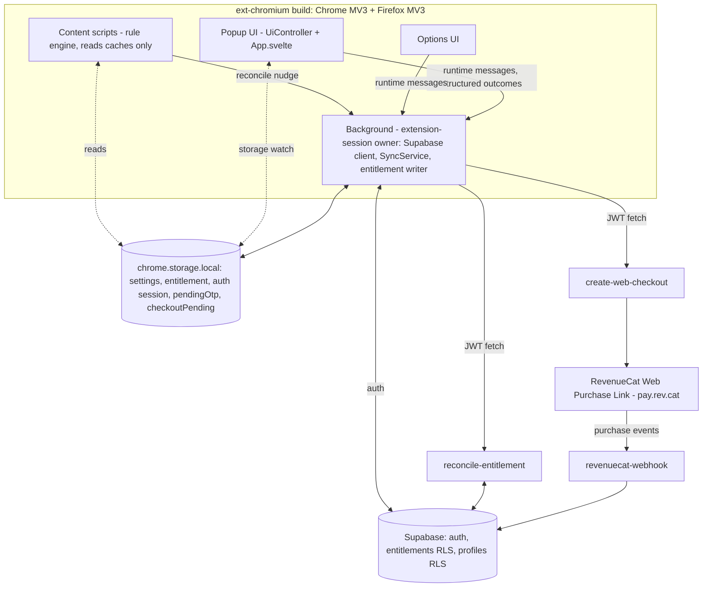
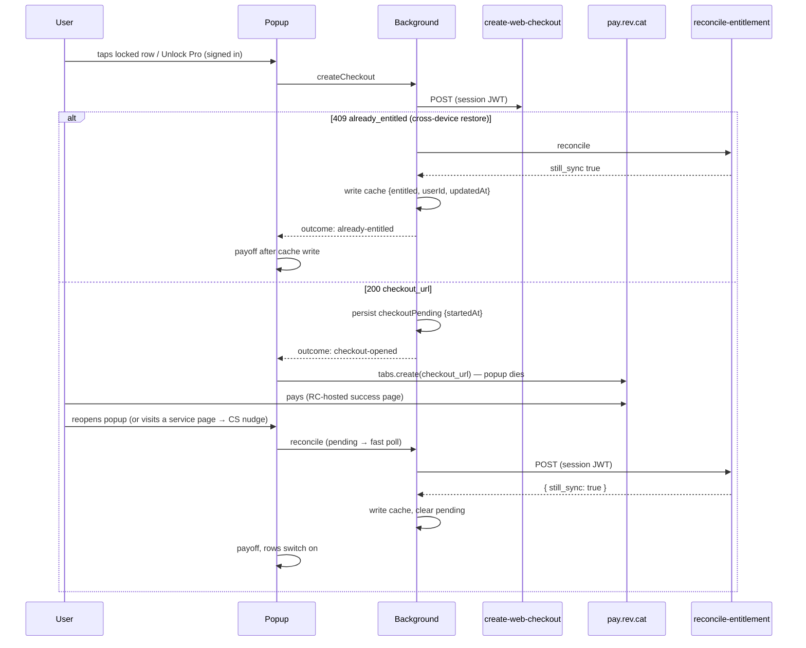
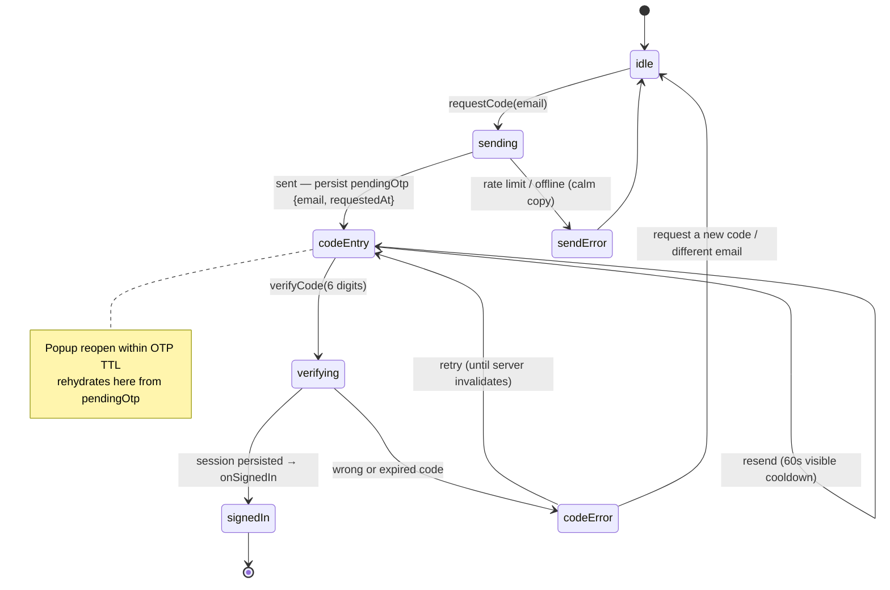

# feat: Chrome/Firefox extension purchase spine + paywall success payoff

## Summary

Make Still Pro purchasable from the Chrome/Firefox extension: email-OTP sign-in in the popup, a background-owned Supabase session, checkout hand-off to the existing `create-web-checkout` → RevenueCat Web Billing hosted link, entitlement activation via the existing `reconcile-entitlement` function writing the existing extension entitlement cache, and settings sync for entitled users — plus the ratified paywall copy refresh and a "Pro unlocked" success payoff state on every surface.

## Problem Frame

The monetization reconciliation (see origin: docs/plans/2026-07-01-001-monetization-spec-reconciliation.md, decisions D2/D3/D4/D6) ratified building the full cross-platform purchase path this release. Today the Chrome/Firefox popup has no auth, no entitlement writer, and `canPurchase: false` — the paywall literally says "Chrome and Firefox unlock is on the way." The server side is already done: `create-web-checkout` (returns `{checkout_url}` | `409 already_entitled` | `502 checkout_unavailable`), `reconcile-entitlement` (queries RevenueCat live and returns `{still_sync: bool}` — no webhook-wait needed client-side), and the webhook all exist and are JWT-verified. The extension side also has the receiving seams built: `createExtensionUiController` was explicitly designed for a later `UiAuth` + `SyncService` injection, and `ChromeEntitlementAdapter` (`still:entitlement`, 30-day TTL) has no writer on Chromium — "Pro rows unlock the moment a writer exists."

Note: `packages/ext-firefox` is an empty scaffold — Firefox is built from `packages/ext-chromium` via `wxt build -b firefox`, so all extension work lands in one package.

---

## Requirements

**Auth**

- R1. A signed-out user can sign in from the popup with email + a 6-digit emailed code (`signInWithOtp` → `verifyOtp({email, token, type: 'email'})`): code-entry screen, visible 60-second resend cooldown, wrong-code handling that surfaces "request a new code" after server invalidation (never raw `error.message` text), and mid-flow popup-death recovery (pending-OTP state persisted so reopening the popup lands on code entry, with a "use a different email" escape).
- R2. The Supabase session lives in ONE owner — the background context — persisted via a `chrome.storage`-backed auth storage adapter (`persistSession: true`, `detectSessionInUrl: false`, no `autoRefreshToken` in UI contexts); popup/options talk to the background via runtime messages with structured outcomes and mirror state via storage watch. The Apple magic-link flow is unchanged.

**Purchase**

- R3. A signed-in, un-entitled user can start checkout from the popup: authenticated `create-web-checkout` call → `chrome.tabs.create(checkout_url)` → a persisted `checkout-pending` state that survives popup death and rehydrates as "checking your purchase…" with reconcile polling on reopen.
- R4. A paid user unlocks without a ritual: reconcile runs on every popup open with a session, and the background also reconciles on the existing content-script `reconcile` nudge when a session exists and checkout is pending or the cache is stale — so "paid, never reopened the popup" self-heals on the next page visit.
- R5. `409 already_entitled` is a success path (the cross-device restore case): reconcile → write cache → success payoff. Never an error toast.
- R6. Server-confirmed unlock shows the success payoff — "Pro unlocked. Enjoy the quiet." — and the newly unlocked service rows visibly switch on. The payoff renders only after the entitlement-cache write lands (single ordering: cache write, then payoff flag), and the same entitled false→true-while-paywall-open rule drives the payoff on Apple.

**Entitlement integrity**

- R7. The entitlement cache is written only from an authenticated server reconcile (or the existing Safari native pull); it never rides the synced settings blob. Reconcile success always rewrites the record — explicit `false` on revocation, and `updatedAt` bumped even when the value is unchanged, so an always-online user's TTL never silently expires.
- R8. The stored entitlement record is identity-bound (carries the `userId` it was verified for); a session-user mismatch reads as "no cache." All teardown paths (sign-out, delete account, identity switch) route through one shared helper that clears the session and writes `entitled: false` (an explicit write, not key removal — subscribers only fire on a value). An identity switch never seeds the new account's cloud profile from the previous user's local settings.

**Sync**

- R9. Entitled signed-in extension users get settings sync with the existing `SyncService` semantics (reconcile-before-read, LWW merge, coalesced write-through) running in the background context. Free signed-in users see honest copy (signed in, Pro not unlocked, unlock + restore affordances) — no sync, no pretending.

**Copy & anti-steering**

- R10. Paywall copy adopts the ratified spec lines (headline "The rest of the noise, gone too", reassurance "One payment. Yours forever.", success "Pro unlocked. Enjoy the quiet."), still names sync as a Pro benefit, keeps bullets launch-real (no YouTube recs/comments claims), and never surfaces web pricing or a web-checkout CTA on Apple targets: purchase/auth deps are injected only from the `ext-chromium` entrypoints, and a test pins that the default shared wiring (Safari) has no purchase path.

**Platform parity & gates**

- R11. Firefox parity: works as an MV3 event page (no background-memory assumptions; all cross-await state in storage), and the Firefox manifest's `data_collection_permissions` is updated from `["none"]` to declare authentication data — an AMO signing requirement once sign-in ships.
- R12. All existing CI gates stay green: pnpm lint/typecheck/unit/build, Deno function checks/tests, Playwright fixtures + smoke.

---

## Key Technical Decisions

- **Background-owned Supabase client, UI contexts as thin mirrors.** One client in the background entrypoint (Chrome service worker / Firefox event page) with a `chrome.storage.local`-backed auth storage adapter; popup/options send runtime messages (`getState`, `requestCode`, `verifyCode`, `signOut`, `deleteAccount`, `reconcile`, `restore`, `createCheckout`) and mirror settings/entitlement via the existing storage-watch wiring. Rationale: two live clients (popup + options) racing refresh-token rotation causes surprise sign-outs; the popup dies on every focus loss so it can't own anything; message handlers wake MV3 workers/event pages reliably. Token refresh is lazy (`getSession()` on wake refreshes expired tokens) — no `chrome.alarms` needed. Two hard rules on this seam:
  - **Sender validation on the message router:** privileged handlers (`requestCode`, `verifyCode`, `signOut`, `deleteAccount`, `restore`, `createCheckout`, `getState`) dispatch only for extension-page senders (`sender.id === chrome.runtime.id` and no `sender.tab`); content-script senders (a `sender.tab` present) may only fire the low-privilege `reconcile` nudge. Content scripts run inside instagram/tiktok/facebook/youtube pages — they never get a path to account-destructive handlers.
  - **Session storage trade-off, documented and accepted:** the session lives in `chrome.storage.local` (a distinct `storageKey`), which our own content scripts can technically read. `setAccessLevel(TRUSTED_CONTEXTS)` is not viable — it would lock content scripts out of the settings/entitlement keys the rule engine reads — and `chrome.storage.session` would force re-auth on every browser restart. Accepted because content scripts are first-party code in isolated worlds (page JS cannot touch extension storage), the design doc already scopes extension storage outside the security boundary, and no session data is ever handed to content scripts. Revisit alongside the deferred signed-token work.
  - **Background wake resumes, never re-reconciles:** on every background start with a persisted session, restart the sync write-through from the CACHED entitlement (no network call) — otherwise a worker that wakes on a settings change silently drops paid sync (the write-through subscription is in-memory and dies with the worker). Live reconcile happens only on the R4 triggers (popup open; nudge with pending/stale cache).
- **Core `extension-session` module mirrors `apple-session`.** All decision logic (message protocol, reconcile→cache writes, checkout-pending lifecycle, teardown, identity-switch policy) lives in a pure, dependency-injected module in `packages/core/src/sync/` with the same money-flow test discipline as `packages/core/src/sync/apple-session.ts`; the WXT entrypoints stay thin (repo convention: testable-module extraction; entrypoints untested by design).
- **Email OTP code entry for the extension; the email template serves both flows.** A popup cannot receive a magic-link redirect, so the extension uses `verifyOtp` code entry. The Supabase "Magic Link" email template must contain BOTH `{{ .ConfirmationURL }}` (Apple keeps magic link) and `{{ .Token }}` (extension code entry) — one template, two consumers. Which UI shows is decided by the host's injected auth capabilities, not user agent sniffing.
- **Keep the plain cached-boolean entitlement record; extend it with `userId`.** Matches the shipped Safari App-Group model and the existing `ChromeEntitlementAdapter` TTL semantics; anything genuinely valuable server-side (sync writes) is already RLS-gated on the DB entitlement. The server-signed entitlement token from `docs/monetization-design.md` §6 stays a deferred hardening (recorded in Scope Boundaries). The `userId` field is optional in the record type so the Safari native pull (which has no userId) stays valid.
- **Structured outcomes at every boundary.** The popup↔background message protocol and the checkout/reconcile flows branch on named unions (extending the existing `PurchaseOutcome` vocabulary in `packages/core/src/native/bridge.ts` where states overlap: `purchased | cancelled | pending | unavailable | failed`, plus web-specific `already-entitled` and `auth-required`), never on matched error strings (repo learning: `docs/solutions/design-patterns/structured-outcome-over-cross-language-string.md`). `auth-required` maps from HTTP 401 on any authed call: the remedy it surfaces is re-sign-in (preserving any `checkoutPending` state) — it is NOT the R8 teardown; an involuntary session death never writes `entitled: false` (the cache rides out its TTL; only voluntary sign-out/delete downgrades).
- **No new permissions, no `externally_connectable`, no hosted success page.** Supabase and Edge Function calls need no `host_permissions` (permissive CORS); the RC-hosted "Purchase Complete" page is the return UX; unlock arrives via reconcile-on-popup-open plus the background nudge (R4). Firefox doesn't support `externally_connectable` from web pages anyway — polling is the cross-browser answer.
- **Identity-switch policy: cloud wins; never seed-from-local across identities.** `SyncService.onSignedIn` currently seeds an empty cloud profile from local settings — correct for the same returning user, a cross-account data leak when a different user signs in. The service gains a last-synced-user seam: when the signing-in `userId` differs from the last synced one, skip the seed-from-local branch (cloud profile wins; a fresh account starts from the local defaults only after an explicit reset). This fix lands in core so the Apple app inherits it (repo learning: mirror fixes across parallel paths).
- **Build-mode trust config, fail-safe.** Supabase URL/key reach the extension via `VITE_*` env at build time following the `ruleSetEndpointFromEnv()` pattern: absent config → auth/purchase UI simply absent (`canSignIn`/`canPurchase` false), never a dev-endpoint fallback in a production build (repo learning: `docs/solutions/security-issues/gate-production-trust-by-build-mode.md`).
- **Web display price is injected by the ext-chromium entrypoint** (a config constant, `$1.99`), not added to shared `strings.ts` — keeps any web-price string out of Apple-target bundles (3.1.3 anti-steering hygiene).

---

## High-Level Technical Design

Component topology — who owns what:

Purchase flow (both outcomes of `create-web-checkout`):

Popup auth state machine (the popup dies mid-flow on the happy path — rehydration is the design, not an edge case):

---

## Implementation Units

### U1. Identity-bound entitlement record + safe teardown/identity-switch in core

- **Goal:** Close the multi-account leaks before any writer exists: entitlement cache bound to the user it was verified for; sign-out/delete/identity-switch clear it; `SyncService` never seeds a new user's cloud from the previous user's local settings; reconcile writes always refresh `updatedAt` and write explicit `false`.
- **Requirements:** R7, R8
- **Dependencies:** none
- **Files:** `packages/core/src/entitlement/adapter.ts`, `packages/core/src/entitlement/chrome-adapter.ts`, `packages/core/src/sync/service.ts`, `packages/core/src/entitlement/__tests__/` (extend existing adapter tests), `packages/core/src/sync/__tests__/sync.test.ts`
- **Approach:** Add optional `userId` to the stored entitlement record (backward-compatible: Safari's native pull writes none). Alongside the existing boolean `get()`/`subscribe` contract the content scripts keep, expose a **record-level store interface** — read/write the full `{entitled, userId, updatedAt}` record — for the extension session's staleness and identity checks (the current adapter APIs are boolean-only/write-only, which cannot implement "cache is stale" or "userId mismatch"). Reads that carry a session context treat a userId mismatch as null. `SyncService` gains a small injected last-synced-identity seam (get/set, storage-backed in real wiring, in-memory in tests); `onSignedIn` skips the seed-from-local branch when the userId differs from the last synced identity. Add a documented teardown contract: teardown writes `entitled: false` explicitly (subscribers don't fire on key removal). Keep the Safari pull path's never-downgrade-on-null semantics untouched.
- **Patterns to follow:** `packages/core/src/entitlement/chrome-adapter.ts` TTL/subscribe semantics; injected `now: () => number` clocks; `packages/ext-safari/lib/entitlement-pull.ts` invariants.
- **Test scenarios:**
  - Record with `userId: "A"` read under session user B returns null (treated as no cache); same-user read within TTL returns the record.
  - Legacy record without `userId` still reads (Safari compatibility).
  - Reconcile-shaped write with unchanged `entitled: true` still bumps `updatedAt` (TTL stays fresh); explicit `false` write notifies subscribers.
  - `onSignedIn` for a different userId than last-synced with an empty cloud profile does NOT call `writeProfile` with local settings; same-user re-sign-in preserves today's seed behavior.
  - Teardown helper clears session state and writes `entitled: false`; subscriber sees the transition.
- **Verification:** Extended core suites pass; no behavior change for the Safari pull tests.

### U2. Email-OTP auth: port, adapter, controller states, sign-in UI

- **Goal:** The full code-entry auth flow in core: port methods, Supabase adapter, controller state machine (with resend cooldown and popup-death rehydration contract), and `SignInSheet` code-entry UI with outcome-phrased copy.
- **Requirements:** R1
- **Dependencies:** none (parallel with U1)
- **Files:** `packages/core/src/sync/ports.ts`, `packages/core/src/sync/auth.ts`, `packages/core/src/ui/controller.svelte.ts`, `packages/core/src/ui/components/SignInSheet.svelte`, `packages/core/src/ui/strings.ts`, `packages/core/src/ui/__tests__/controller.test.ts`
- **Approach:** Extend the auth port with code-flow methods (`requestCode`, `verifyCode`) alongside the existing magic-link method; `SupabaseAuthPort` implements both (`signInWithOtp`, `verifyOtp({email, token, type: 'email'})`). The controller's auth flow gains `code-entry | verifying | code-error` states plus a resend cooldown countdown driven by an injected clock. Which UI a host shows is capability-driven: hosts inject which auth methods they support (Apple keeps magic link + SIWA; the extension injects code entry). Pending-OTP persistence is the host's job (U5) — the controller exposes rehydrate-to-code-entry as an input. The code input is ONE field: `type="text" inputmode="numeric" pattern="[0-9]*" autocomplete="one-time-code" maxlength="6"`, aria-labelled, accepting a full pasted code, with the verify button enabling at 6 digits — no segmented per-digit boxes. Copy additions: code-entry prompt, resend-with-countdown, wrong-code and expired-code lines, plus code-flow variants of the send-error/resend strings — the existing `auth.error`/`auth.resend` strings say "link" and must never render in the code flow. All sentence-case outcome-phrased; never pipe raw `error.message` into the UI. **Purchase-intent continuation:** `lockedTap()` on a signed-out purchasable host records a purchase-intent flag before opening sign-in; a successful `verifyCode` checks it and auto-opens the paywall sheet (one confirming tap before money moves — never auto-invokes checkout). The flag persists with `pendingOtp` so the continuation survives popup death. A deliberate "Not now" dismiss mid-code-entry clears `pendingOtp` and the intent flag (a fresh email field next open — deliberate exit, unlike popup death).
- **Test scenarios:**
  - `requestCode` success → `code-entry` state; failure → calm error state, no raw error text in `authError` surface.
  - `verifyCode` success → signed-in (userId set); wrong code → `code-error` with retry; repeated failures surface the request-a-new-code affordance.
  - Resend blocked during the 60s cooldown with a visible countdown; enabled after (clock injected).
  - Rehydration input puts the controller straight into `code-entry` for a given email.
  - Host without code capability (Apple-shaped `UiAuth`) renders the existing magic-link flow unchanged.
  - Sign-in triggered from a locked-row tap: after `verifyCode` succeeds, the paywall sheet opens automatically (purchase-intent continuation); a plain sign-in (no intent flag) lands on the normal signed-in popup.
  - Send-error state in the code flow renders code-flow copy — asserts no "link" wording reaches the code-entry path.
- **Verification:** Controller/UI suites pass; `pnpm typecheck` clean; Apple WKWebView flow unaffected (existing tests stay green).

### U3. Paywall copy refresh + success payoff state (all hosts)

- **Goal:** Adopt the ratified copy (D6) and add the missing success payoff: "Pro unlocked. Enjoy the quiet." with the newly unlocked rows visibly switching on — driven by one rule on every host.
- **Requirements:** R6, R10
- **Dependencies:** none (parallel; U4/U5 consume the payoff)
- **Files:** `packages/core/src/ui/strings.ts`, `packages/core/src/ui/controller.svelte.ts`, `packages/core/src/ui/components/PaywallSheet.svelte`, `packages/core/src/ui/App.svelte`, `packages/core/src/sync/apple-session.ts`, `packages/core/src/sync/__tests__/apple-session.test.ts`, `packages/core/src/ui/__tests__/controller.test.ts`
- **Approach:** New paywall copy: headline "The rest of the noise, gone too"; unlocks named plainly (Instagram Reels, TikTok, Facebook Reels) with sync still a named benefit; "$-price · one-time" CTA wording preserved from host-injected price; reassurance "One payment. Yours forever."; success "Pro unlocked. Enjoy the quiet." Replace the stale `nonApple` "on the way" copy with the host-appropriate paths (Safari keeps its unlock-in-the-app explanation); add a distinct transitional string for the web checkout hand-off ("Opening checkout…" — the Apple `purchasing` copy describes an in-place purchase that hasn't started here). Payoff rule: a `justUnlocked` controller state set by the same code path that observes `entitled` transitioning false→true while the paywall is open — set only after the entitlement store write has landed (C5 ordering); the rehydrated "checking your purchase…" state counts as paywall-open (a paying user must get the payoff, not a quiet unlock). Payoff presentation: `role="status"`, auto-dismisses after ~2.5s with early dismiss on tap/Escape; rows render unlocked-and-on (settings defaults already enable services). Apple gets the payoff via the same transition rule — `apple-session.ts` currently calls `dismissPaywall()` immediately at four entitled call sites; those route through the new payoff state instead (its money-flow tests update accordingly).
- **Test scenarios:**
  - Entitled transition false→true with paywall open → payoff state; with paywall closed → no payoff (quiet unlock).
  - Payoff never renders while the entitlement store still reports false (ordering pin).
  - Locked rows become live toggles after the transition; previously-on services show as on.
  - Copy snapshot: no "on the way" string remains; no web-price string exists in shared strings.
- **Verification:** UI suites pass; manual popup render check via existing Playwright smoke.

### U4. Web checkout flow: backend port + controller states

- **Goal:** The client-side checkout state machine: create-checkout call with structured outcomes, checkout-pending lifecycle (persisted, rehydrated, polled), 409-as-restore, and the give-up path.
- **Requirements:** R3, R5, R6
- **Dependencies:** U3 (payoff), U1 (cache semantics)
- **Files:** `packages/core/src/sync/ports.ts`, `packages/core/src/sync/profile.ts`, `packages/core/src/ui/controller.svelte.ts`, `packages/core/src/ui/components/PaywallSheet.svelte`, `packages/core/src/sync/__tests__/` (new checkout test module), `packages/core/src/ui/__tests__/controller.test.ts`
- **Approach:** `BackendPort` gains `createWebCheckout()` returning a named union mapped from HTTP status: `{kind: "checkout-url", url} | {kind: "already-entitled"} | {kind: "auth-required"} | {kind: "unavailable"}` (200/409/401/everything-else) — never string-matched errors. Implementation note: `supabase.functions.invoke` buries the status inside `FunctionsHttpError.context.status`; map by status via that or a direct authenticated fetch so the 409 branch is mechanical. Controller: purchase flow on web hosts drives `beginPurchase` → checkout outcome; `already-entitled` → reconcile → payoff (R5); `auth-required` → re-sign-in affordance that preserves `checkoutPending`; `checkout-url` → host opens the tab and persists `checkoutPending {startedAt, tabId}` (host seam, U5). On rehydration with a pending flag: "checking your purchase…" + reconcile fast-poll (3s × 10 while open, then stop; every poll is a live RC query server-side — capped deliberately); reopening the popup within the pending window starts a fresh poll window, and between poll windows the state shows named quiet-pending copy ("Still checking — this can take a minute. Reopen this window to check again."). **The pending state never blocks re-purchase:** an explicit "I didn't finish checkout — start over" affordance clears the flag immediately, and invoking checkout again while pending replaces the flag (the server 409 remains the double-entitlement guard) — checkout abandonment is the most common outcome and must not trap the buyer for 24h. Pending decays after 24h: state becomes the already-decided "Find my purchase" support mailto plus a retry. Reconcile returning true ends pending → payoff.
- **Test scenarios:**
  - 200 → `checkout-url` outcome; 409 → `already-entitled` → reconcile called → payoff after cache write; 502/network → `unavailable` with calm copy, CTA re-enabled.
  - Pending rehydration → checking state → poll count capped at 10 → falls to quiet pending note; reopening starts a fresh window.
  - Pending older than 24h → find-my-purchase state, no infinite "checking"; garbage/missing `startedAt` in the pending record is treated as expired-pending (never NaN-comparison limbo).
  - Reconcile true during polling → pending cleared, payoff fires exactly once.
  - "Start over" clears pending immediately; re-invoking checkout while pending replaces the old flag — no 24h lockout for abandoners.
  - `auth-required` during pending polling or createCheckout → re-sign-in affordance, `checkoutPending` preserved, entitlement cache NOT downgraded.
  - Signed-out user triggering purchase routes through sign-in first, then continues to the paywall (purchase-intent continuation — no dead-end back at the popup root).
- **Verification:** New checkout suite + controller suite pass.

### U5. Core `extension-session` module (background owner)

- **Goal:** The tested orchestrator the background entrypoint wires: Supabase client config, message protocol, reconcile→cache writes, checkout-pending flag, content-script nudge handling, sync lifecycle, shared teardown.
- **Requirements:** R2, R4, R7, R8, R9
- **Dependencies:** U1, U2, U4
- **Files:** `packages/core/src/sync/extension-session.ts` (new), `packages/core/src/sync/index.ts` (barrel), `packages/core/src/sync/__tests__/extension-session.test.ts` (new)
- **Approach:** Mirror `createAppleSession`'s shape: a factory over injected deps (auth port, backend port, entitlement **record store** (U1's read/write interface, not the boolean sink), settings cache, identity store, clock, pending-flag store) exposing message handlers: `getState` (returns `{userId, entitled, checkoutPending, pendingOtp}` — the popup's mount snapshot; userId/pending have no storage-watch mirror), `requestCode`, `verifyCode` (persists/clears `pendingOtp` + purchase-intent flag), `signOut`, `deleteAccount`, `reconcile`, `restore` (reconcile-only; backs the paywall's Restore button on web hosts), `createCheckout`, plus `onNudge` (content-script reconcile nudge: only acts when a session exists AND checkout is pending or the cache is stale). Two named constants govern the nudge: `NUDGE_STALENESS_MS` (24h — distinct from the 30-day fail-safe TTL; keeps refund revocation ≤ ~24h for an online user) and `NUDGE_THROTTLE_MS` (6h), with the throttle stamp written BEFORE awaiting the network call plus an in-instance single-flight guard (concurrent session-restore nudges must produce exactly one reconcile). `resume()` runs on every background start with a persisted session: restart sync write-through from the CACHED entitlement, no network reconcile (a worker that wakes on a settings edit must not drop paid sync, and must not burn an RC query per wake). Reconcile handler: call backend reconcile → read tri-state → write cache `{entitled, userId, updatedAt: now}` on any definitive answer (explicit false included), no write on `unknown`; 401 maps to `auth-required` and never triggers teardown (involuntary session death leaves the cache to its TTL). Sign-in success runs `SyncService.onSignedIn` (sync only when entitled — R9 unchanged semantics). Teardown routes VOLUNTARY sign-out AND delete through one helper: Supabase sign-out, entitlement `set(false)`, pendingOtp/checkoutPending/intent flags cleared, best-effort `chrome.tabs.remove(checkoutPending.tabId)` (an open pay.rev.cat tab still carries the old identity), identity store updated (mirrors `signOutEverywhere` parity learning). All persisted records parse defensively: garbage `pendingOtp`/`checkoutPending`/session JSON reads as absent/signed-out, never throws during boot (mirrors the chrome-adapter garbage-timestamp rule). Client config contract documented here: `persistSession: true`, `detectSessionInUrl: false`, `autoRefreshToken: false` in the background (lazy refresh via `getSession()` on wake), chrome.storage-backed auth storage adapter under a distinct `storageKey`.
- **Execution note:** Test-first for the money-flow branches, matching `apple-session.test.ts` discipline.
- **Test scenarios:**
  - verifyCode success → onSignedIn → reconcile-before-read → entitled → cache written with userId + sync started; not entitled → signed-in, no sync, cache written false.
  - Reconcile `unknown` (offline) → no cache write (never downgrade on couldn't-read); explicit not-entitled → cache write false.
  - `onNudge` with no session → no-op; with session + pending flag → reconcile once, throttle window respected across two nudges; with session + fresh cache (younger than `NUDGE_STALENESS_MS`) + no pending → no-op; cache older than staleness → reconcile.
  - Two CONCURRENT `onNudge` calls (session-restore burst) → exactly one backend reconcile (stamp-before-await + single-flight).
  - `resume()` after worker restart with persisted session + entitled cache → settings edit reaches `writeProfile` without any new reconcile call.
  - createCheckout 409 → reconcile → cache true → structured `already-entitled` outcome returned to the UI; 401 → `auth-required`, cache untouched, pending preserved.
  - Sign-out and delete-account both clear pendingOtp/checkoutPending/intent, write entitled false, remove the checkout tab when one is recorded, and reset identity — asserted through the SAME helper (parity pin).
  - Identity switch (verifyCode as user B after user A) → cache reset before B's reconcile lands; no cross-user read; A's checkoutPending cleared before B's session starts.
  - Malformed persisted state: garbage `checkoutPending`/`pendingOtp`/session JSON → treated as absent (boots signed-out, no throw, no infinite pending).
- **Verification:** New suite passes; `apple-session` suite green as updated by U3.

### U6. ext-chromium wiring: background + popup/options injection, manifest, env

- **Goal:** Wire the tested modules into the WXT entrypoints; keep Safari purchase-free; update the Firefox manifest declaration.
- **Requirements:** R2, R3, R4, R10, R11
- **Dependencies:** U5
- **Files:** `packages/ext-chromium/entrypoints/background.ts`, `packages/ext-chromium/entrypoints/popup/main.ts`, `packages/ext-chromium/entrypoints/options/main.ts`, `packages/ext-chromium/entrypoints/options/OptionsApp.svelte` (the options controller is constructed here, not in its main.ts), `packages/core/src/ui/extension-setup.ts`, `packages/ext-chromium/wxt.config.ts`, `packages/ext-chromium/.env.example` (new), `.env.example` (document new vars), `packages/core/src/ui/__tests__/extension-setup.test.ts` (new)
- **Approach:** Background: create the Supabase client (build-mode env gate à la `ruleSetEndpointFromEnv` — absent config disables the whole spine, never a dev fallback), instantiate `createExtensionSession`, call `session.resume()` at startup, register `chrome.runtime.onMessage` routing with structured outcomes AND sender validation (privileged handlers only for extension-page senders — `sender.id === chrome.runtime.id`, no `sender.tab`; content-script senders reach only the `reconcile` nudge), extend the existing content-script `reconcile` nudge listener to also call `session.onNudge`. Mind the cross-browser async-response mechanics (Chrome `sendResponse` + `return true` vs Firefox promise-returning listeners) — the existing listener returns synchronously, these are the first async handlers. Popup/options: `createExtensionUiController` gains an optional injection param (auth capabilities as message-closures, `canPurchase`, web display price, checkout-tab opener `chrome.tabs.create`, `getState` mount snapshot, restore closure) — passed ONLY by ext-chromium entrypoints; ext-safari passes nothing and stays explanatory (R10). Manifest (`wxt.config.ts`): Firefox `data_collection_permissions` gains authentication data (from `["none"]`); no new permissions or host_permissions (Supabase CORS covers fetch). Dual background keys (`scripts` + `service_worker`) already handled by WXT's `-b firefox` build.
- **Test scenarios:**
  - `extension-setup` with no injection → `canSignIn` false, `canPurchase` false, no auth/checkout affordances (the Safari acceptance pin, M4/3.1.1).
  - With injection → controller exposes sign-in + purchase; checkout opener invoked with the URL from the checkout outcome.
  - Env gate: missing `VITE_SUPABASE_URL`/key → injection disabled even in ext-chromium wiring (fail-safe).
  - Test expectation for entrypoint glue itself: none — WXT entrypoints are untested by design (repo convention); logic lives in U5.
- **Verification:** `pnpm build` produces chrome-mv3 + firefox-mv3; Playwright fixtures still pass (blocking behavior untouched); manual popup smoke: sign-in sheet reachable, locked-row tap → paywall with new copy.

### U7. Ops, docs, and deploy checklist

- **Goal:** Everything a human must flip before this ships, written down where the release flow will find it; repo docs updated to the new reality.
- **Requirements:** R12 (gates), supports R1/R3 operationally
- **Dependencies:** U1–U6 (documents their final shape)
- **Files:** `docs/release/extension-purchase-deploy-checklist.md` (new), `docs/monetization-design.md` (status annotations), `.env.example`, `CONTEXT.md` (extension-session vocabulary)
- **Approach:** Checklist contents (human tasks, no code): custom SMTP on the hosted Supabase project (built-in sender is ~2-4 emails/hour — OTP sign-in is unusable without it); update the hosted "Magic Link" email template to include BOTH the link and `{{ .Token }}`, then IMMEDIATELY verify the Apple magic-link sign-in end-to-end (email → link → signed-in state, both placeholders rendering) before anything else; create the RevenueCat Web Billing offering/product (`still_sync_web`, $1.99) + Web Purchase Link, set `REVENUECAT_WEB_BILLING_CHECKOUT_URL` as an Edge Function secret; customize the RC success-page copy ("Pro unlocked — head back to the Still popup"); Chrome Web Store listing disclosure (paid tier named in the description, seller identity, terms/refunds link) and AMO listing data-collection statements; a support playbook entry for post-deletion web-purchase recovery (locate the Stripe charge in RC, re-grant to the new app_user_id) — Web Billing has no store-side restore, so delete-account permanently orphans a web purchase (the in-app delete confirmation for entitled users must say so; fold that copy line into U3's strings work); sandbox verification script (buy on web → unlock in extension → restore on second browser → refund → revocation within TTL → self-grant attempt via forged storage stays locked because rows re-lock on next reconcile → **double-purchase window probe:** open a web checkout tab, complete a purchase for the same account from another device, then complete the stale tab — record whether RC blocks or double-charges, and if it double-charges document the refund remediation under the Find-my-purchase path... verify honestly and record results).
- **Test expectation:** none — documentation-only unit.
- **Verification:** Checklist reviewed against KTDs; `.env.example` names every new variable with the repo's `[loop-ok]/[HUMAN-ONLY]` legend.

---

## Acceptance Examples

- AE1. **Given** a signed-out free user in Chrome, **when** they tap the locked Instagram row, **then** the sign-in sheet opens first; after code verification, the flow continues automatically to the paywall/checkout without re-tapping the row.
- AE2. **Given** a user who requested a code and closed the popup to read email, **when** they reopen the popup within the OTP TTL, **then** they land on code entry for that email (not the empty email field), with resend under a visible cooldown.
- AE3. **Given** a user who paid on pay.rev.cat and closed everything, **when** they next visit instagram.com without opening the popup, **then** the content-script nudge triggers a background reconcile (session + pending flag) and blocking activates without any popup interaction.
- AE4. **Given** a user who bought Pro on iPhone, **when** they sign in on Chrome and tap Unlock Pro, **then** `create-web-checkout` returns 409, the client reconciles, and they see "Pro unlocked. Enjoy the quiet." — no error, no second charge.
- AE5. **Given** entitled user A signs out and free user B signs in on the same browser, **then** B sees locked rows immediately (no inherited entitlement) and B's cloud profile is never written from A's local settings.
- AE6. **Given** an entitled user whose reconcile fails (offline), **when** the popup opens, **then** cached entitlement within TTL keeps Pro active (no downgrade); an explicit server `false` (refund) downgrades on the next successful reconcile.
- AE7. **Given** the Safari extension build, **then** its popup contains no sign-in, no checkout CTA, and no web price — only the unlock-in-the-app explanation (guideline 3.1.1 pin).

---

## Scope Boundaries

**In scope:** everything in the Implementation Units, for the `ext-chromium` package (Chrome + Firefox builds), core, and docs.

**Deferred to Follow-Up Work**

- Server-signed entitlement token (Ed25519/JWS per `docs/monetization-design.md` §6) replacing the plain cached boolean — deliberate deferral; revisit after launch.
- Custom entitlement claim in the Supabase access token (would make every authed call entitlement-aware server-side).
- Google sign-in (ratified deferral D3); in-page browsing nudge (D5).
- Reading `reconcile-entitlement`'s response body directly in `SupabaseBackendPort` to skip the follow-up table read — micro-optimization, not needed now.
- Store-listing submission work itself (Chrome Web Store / AMO) — the checklist (U7) feeds it.
- m.youtube.com Shorts gap (issue #28, v1.1).

**Outside this product's identity**

- Subscriptions, trials, price experiments (one-time $1.99 flat is ratified).
- Making sync free or account-gating the free tier (ratified D1: sync stays in Pro; free stays anonymous).

**Decision amendment recorded here:** D3's "extensions sign in via email magic link" is amended to email-OTP code entry for the extension surface — a browser-extension popup cannot receive a magic-link redirect. Same passwordless email mechanism, different completion step; Apple keeps the magic link. (Google deferral in D3 unchanged.)

---

## Risks & Dependencies

- **Hosted email rate limits are a launch blocker** (I6): the built-in Supabase sender allows ~2-4 emails/hour project-wide. Custom SMTP (U7) must land before any user-facing rollout; the code ships safely regardless.
- **Email template change touches the live Apple flow**: the template must keep `{{ .ConfirmationURL }}` when adding `{{ .Token }}` — verify the Apple magic-link sign-in immediately after the template edit.
- **RevenueCat dashboard state is a human dependency**: `REVENUECAT_WEB_BILLING_CHECKOUT_URL` unset → `create-web-checkout` returns `unavailable`; the popup shows the calm failure copy (fail-safe, not broken).
- **Firefox AMO data-collection enforcement (2026)**: signing is blocked if `data_collection_permissions` misses the new categories once auth ships — covered by U6, worth double-checking against AMO's current category names at implementation time.
- **Refresh-token behavior in long-idle backgrounds**: lazy refresh on wake is the chosen posture; if Supabase rotates refresh tokens with a strict reuse window, a popup and background waking simultaneously could race — mitigated by single ownership (only the background touches auth). Watch for surprise sign-outs during verification.
- **Poll cost**: every reconcile hits RevenueCat's live API server-side; the 10-poll cap, the 24h nudge-staleness constant, and the 6h nudge throttle are deliberate — don't loosen them without checking RC rate limits. The resulting worst-case refund-revocation latency for an online user who never opens the popup is ~24h (staleness-triggered nudge reconcile), bounded by the 30-day TTL for fully-offline users.
- **AuthPort widening breaks existing test mocks**: adding code-flow methods to the port churns every mock implementing it in `sync.test.ts` and `controller.test.ts` — mechanical, but budget it inside U2 rather than discovering it at typecheck.

---

## Sources & Research

- Ratified decisions: `docs/plans/2026-07-01-001-monetization-spec-reconciliation.md` (D1–D6); design detail: `docs/monetization-design.md` §5–§8 (U8/U10 naming), `CONTEXT.md` vocabulary ("entitlement lane", "extension UI factory").
- Code seams verified in-repo: `packages/core/src/ui/extension-setup.ts` (designed for this injection), `packages/core/src/entitlement/chrome-adapter.ts` (TTL, no Chromium writer), `packages/core/src/sync/apple-session.ts` (orchestrator template), `supabase/functions/create-web-checkout/handler.ts` (200/409/502 contract), `supabase/functions/reconcile-entitlement/handler.ts` (live RC query; returns `{still_sync}`), `packages/ext-chromium/entrypoints/background.ts` (existing nudge listener).
- Supabase: `signInWithOtp`/`verifyOtp` shapes, email-template `{{ .Token }}` vs `{{ .ConfirmationURL }}`, OTP TTL 1h, 60s resend cooldown, 30 OTP/hour project default, custom storage adapter requirement in MV3 (in-memory fallback trap), `detectSessionInUrl: false` — supabase.com/docs (auth-signinwithotp, auth-verifyotp, auth-email-passwordless, rate-limits, initializing).
- RevenueCat: Web Purchase Link URL shape `pay.rev.cat/<token>/<app_user_id>`, fixed server-side pricing, custom redirect/success page options, webhook parity for Web Billing (`NON_RENEWING_PURCHASE`, `store: RC_BILLING`), `GET /v1/subscribers` remains the recommended entitlement read — revenuecat.com/docs (web-purchase-links, webhooks, api-v1).
- Store policy: Chrome Web Store requires paid-functionality disclosure + seller identity; AMO allows external payments with disclosure; Firefox `data_collection_permissions` mandatory for all extensions H1 2026; `externally_connectable` unsupported in Firefox (polling chosen instead) — developer.chrome.com, extensionworkshop.com, MDN.
- Repo learnings applied: `docs/solutions/security-issues/gate-production-trust-by-build-mode.md`, `docs/solutions/conventions/mirror-fixes-across-parallel-paths.md`, `docs/solutions/design-patterns/structured-outcome-over-cross-language-string.md`, `docs/solutions/architecture-patterns/testable-swift-decision-logic-via-stillkit.md` (ported to TS).
