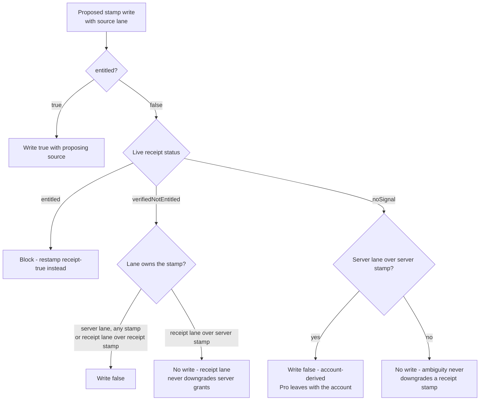
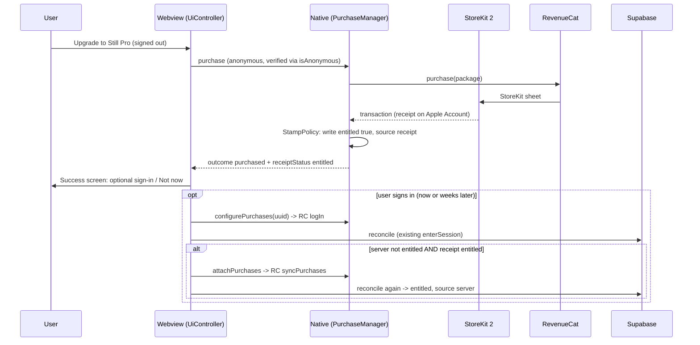

# feat: Apple purchase-first Pro flow (Guideline 5.1.1 fix)

## Summary

Restructure the Apple app so Still Pro is purchasable with no account: RevenueCat runs anonymously
until an optional sign-in, the device's StoreKit 2 receipt becomes a first-class entitlement
authority alongside the server, the App Group stamp gains a `source` field with a single StillKit
policy gating every downgrade write on a live receipt check, and the post-purchase success screen
offers optional sign-in for cross-surface Pro and settings sync. Ships with the Apple marketing
version returned to 1.0 (build 4) for resubmission on the rejected version train.

---

## Problem Frame

Apple rejected macOS 1.0 (3) under Guideline 5.1.1(v): email registration is required before
purchasing a non-account-based IAP. The requirement is structural, not cosmetic:

- `PurchaseManager.configure` refuses anonymous configuration and `PurchaseDecision.readiness`
  returns `.notConfigured` for a nil/empty app-user id — purchase is impossible without a
  signed-in Supabase UUID (KTD5 of the founding build plan).
- `UiController.startUpgrade()` routes signed-out users into sign-in with a persisted
  purchase-intent continuation; the paywall (and its Restore button) is unreachable signed out.
- The App Group entitlement stamp that unlocks the Safari extension is written only from
  server-confirmed sync state (`apple-session.onSyncState`, `confirmed && cloudReachable`), and a
  voluntary sign-out deliberately stamps `entitled:false` — entitlement is 100% account-derived.

The app has zero production users (1.0 never released), so the flow can be restructured without
migrating existing purchasers. Both platform binaries (iOS and macOS) must carry the fix — they
are reviewed independently against the same guideline.

---

## Requirements

Origin R-IDs (R1–R12) carry over verbatim from the brainstorm; R13+ are hardening requirements
from flow analysis. Every implementation unit cites these.

**Purchase flow (Apple)**

- R1. "Upgrade to Still Pro" opens the native purchase sheet directly, fully signed out, with no
  email or registration step anywhere before purchase completion.
- R2. Purchases proceed on an anonymous RevenueCat identity when no session exists; RevenueCat is
  keyed to the Still account identity only at or after sign-in.
- R3. The post-purchase success screen offers optional sign-in with cross-surface framing and is
  dismissible without any input ("Not now" carries equal visual weight). A signed-in purchaser
  sees a sync-flavored success with no account CTA.
- R4. "Restore Purchases" is available signed out — paywall footer link and a settings row — and
  fully restores receipt-based Pro with no account.

**Entitlement behavior**

- R5. Receipt-proven entitlement unlocks Pro in both the app and the Safari extension without an
  account: the App Group stamp honors device-local receipt state.
- R6. Never-downgrade: sign-in, sign-out, account deletion, and failed or absent server reconciles
  never remove Pro proven by the device's current receipt. Only verified Apple-side revocation
  (refund) or genuine receipt absence downgrades.
- R7. Signing in on an entitled device attaches the purchase to the Still account via ID-level
  merge; the existing webhook → Supabase → reconcile spine records and distributes it unchanged.
- R8. Signing in on a device that never purchased delivers entitlement from the server profile
  (existing behavior preserved).
- R13. Every `entitled:false` App Group write — server mirror, sign-out teardown, launch check —
  is gated on the current receipt status (a bounded-fresh cached snapshot; see the KTD for
  refresh sites and the blocked-write re-read rule) with tri-state semantics AND source-aware
  precedence:
  `entitled` blocks any downgrade (restamp receipt-true instead); a false write otherwise lands
  only when the proposing lane owns the stamp it is downgrading — server-lane proposals (sign-out
  teardown, server mirror) may downgrade server-source stamps always and receipt-source stamps
  only on `verifiedNotEntitled`; receipt-lane proposals (launch/foreground refund check) may
  downgrade receipt-source stamps only on `verifiedNotEntitled` and never touch server-source
  stamps. `noSignal` never downgrades a receipt-source stamp. One enforcement home: the policy
  runs inside `EntitlementBridge`'s set path (StillKit), not at call-sites.
- R14. Signed-out Restore (and the purchase path's already-owned short-circuit) pre-flights the
  device receipt: when the receipt already proves `still_sync`, report success and stamp
  receipt-true WITHOUT calling RevenueCat restore — RevenueCat restore (which can transfer the
  entitlement between customers) is reached only by devices whose receipt check is negative.
- R15. An anonymous purchase or restore requires a verified-anonymous RevenueCat identity: if a
  prior sign-out's `logOut` failed and the SDK is still keyed to an account, retry the logOut
  first; never let a new buyer's receipt attach to a stale identity. `PurchaseDecision` accepts
  nil-user only when the identity is verified anonymous.
- R16. Launch ordering: the receipt check and (if entitled) the receipt-true restamp complete
  BEFORE `InstallGeneration.ensure` publishes a new install id, so a reinstall can never purge the
  Safari extension's entitlement while a valid receipt sits unstamped.
- R17. The webview learns receipt entitlement through the bridge (at boot, after purchase, after
  restore, on foreground) so a signed-out purchaser sees Pro in the app UI; server-derived state
  keeps precedence once signed in.
- R18. An Ask-to-Buy purchase approved while signed out resolves the pending paywall to the
  success screen on next foreground — pending resolution no longer requires a session.

**Backend**

- R19. The webhook reconciles each affected UUID independently: a UUID that no longer exists in
  `auth.users` (deleted account in a TRANSFER) is skipped without failing the event, so the
  surviving side still reconciles and RevenueCat's retries terminate.
- R20. Anonymous-only webhook events (no valid UUID among app_user_id/original/aliases) remain
  accepted no-ops (`200`, `reconciled: 0`) — pinned by test.

**Sign-in and story alignment**

- R9. The standalone "Sign in" entry's copy targets returning Pro users and sync.
- R10. Web/extension purchase mechanics are unchanged; checkout/account copy aligns to the story
  that the Still account carries Pro and settings across surfaces.
- R11. Product-truth statements (`AGENTS.md`, `STRATEGY.md`, `docs/monetization-design.md`,
  `docs/ARCHITECTURE.md`) are updated: sign-in optional for Apple-platform purchase, required for
  sync and for Pro in Chrome/Firefox.

**Compliance and release**

- R12. The resubmitted flow satisfies 5.1.1(v); App Review notes describe the new flow with a
  60-second verification script and explicitly name the `still_sync` IAP riding the submission.
- R21. Apple `MARKETING_VERSION` returns to `1.0` (all 8 build settings), `CURRENT_PROJECT_VERSION`
  stays `4` — the resubmission attaches to the rejected 1.0 version records. Browser-store
  packages stay at their staged 1.0.3.

---

## Key Technical Decisions

- **StoreKit 2 is the device receipt oracle; RevenueCat stays the purchase executor.** The
  oracle reads `Transaction.latest(for: "still_sync")` (NOT `currentEntitlements`, which
  excludes revoked transactions and would make refunds unobservable): a verified unrevoked
  transaction → `entitled`; a verified transaction with `revocationDate` set →
  `verifiedNotEntitled`; nil/unverifiable → `noSignal`. Identity-independent (survives
  RevenueCat `logOut`) and local; RevenueCat `CustomerInfo` goes blank after sign-out and cannot
  serve as receipt truth. An empty ledger while offline or cache-cold is `noSignal`, never
  `verifiedNotEntitled`. The launch read is bounded by the existing 8-second settle-deadline
  pattern so a hung StoreKit call can neither defer install-id publication nor stall startup.
  The oracle also reads `Transaction.ownershipType`: a `familyShared` transaction counts as
  `entitled` for device-local Pro (correct Apple semantics if IAP Family Sharing is ever enabled)
  but is **never eligible for attach** — attaching a family member's purchase to their own Still
  account would transfer the buyer's entitlement away. (`still_sync` Family Sharing is OFF in
  App Store Connect by default; the portal checklist pins keeping it off for launch.)
  **Sync/async seam:** `Transaction.latest` is async while `EntitlementBridge.handle` is sync —
  the policy therefore consumes a cached `ReceiptStatus` snapshot owned by the app target and
  refreshed at every read site (launch, foreground, post-purchase, post-restore, and before a
  teardown proposal). When the policy blocks a false write because the cached status is
  `entitled`, the app schedules an immediate fresh read and re-submits the proposal if the fresh
  read is `verifiedNotEntitled` — so a mid-session refund converges within one re-read instead
  of riding a stale cache.
- **One enforcement home for never-downgrade: the policy runs inside `EntitlementBridge`'s set
  path.** Seating it in `WebBridgeRouter` would leave a live bypass: `SafariWebExtensionHandler`
  routes raw entitlement messages through its own `EntitlementBridge`, whose set branch writes
  unconditionally — and the extension process has no receipt oracle. The policy function
  (StillKit, swift-test covered) receives (proposed write with source, live receipt status,
  current stamp with source) and returns the write decision; the receipt status arrives as an
  injected provider closure (like `now`/`installId`), defaulting to `noSignal`. The app target
  injects the live StoreKit read; the extension handler's entitlement lane additionally becomes
  read-only (`getEntitlement` only) since `noSignal` alone would still permit `entitled:true`
  forgeries and the extension must never compute or write entitlement. TypeScript still avoids
  sending doomed writes (defense in depth), but the bridge is authoritative. "One home" applies
  to the App Group stamp specifically — the extension's 30-day TTL and install-generation purge
  remain deliberate, separate downgrade authorities on its derived browser.storage copy; ADR 0003
  records this three-authority layering explicitly (and references the deferred cross-orchestrator
  consolidation candidate in `docs/plans/2026-07-14-001-architecture-deepening-index.md`, which
  stays deferred).
- **The stamp record gains `source: "receipt" | "server"`.** The envelope keeps hand-written
  `encode(to:)` with literal-JSON-string tests (Codable drops nil keys otherwise — prior lesson).
  The Safari extension's `parseNativeEntitlement` already ignores unknown fields; a pinning test
  makes that load-bearing. Old envelopes without `source` parse as before (treated as server).
- **RevenueCat configures anonymously at native app launch.** `PurchaseManager.configure()` drops
  the account requirement; the webview's `configurePurchases(uuid)` → `logIn` re-key path is
  unchanged (RevenueCat's documented pattern for optional-login apps). No `configure(appUserID:)`
  at launch — the Supabase session lives in the webview and arrives via the bridge.
- **Attach evaluation lives in `enterSession` and foreground re-entry.** Rule: server says
  not-entitled AND receipt says entitled → `attachPurchases` (RevenueCat `syncPurchases`) →
  reconcile again. Covers the logIn no-merge edge (account already carries an anonymous alias —
  RevenueCat merges nothing and fires no webhook), late Ask-to-Buy approvals, and web-refund
  back-fill. Idempotent: the second reconcile finds the server entitled. Placement rationale: the
  rule needs server truth, session identity, and bridge availability simultaneously fresh, which
  coincide only here; a native event-driven alternative would need a new privileged native→web
  push channel (the only existing push lane is deliberately non-privileged) for seconds of
  latency. **Teardown race guard (both layers):** natively, `attachPurchases` carries the same
  signed-in guard as the other privileged purchase calls (`currentAppUserID != nil`, nulled
  synchronously at the start of `reset()`) so an attach arriving after sign-out begins is
  refused — otherwise `syncPurchases` under default transfer semantics would attach the receipt
  to the fresh post-logOut anonymous user, revoking it from the account. The guard additionally
  asserts SDK identity equality (`Purchases.shared.appUserID == currentAppUserID`) — non-nil
  alone doesn't prove the SDK identity matches after a timed-out re-key — and skips the attach
  entirely when the entitling transaction's `ownershipType` is `familyShared`. In TypeScript,
  `enterSession` snapshots the teardown generation on entry and bails out of the attach step and
  the second reconcile when it changed (the existing guard filters only state projections, not
  in-flight side effects).
- **Signed-out Restore pre-flights the receipt (R14).** RevenueCat's project-level restore
  behavior stays on the default "Transfer to new App User ID" (their recommendation for
  optional-login apps; the restrictive setting is a documented rejection vector) — which is
  exactly why the app must not call RC restore when the receipt already proves Pro: under
  transfer semantics that call would strip the entitlement from the signed-in account it was
  attached to. Portal verification of this setting is an operational checklist item.
- **Bridge grows two hand-routed kinds** per `docs/adr/0001-bridge-message-kinds-stay-hand-routed.md`:
  `receiptStatus` (tri-state read for R17) and `attachPurchases` (R7 attach step). Structured
  outcome enums cross the bridge, never display strings.
- **The 30-day staleness bounds are accepted for v1** (refunded non-launcher keeps Safari Pro up
  to 30 days; a Safari-only user who never launches the app re-locks after 30 days until they
  open it). Documented in the runbook and support playbook. The in-extension StoreKit receipt
  refresh that would eliminate both is a recorded deferred follow-up, not silent scope.
- **Sign-out still resets the RevenueCat identity** (`logOut`; prior P1 security fix). No
  automatic `syncPurchases` after logOut — that would transfer the purchase to the fresh
  anonymous user, revoking it from the account. Receipt-derived Pro persists through the stamp.

---

## High-Level Technical Design

Entitlement write policy (the R13 gate — StillKit pure function):

The full decision matrix (proposal source × receipt tri-state × current stamp source) is pinned
cell-by-cell in U1's `StampPolicyTests`. The two load-bearing source-aware cells: a signed-out
web purchaser's Mac still re-locks Safari on sign-out (server-lane false over a server-source
stamp writes even on `noSignal` — the ratified shared-machine invariant survives), and a
refunded Apple purchase never clobbers web-granted Pro (receipt-lane false over a server-source
stamp is dropped).

Signed-out purchase through optional attach (F1 → F2):

Launch ordering (R16): receipt check → StampPolicy restamp → `InstallGeneration.ensure` → normal
startup. The extension treats a null install id as strict no-op, so deferring publication is safe;
the purge-then-apply single-flight pull ordering is unchanged.

---

## Implementation Units

### U1. StillKit: receipt tri-state, stamp policy, envelope source, purchase readiness

- **Goal:** All new decision logic lands as pure, swift-test-covered StillKit functions: the
  tri-state receipt status type, the stamp write policy (R13), the envelope `source` field, and
  the verified-anonymous purchase readiness (R15).
- **Requirements:** R5, R6, R13, R15; enables R14, R16.
- **Dependencies:** none (first unit).
- **Files:** `apps/apple/StillKit/Sources/StillKit/ReceiptStatus.swift` (new),
  `apps/apple/StillKit/Sources/StillKit/StampPolicy.swift` (new),
  `apps/apple/StillKit/Sources/StillKit/EntitlementBridge.swift`,
  `apps/apple/StillKit/Sources/StillKit/PurchaseDecision.swift`,
  `apps/apple/StillKit/Tests/StillKitTests/StampPolicyTests.swift` (new),
  `apps/apple/StillKit/Tests/StillKitTests/EntitlementBridgeTests.swift`,
  `apps/apple/StillKit/Tests/StillKitTests/PurchaseDecisionTests.swift`.
- **Approach:** `ReceiptStatus` enum: `entitled`, `verifiedNotEntitled`, `noSignal` — a plain
  value StillKit never computes itself (the app target owns StoreKit I/O; StillKit owns the
  decision). `StampPolicy.decide(proposed:receipt:current:) -> StampDecision` implements the HTD
  matrix, including "block false + restamp receipt-true" and the source-aware lanes. **The policy
  seats inside `EntitlementBridge`'s set handling**: the receipt status arrives as an injected
  provider closure (like `now` and `installId`), defaulting to `{ .noSignal }` — the provider
  returns the app target's cached snapshot (sync, so `handle` stays sync); freshness is owned by
  the U2 refresh sites plus the blocked-write re-read rule in the KTD; the bridge also
  gains a read-only mode (parse `getEntitlement` only) that the Safari extension handler adopts —
  the extension process must never write the stamp. `EntitlementRecord` gains
  `source: EntitlementSource` (`receipt`/`server`); decode defaults absent `source` to `server`
  (old stamps); hand-written `encode(to:)` keeps deterministic key order; the header contract
  comment updates `updatedAt`'s meaning to "last time any authority confirmed".
  `PurchaseDecision.readiness` gains an `identityVerifiedAnonymous: Bool` input: nil
  `startingAppUserID` is `.proceed`-eligible only when verified anonymous, else a new
  `.staleIdentity` readiness that the UI maps to a retry-signout path.
- **Execution note:** Test-first — the policy matrix is the heart of R6/R13; write
  `StampPolicyTests` from the HTD table before the implementation.
- **Patterns to follow:** `docs/solutions/architecture-patterns/testable-swift-decision-logic-via-stillkit.md`;
  literal-JSON-string envelope tests per
  `docs/solutions/logic-errors/stale-entitlement-survives-app-reinstall.md`;
  structured outcomes per `docs/solutions/design-patterns/structured-outcome-over-cross-language-string.md`.
- **Test scenarios:**
  - Full matrix, cell by cell: `(false, receipt entitled, any)` → blocked + restamp true/receipt;
    `(false·server-lane, verifiedNotEntitled, any stamp)` → write; `(false·receipt-lane,
    verifiedNotEntitled, receipt stamp)` → write; `(false·receipt-lane, verifiedNotEntitled,
    server stamp)` → NO write; `(false·server-lane, noSignal, server stamp)` → write;
    `(false·server-lane, noSignal, receipt stamp)` → no write; `(false·receipt-lane, noSignal,
    any)` → no write; `(true, any, any)` → write with proposing source.
  - Covers AE2: sign-out proposed false over a receipt-entitled device → blocked.
  - Covers AE6: refund (`verifiedNotEntitled`, receipt-lane, receipt stamp) → false write lands.
  - Covers AE12: sign-out (server-lane) on a `noSignal` device with a server-source stamp →
    false write lands (shared-machine invariant preserved).
  - Edge: proposed server-true over receipt-source stamp → writes (server may refresh true);
    equal-value writes still refresh `updatedAt`.
  - Envelope: JSON literal with `source:"receipt"`; decode of legacy envelope without `source`
    → server; unknown extra fields ignored.
  - Bridge read-only mode: `setEntitlement` through a read-only bridge is refused (the extension
    handler's lane); `getEntitlement` still replies.
  - Readiness: nil user + verified anonymous → proceed; nil user + NOT verified → staleIdentity;
    existing identified-user matrix unchanged; identityChanged guard intact.
  - Attach eligibility (new pure function, covers AE14/AE13 native half): signed-in + SDK
    identity equal + ownership `purchased` → eligible; `familyShared` → refuse; identity
    mismatch or nil user → refuse.
- **Verification:** `swift test` in `apps/apple/StillKit` green; no app-target imports in StillKit.

### U2. Native layer: anonymous-first PurchaseManager, receipt oracle, launch ordering, new bridge kinds

- **Goal:** The app target configures RevenueCat anonymously at launch, exposes the StoreKit 2
  receipt oracle and attach action over the bridge, orders launch per R16, and routes every stamp
  write through `StampPolicy`.
- **Requirements:** R1, R2, R14, R15, R16, R17 (native half), R18 (native foreground refresh).
- **Dependencies:** U1.
- **Files:** `apps/apple/Still/Shared (App)/Purchases/PurchaseManager.swift`,
  `apps/apple/Still/Shared (App)/WebBridgeRouter.swift`,
  `apps/apple/Still/Shared (App)/ViewController.swift`.
- **Approach:** `configure()` (no user id) runs **synchronously in `viewDidLoad` before
  `loadFileURL`** — so a stored-session webview boot's `configurePurchases(uuid)` can only ever
  take the `logIn` re-key branch, never a racing first-configure (a double-configure would
  replace the RevenueCat singleton and drop in-flight completions). The existing
  `configure(appUserID:)`/`logIn` re-key path is kept verbatim for the webview's sign-in call.
  `stillProPackage()`, `priceString()`, and `hasStillPro()` relax their `currentAppUserID != nil`
  guard to "configured AND (verified anonymous OR signed in)" per R15 — without this, the
  flagship signed-out purchase resolves `.unavailable` (nil package) and the anonymous paywall
  has no localized price. New `receiptStatus()` reads
  `Transaction.latest(for: productID)` (NOT `currentEntitlements` — it excludes revoked
  transactions, which would make refunds unobservable): verified + `revocationDate == nil` →
  `entitled`; verified + `revocationDate != nil` → `verifiedNotEntitled`; nil or unverifiable →
  `noSignal` (cold cache/offline is indistinguishable from never-bought by design). The launch
  read is bounded by the existing 8s `awaitSettled` deadline — timeout maps to `noSignal` and
  startup proceeds. `restore()` pre-flights `receiptStatus()` — `entitled` short-circuits to
  success + restamp without touching RevenueCat (R14); same pre-flight guards
  `purchaseStillPro()`'s already-owned path. Anonymous purchase path asserts
  `Purchases.shared.isAnonymous`, retrying `reset()` once when a stale identity lingers (R15 →
  `staleIdentity` outcome on second failure). `attachPurchases` carries the same signed-in guard
  as the other privileged calls (`currentAppUserID != nil` AND
  `Purchases.shared.appUserID == currentAppUserID`; `reset()` nulls it synchronously first) so a
  teardown in flight — or a timed-out re-key that left the SDK on a different identity — can
  never convert an attach into a transfer-to-anonymous; it also refuses when the entitling
  transaction is `familyShared`. The cached `ReceiptStatus` snapshot lives here, refreshed at
  launch, foreground, post-purchase, post-restore, and before teardown proposals; a policy
  block-on-cached-entitled triggers an immediate fresh read and re-proposal per the KTD. The
  `setEntitlement` wire shape stays source-less: webview proposals are server-lane by definition
  (the webview only ever mirrors server state); the native launch/foreground restamp is the only
  receipt-lane proposer.
  Launch sequence in `ViewController.viewDidLoad`: async task runs receipt check → restamp
  through the bridge (policy inherited) → `InstallGeneration.ensure` → rest of startup;
  foreground (`didBecomeActive`) repeats check+restamp. `WebBridgeRouter` adds `receiptStatus`
  (replies `{receipt:"entitled"|"verifiedNotEntitled"|"noSignal"}`) and `attachPurchases`
  (RevenueCat `syncPurchases`, replies `{entitled}`); `setEntitlement` flows through
  `EntitlementBridge`, where the policy now lives — the router itself needs no policy logic.
- **Patterns to follow:** ADR `docs/adr/0001-bridge-message-kinds-stay-hand-routed.md` checklist
  for the two new kinds; keep `PurchaseManager` a thin adapter (decisions in U1's StillKit).
- **Test scenarios:** Decision logic covered in U1 by design. Bridge-shape assertions ride U3's
  TS tests (fake port). `Test expectation: none (app target has no XCTest bundle) — logic
  extracted to U1; runtime behavior verified by U8's build + on-device checklist.`
- **Verification:** Both platform Release builds compile; manual trace of launch order in code
  review (receipt → stamp → install-generation) — this ordering is also pinned by an AE in U8's
  checklist.

### U3. Core session spine: signed-out purchase/restore, attach evaluation, receipt feed, teardown rework

- **Goal:** The TypeScript orchestration supports the signed-out lifecycle end to end and the
  attach step at every session establishment, and the teardown semantics become receipt-aware.
- **Requirements:** R2, R4, R6, R7, R8, R17, R18; defense-in-depth for R13.
- **Dependencies:** U1, U2 (bridge kinds).
- **Files:** `packages/core/src/native/bridge.ts`, `packages/core/src/sync/apple-session.ts`,
  `packages/core/src/native/__tests__/bridge.test.ts`,
  `packages/core/src/sync/__tests__/apple-session.test.ts`,
  `packages/core/src/sync/__tests__/teardown-parity.test.ts`,
  `packages/app-webview/src/main.ts`.
- **Approach:** `NativeMessage` union gains `receiptStatus` and `attachPurchases`;
  `PurchaseOutcome` gains `staleIdentity` (structured outcome for the R15 second-failure path);
  `AppleSessionBridge` widens accordingly. `createAppleSession` changes:
  (a) new `refreshReceipt()` — bridge `receiptStatus` → controller receipt-entitlement input —
  called at boot wiring, post-purchase, post-restore, and on `visibilitychange`;
  (b) `onGet` signed-out branch: skip `enterSession`, purchase directly, feed receipt state,
  route to the success screen (signed-in branch unchanged, double-charge guard intact) — and
  load the localized price for the signed-out paywall via `bridge.price()` at boot wiring and
  paywall open (price is currently loaded only inside `enterSession`, which this branch skips);
  (c) `onRestore` signed-out branch: `bridge.restore()` (which pre-flights the receipt natively)
  → refresh receipt → restored/restored-none UI states without requiring `userId`;
  (d) `enterSession` gains the attach evaluation after the first reconcile: server-not-entitled ∧
  receipt-entitled → `attachPurchases` → `sync.onSignedIn` again (single retry, idempotent);
  (e) `onVisibilityChange` drops the `userId` requirement: foreground always refreshes receipt;
  a `pending` purchase flow resolving to receipt-entitled lands on the success screen (R18);
  (f) `onSyncState` skips mirroring `entitled:false` when the last receipt read was `entitled`
  (native policy enforces authoritatively; this avoids doomed writes);
  (f2) `enterSession` snapshots the teardown generation on entry and aborts the attach step and
  the second reconcile when a teardown intervened (the existing guard filters only projections —
  without this, an in-flight attach after sign-out would transfer the purchase to the fresh
  anonymous RevenueCat user and restart write-through for the departed account);
  (g) `signOutEverywhere`/`deleteAccountEverywhere` keep RevenueCat `signOut` and the Supabase
  teardown, but the App-Group downgrade is now policy-gated (native) — amend the pinned
  expectation "sign-out mirrors entitled:false" to "sign-out proposes false; receipt-entitled
  devices keep Pro" and update `teardown-parity.test.ts` to assert the *proposal*, with a
  receipt-entitled fake showing no downgrade.
- **Execution note:** Amend the two pinned test files deliberately and first — they codify the
  old account-only semantics; changing them is the semantic change. The teardown-parity Apple
  harness currently wires `bridge.available: false` (the native leg was deliberately out of
  scope there); flip that seam to `available: true` with a receipt-entitled fake before the new
  proposal assertion is expressible.
- **Patterns to follow:** `apple-session.test.ts` harness (`makeBridge(over)` partial fakes, real
  `UiController`, configurable `SyncState` projection); mirror-fixes convention — audit sign-out,
  delete-account, and session-expiry siblings in this same unit.
- **Test scenarios:**
  - Covers AE1: signed-out purchase → receipt feed → controller entitled without any session.
  - Covers AE2: sign-in on entitled device → attach fires when server lags → second reconcile;
    sign-out afterwards → no App-Group false proposal reaches the bridge when receipt entitled.
  - Covers AE4: signed-out restore resolves restored state, no `userId` needed.
  - Covers AE5: web purchaser signs in on a receipt-less device → no attach call (receipt
    noSignal), server entitlement flows as today (R8).
  - Attach idempotency: second `enterSession` with server-entitled makes no `attachPurchases` call.
  - Ask-to-Buy: purchase `pending`, foreground with receipt entitled → success screen, signed out.
  - Covers AE13: sign-out fired while `enterSession`'s attach evaluation is in flight → no
    `attachPurchases` call reaches the bridge, no second `onSignedIn` for the departed user.
  - Offline signed-out purchase attempt → existing calm offline copy unchanged.
  - Bridge wire tests: new kinds round-trip, malformed replies → structured failures.
- **Verification:** `pnpm --filter @still/core test` green including amended pins; typecheck.

### U4. Webview UI: ungated upgrade, success screen, receipt-fed entitled state, copy

- **Goal:** The visible flow: Upgrade opens the paywall signed out, purchase success lands on the
  optional-sign-in success screen, Restore is reachable signed out, and all copy lands in
  `STRINGS` with the ratified rules.
- **Requirements:** R1, R3, R4, R9, R10 (copy), R17 (UI half).
- **Dependencies:** U3.
- **Files:** `packages/core/src/ui/controller.svelte.ts`, `packages/core/src/ui/App.svelte`,
  `packages/core/src/ui/components/PaywallSheet.svelte`, `packages/core/src/ui/strings.ts`,
  `packages/core/src/ui/__tests__/controller.test.ts`, `packages/core/src/ui/__tests__/App.test.ts`.
- **Approach:** Controller gains `receiptEntitled` state fed by the session (U3); the `entitled`
  accessor becomes `serverEntitled || receiptEntitled` with server precedence for sync-related UI.
  `popupState` gains a `pro-no-account` value for receipt-entitled-with-no-session (today
  `!userId` short-circuits to `"signed-out"` before `entitled` is consulted, which would leave an
  anonymous purchaser staring at a dead "Get Still Pro" button): the home screen shows
  entitled-but-no-account copy with the "Sign in" entry still visible. `startUpgrade()` on Apple
  (`host.canPurchase`): drop the sign-in redirect and purchase-intent persistence — open the
  paywall directly regardless of session (web/extension checkout branch untouched;
  `purchaseIntent` machinery stays for the web host). Success screen: a **dedicated presentation
  path, NOT the existing 2.5s payoff** — the current payoff is a single wrapping auto-dismissing
  button sized for one line, structurally incapable of hosting two CTAs; the new success state
  has no auto-dismiss timer, renders two independent buttons, and keeps the shared focus-trap
  conventions (first focus lands on `Create free account`). Two branches — signed-out: headline +
  one benefit-led card ("Use Still Pro in Chrome, Firefox, and on your other devices — create a
  free account to sync") + equal-weight `Create free account` / `Not now` + reassurance line
  ("Without an account your purchase stays with your Apple Account; Restore Purchases brings it
  back anytime."); signed-in: sync-flavored confirmation only (no account CTA); the quiet 2.5s
  payoff remains for web/extension entitlement transitions where it was designed. `PurchaseFlow`
  gains a `staleIdentity` state mapped from the new outcome, with STRINGS copy and a single
  "Try again" CTA that re-runs the native reset-then-purchase sequence (never a "sign out"
  instruction — the user is already signed out). Paywall gains the pre-purchase reassurance
  one-liner ("No account needed — you can add sync later."); the existing secondary Restore
  button is the single restore affordance, relabeled "Already purchased? Restore" in the
  signed-out state (no second footer link — one affordance, one wording). Reword
  `STRINGS.paywall.restoredNone` to be account-agnostic ("No purchase found on this device.") —
  the current "on this account" presupposes an account the signed-out flow never created.
  Sign-in entry copy per R9. All new strings in `STRINGS` with the established rule comments (no
  web prices, shipped capabilities only, sentence case, "every supported surface").
- **Patterns to follow:** PR #45 CTA-matrix pattern — new UI states extend the flow unions +
  `STRINGS` + pinned tests, never ad-hoc booleans; `design-contract.test.ts` stays green.
- **Test scenarios:**
  - CTA matrix: signed-out + canPurchase → Upgrade opens paywall (no sign-in sheet, no
    purchase-intent persisted); web host unchanged (checkout still sign-in-first).
  - Signed-out paywall shows the localized price on the CTA (price loaded outside enterSession).
  - `pro-no-account` home state: receipt-entitled + no session → entitled copy, no buy CTA,
    Sign in entry visible.
  - `staleIdentity` flow state renders its copy + "Try again" CTA; retry fires the native
    reset-then-purchase sequence.
  - Success screen has no auto-dismiss: it persists until an explicit choice; both CTAs
    tab-reachable; first focus on the account CTA.
  - Covers AE1: purchase success signed out → success screen with equal-weight account/Not-now.
  - Success screen signed-in branch: no account CTA.
  - `Not now` dismisses; Sign in entry later still works (controller state clean).
  - Entitled merge: receipt-only → Pro UI without sync rows; both → server precedence.
  - Restore link visible and enabled signed out; restored-none state copy.
  - Regression: already-entitled account signing in via upgrade path still skips the buy sheet.
- **Verification:** `pnpm --filter @still/core test` + `pnpm build`; Playwright fixtures stay
  green (extension surfaces untouched).

### U5. Webhook: per-UUID fault tolerance and behavior pins

- **Goal:** A TRANSFER involving a deleted account cannot wedge the event; anonymous-event
  handling is pinned.
- **Requirements:** R19, R20.
- **Dependencies:** none (parallel).
- **Files:** `supabase/functions/revenuecat-webhook/handler.ts`,
  `supabase/functions/revenuecat-webhook/handler.test.ts`, `supabase/functions/_shared/pg-store.ts`
  (error classification only if needed).
- **Approach:** Reconcile each UUID from `affectedUuids` independently; classify the
  missing-auth-user failure (FK violation on `entitlements.user_id`) as skip-and-continue while
  other errors keep the current fail-and-release-claim retriability. Event completes when every
  UUID either reconciled or was skipped-as-deleted.
- **Execution note:** Test-first against the existing `mockStore()`/`mockRc()` harness.
- **Patterns to follow:** existing `handler.test.ts` dependency-injection style; claim-token
  idempotency machinery untouched.
- **Test scenarios:**
  - Covers AE8 (new): TRANSFER `transferred_from:[deleted-uuid]`, `transferred_to:[live-uuid]` →
    200, live side reconciled, event completed.
  - Anonymous-only event (`$RCAnonymousID` everywhere) → 200 `reconciled: 0`, claimed+completed (pin).
  - TRANSFER anon→uuid → uuid side reconciled.
  - Transient store error on one UUID → 500 + claim released (retriability preserved).
- **Verification:** `deno lint && deno check */index.ts && deno test` in `supabase/functions`.

### U6. Safari extension: envelope tolerance pin

- **Goal:** Prove the extension's entitlement parser is indifferent to the new `source` field and
  legacy envelopes — no extension behavior change in this release.
- **Requirements:** R5 (extension half), guards R13's format change.
- **Dependencies:** U1 (envelope shape).
- **Files:** `packages/ext-safari/lib/__tests__/entitlement-pull.test.ts`,
  `packages/ext-safari/lib/entitlement-pull.ts` (header contract comment only),
  `apps/apple/Still/Shared (Extension)/SafariWebExtensionHandler.swift` (adopt the read-only
  entitlement bridge from U1).
- **Approach:** Pin: envelope with `source:"receipt"` parses identically to today's shape; the
  extension's TTL/no-signal/purge semantics unchanged. The handler constructs the read-only
  bridge (U1) so the extension process can never write the stamp; the `updatedAt` meaning in the
  pull's header comment updates to "last time any authority confirmed."
- **Test scenarios:** envelope with `source` field → applied; without → applied; malformed → no
  signal (existing pins re-run). Swift-side read-only refusal is pinned in U1.
- **Verification:** `pnpm --filter @still/ext-safari test`.

### U7. Versions, product-truth docs, ADR, release runbook

- **Goal:** The repo's authoritative documents match the shipped behavior, and the resubmission
  mechanics are staged.
- **Requirements:** R11, R12 (notes content), R21.
- **Dependencies:** conceptual — write after U1–U4 stabilize wording.
- **Files:** `apps/apple/Still/Still.xcodeproj/project.pbxproj` (MARKETING_VERSION 1.0.3 → 1.0,
  8 occurrences; CURRENT_PROJECT_VERSION stays 4),
  `docs/adr/0002-entitlement-authority-receipt-and-server.md` (new),
  `AGENTS.md` (product truths), `STRATEGY.md` (Pro row), `docs/monetization-design.md`
  (principle 8 amendment + §6 receipt-authority nuance), `docs/ARCHITECTURE.md`
  ("server-authoritative" nuance), `docs/release/01-apple-app-store.md` (resubmission section:
  reviewer-notes script, IAP "Ready to Submit" re-attach warning, RevenueCat transfer-behavior
  portal check, TN3186 sandbox checklist, 30-day staleness support notes), `CHANGELOG.md`.
- **Approach:** ADR 0003 (numbered after the existing `docs/adr/0002-packaged-css-owns-bundled-hides-only.md`)
  records: receipt+server dual authority, tri-state semantics, the StillKit policy home, and the
  explicit relationship to deferred candidate 5 (Apple-side only; cross-orchestrator
  consolidation still deferred). The pbxproj edit also raises `MACOSX_DEPLOYMENT_TARGET` from
  11.0 to 12.0 (all four build settings) — the StoreKit 2 receipt oracle requires macOS 12, the
  app has zero production users, and Big Sur is EOL; the extension handler's
  `#available(..., macOS 11.0, *)` branches become dead-but-harmless, and the supported-macOS
  floor change is noted in the same product-truth docs. Product truths change to: "Still Pro can
  be purchased on Apple platforms without an account; one entitlement can be restored across
  supported surfaces by signing into the same Still account; sign-in is required for sync and for
  Pro in Chrome/Firefox, not for the free tier or Apple-platform purchase." Store listing copy
  (`docs/release/store-listing-copy.md`) was reviewed against the new flow: it already leads with
  "No account required" and its cross-surface sign-in claims remain accurate — no listing change
  required (origin R11's "where applicable" is dispositioned as not applicable). Support playbook
  gains: the transfer audit trail is the existing `revenuecat_events` table (TRANSFER payloads
  are queryable — "why did my Pro disappear" resolves there), plus the 30-day staleness matrix
  and offline-reinstall recovery note. `CHANGELOG.md` gains an entry: Apple purchase-first Pro
  flow — purchase without an account, optional post-purchase sign-in, receipt-based entitlement
  on Apple platforms (Guideline 5.1.1 resubmission). Reviewer notes use the researched script
  (launch free → sandbox purchase signed out → optional account screen with Not now → signed-out
  Restore → in-app account deletion path), naming the `still_sync` IAP. Portal checklist adds:
  verify `still_sync` Family Sharing remains OFF in App Store Connect.
- **Test scenarios:** `Test expectation: none — docs and build-settings only. The pbxproj edit is
  verified by `xcodebuild -list` parsing and U8's version assertion.`
- **Verification:** grep pins: zero `MARKETING_VERSION = 1.0.3` remain; AGENTS.md diff reviewed
  against the product-truth list; ADR linked from the deepening index doc.

### U8. Full verification and packaging readiness

- **Goal:** Prove the tree is releasable: all gates, both platform Release compiles, and an
  AE-mapped on-device checklist for the human sandbox pass.
- **Requirements:** R12 (verifiability), gates for all.
- **Dependencies:** U1–U7.
- **Files:** `docs/release/VALIDATION.md` (new addendum section for this change).
- **Approach:** Run the repository gates (`pnpm lint`, `typecheck`, `test`, `build`,
  `playwright --project=fixtures`; `swift test` in StillKit; `deno lint/check/test`), then
  unsigned Release `xcodebuild` for `Still (iOS)` and `Still (macOS)`. Write the VALIDATION
  addendum: automated results table + the on-device sandbox checklist mapped to acceptance
  examples (AE1 purchase signed out on macOS; AE2 sign-in/sign-out never-downgrade; AE3 Chrome
  unlock; AE4 delete+reinstall restore — **on iOS**, or on macOS only after manually deleting the
  Group Container (a plain macOS delete+reinstall preserves Group Containers, so the purge path
  never fires and the item passes vacuously); AE6 refund via a mechanism that actually sets
  `revocationDate` — a StoreKitTest local-session refund or sandbox
  `Transaction.beginRefundRequest` (auto-approved in sandbox) — while sandbox "clear purchase
  history" is a separate checklist item verifying the `noSignal` cell (absence, not revocation);
  Ask-to-Buy via `simulatesAskToBuyInSandbox`; reinstall restamp ordering (AE10) — also iOS for
  the same Group Container reason).
- **Test scenarios:** `Test expectation: none — this unit runs and records the others' gates.`
- **Verification:** every gate exit 0; both compiles succeed; addendum committed.

---

## Acceptance Examples

Origin AE1–AE6 carry forward unchanged. New:

- AE7. **Covers R7 boundary.** Given account A entitled via an attached Apple purchase, when the
  device signs into account B and the attach evaluation syncs the receipt, then RevenueCat
  transfers the entitlement (A loses it at A's next reconcile; A's other browsers ride the ≤30-day
  cache until then) and the webhook reconciles both sides. Documented, tested at the webhook
  layer — not "fixed" ad hoc.
- AE8. **Covers R19.** Given a TRANSFER whose `transferred_from` UUID was deleted, when the
  webhook processes it, then the surviving UUID reconciles and the event completes (no retry loop).
- AE9. **Covers R18.** Given a signed-out Ask-to-Buy purchase approved while the app is
  backgrounded, when the app foregrounds, then the pending paywall resolves to the success screen
  and Safari has Pro — still with no account.
- AE10. **Covers R16.** Given an entitled reinstall, when the app first launches (online), then
  the Safari extension never observes a purged-without-restamp state — the receipt restamp lands
  before the new install id is published.
- AE11. **Covers R14.** Given a device whose receipt is already attached to account A, when a
  signed-out user taps "Already purchased? Restore", then Pro is confirmed from the receipt
  without any RevenueCat restore call and account A's entitlement is untouched.
- AE12. **Covers R13 boundary.** Given a web-purchasing account user on a Mac that never bought
  on Apple (receipt `noSignal`, stamp `source:server`), when they sign out, then the Safari
  extension re-locks — account-derived Pro leaves with the account, preserving the ratified
  shared-machine sign-out invariant.
- AE13. **Covers the R7 teardown race.** Given sign-out fired while the attach evaluation is in
  flight, then no `attachPurchases` reaches RevenueCat and the purchase is never transferred to
  the post-sign-out anonymous identity.
- AE14. **Covers R7 family boundary.** Given a device whose `still_sync` transaction is
  `familyShared`, when any Still account signs in, then the attach evaluation never calls
  `attachPurchases` — device-local Pro works, but the buyer's entitlement is never transferred
  to a family member's account.

---

## System-Wide Impact

**Surfaces touched:** StillKit (new entitlement vocabulary + the policy seat; `updatedAt`
semantics widen to "last time any authority confirmed" — header contracts in
`EntitlementBridge.swift` and `packages/ext-safari/lib/entitlement-pull.ts` updated to match);
both app targets (anonymous RevenueCat configure, launch reorder bounded by the 8s settle
deadline, two new hand-routed bridge kinds, guarded `attachPurchases`); core sync
(signed-out branches, attach evaluation, receipt-aware teardown proposals, extended teardown
generation guard); webview UI (`entitled = serverEntitled || receiptEntitled`, ungated Apple
paywall, success screen — web-host checkout branch byte-for-byte unchanged); Safari extension
(no behavior change; parser tolerance pinned; native handler's entitlement lane becomes
read-only); webhook (per-UUID fault isolation, no schema change); product-truth docs.

**Parity obligations (mirror-fixes convention):** sign-out, account-deletion, and session-expiry
paths are audited together in U3 — all three now *propose* `entitled:false` and the native
policy decides. The teardown-parity contract forks per surface and the suite must say so: the
extension harness keeps "signed out → record purged" (no device receipt exists there — the
extension-session orchestrator is deliberately untouched, coherent because the server remains
Chromium's sole authority); the Apple harness becomes "sign-out proposes false; the receipt and
stamp source decide." The suite's header comment is updated so the parity pin stays honest
rather than silently weakened. This is the Apple half of deferred candidate 5; cross-orchestrator
consolidation stays deferred (ADR 0003).

**Failure propagation:** receipt oracle unreachable (`noSignal`) → no receipt-stamp downgrade
anywhere, upgrades still flow from the server lane; attach failure → server stays not-entitled,
retried at every `enterSession`/foreground, Apple surfaces unaffected; webhook outage → Apple
surfaces unaffected, browser surfaces self-heal via reconcile-on-sign-in; deleted-account
TRANSFER → surviving UUID reconciles, event completes; App Group degraded → in-memory fallback,
extension sees no signal, TTL rides (unchanged); StoreKit launch check hung → settle deadline
maps to `noSignal`, startup proceeds, install-id publication deferred at most one deadline.
Offline reinstall with a valid-but-unreadable receipt: the purge legitimately fires and Pro
re-locks until the first online launch restamps — pinned in tests and documented in the support
playbook (deferring the install-id publish on `noSignal` would reopen the issue-#63 stale-grant
hole for account users, so proceeding is correct).

---

## Open Questions

None blocking. Two policy cells surfaced by the architecture review were resolved during
planning because both resolutions preserve already-ratified invariants rather than introduce new
behavior; recorded here for traceability:

- **Sign-out on a `noSignal` device with a server-source stamp writes `false`** (AE12). The
  alternative — letting the stamp ride the 30-day TTL — would have silently weakened the ratified
  shared-machine sign-out invariant for every non-receipt device. Source-aware lanes preserve
  both: receipt Pro survives cold caches; account-derived Pro leaves with the account.
- **A receipt refund never downgrades a server-source stamp.** The alternative would let an
  Apple-side refund transiently lock Safari for a web purchaser (double-purchase case) until the
  next reconcile. The receipt lane owns only receipt-source stamps; the server lane owns its own.

---

## Scope Boundaries

- **Deferred to Follow-Up Work:**
  - In-extension StoreKit receipt refresh at `getEntitlement` time (eliminates both 30-day
    staleness bounds). Deliberately out: adds StoreKit to the extension process during a
    review-critical resubmission.
  - Cross-orchestrator consolidation of never-downgrade rules (deferred candidate 5) — ADR 0003
    documents the Apple-side half only.
  - Full SIWA dead-code excision (dormant since PR #43; unchanged here).
  - `/ce-compound` solution doc for purchase-first + receipt trust after the work lands.
- **Not in this change:** web/extension purchase mechanics (story-copy alignment only); the other
  three rejection items' portal work (IAP promo image deletion, demo-account provisioning beyond
  the reviewer-notes description, App Store Connect resubmission clicks); browser-store 1.0.3
  uploads (separate, post-approval per the coordinated gate).

---

## Risks & Dependencies

- **Semantics change to pinned teardown tests** — the riskiest edit is deliberate: amending
  `apple-session.test.ts:87` and `teardown-parity.test.ts` re-defines a ratified invariant.
  Mitigation: U3 amends them first with explicit new-language comments; ADR 0003 records why.
- **RevenueCat project setting is external state** — the default "Transfer to new App User ID"
  must be verified in the dashboard (portal checklist, U7 runbook edit). A restrictive setting
  would break signed-out restore during review.
- **StoreKit sandbox flakiness during review** (TN3186) — mitigated by the runbook checklist
  (agreement active, IAP re-attached and "Ready to Submit", bundle match) and reviewer notes.
- **`entitlements` FK behavior** — R19's skip-classification must not mask genuine store outages;
  only the missing-user error class is skipped.
- **Receipt oracle on cold caches** — `noSignal` mapping is load-bearing; treating empty as
  not-entitled would mass-downgrade. Pinned by U1's policy tests.
- **Oracle primitive choice is load-bearing** — `Transaction.currentEntitlements` excludes
  revoked transactions; using it would make `verifiedNotEntitled` unreachable and refund
  revocation (AE6) unimplementable. `Transaction.latest(for:)` is required. Pinned in U2's
  approach and reviewed in code review.

---

## Documentation / Operational Notes

- Portal actions recorded in the runbook (human): verify RevenueCat restore behavior = default
  transfer; delete the rejected IAP promotional image; confirm `still_sync` shows "Ready to
  Submit" and is named in the review notes; resubmission review-notes script (U7).
- Support playbook additions: refund/staleness matrix (30-day bounds), "open the Still app"
  recovery, double-purchase (web + Apple) refund guidance.
- Deploy: `supabase functions deploy revenuecat-webhook` with the repo's documented import-map
  flag after merge (only changed function).

---

## Sources & Research

- Origin requirements: `docs/brainstorms/2026-07-15-apple-purchase-first-pro-flow-requirements.md`.
- Repo grounding: `packages/core/src/native/bridge.ts` (KTD5 comments),
  `packages/core/src/sync/apple-session.ts` (`onSyncState` confirmed-gate, teardown generations),
  `packages/core/src/sync/service.ts` (`SIGNED_OUT.confirmed = true`),
  `apps/apple/Still/Shared (App)/Purchases/PurchaseManager.swift` (anonymous refusal, fail-closed
  re-key), `apps/apple/StillKit/Sources/StillKit/EntitlementBridge.swift`,
  `packages/ext-safari/lib/entitlement-pull.ts` (no-signal philosophy, single-flight),
  `supabase/functions/_shared/types.ts` (`affectedUuids` TRANSFER handling verified),
  `supabase/migrations/0001_init.sql` (entitlements FK).
- Institutional learnings: `docs/solutions/logic-errors/stale-entitlement-survives-app-reinstall.md`,
  `docs/solutions/security-issues/supabase-signout-leaves-local-session-on-revoke-failure.md`,
  `docs/solutions/security-issues/supabase-edge-function-hardening.md`,
  `docs/solutions/conventions/mirror-fixes-across-parallel-paths.md`,
  `docs/solutions/architecture-patterns/testable-swift-decision-logic-via-stillkit.md`,
  `docs/adr/0001-bridge-message-kinds-stay-hand-routed.md`,
  `docs/plans/2026-07-14-001-architecture-deepening-index.md` (deferred candidate 5).
- RevenueCat (docs verified 2026-07): anonymous configure + logIn merge semantics and the
  no-merge row (account already aliased); **no webhook on logIn merge** (staff-confirmed);
  restore-behavior options and the default-transfer recommendation for optional-login apps;
  `syncPurchases` transfer risk; `paymentPendingError` for Ask-to-Buy.
  Key URLs: revenuecat.com/docs/customers/identifying-customers,
  /docs/projects/restore-behavior, /docs/integrations/webhooks/event-types-and-fields.
- App Review practice: guideline 5.1.1(v) + 3.1.1 restore requirement; Apple-sanctioned optional
  post-purchase account framing; IAP "returned" on rejection (re-attach before resubmit); both
  platforms reviewed independently; TN3186 sandbox checklist.
