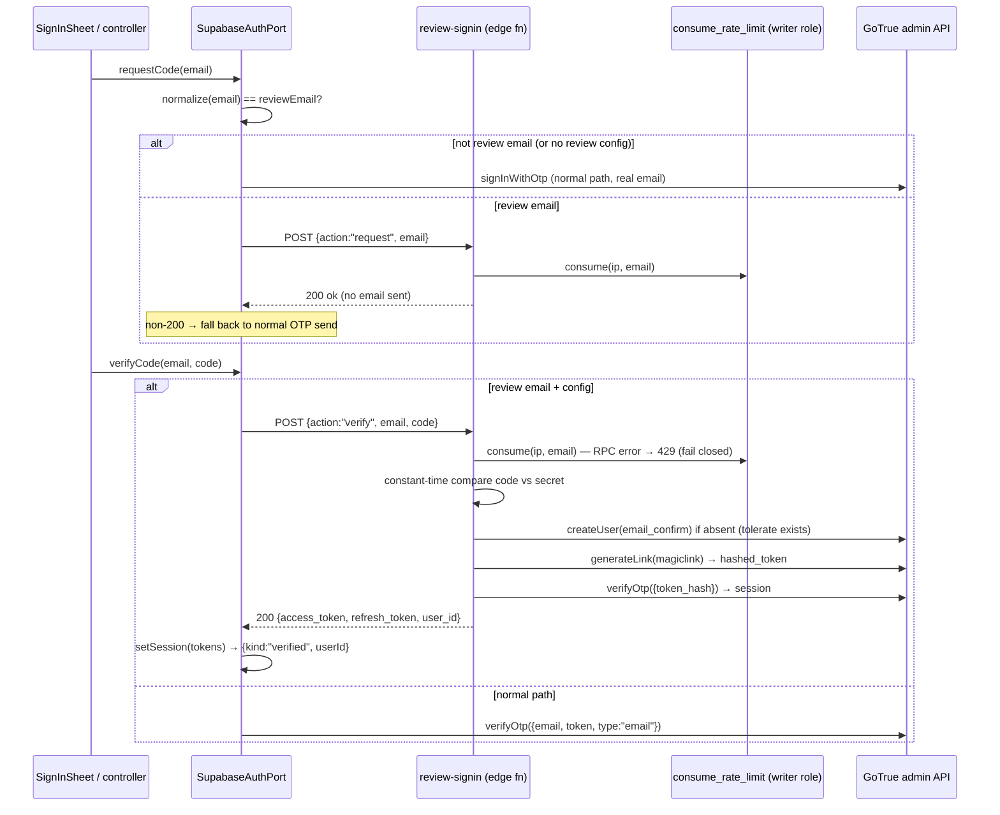
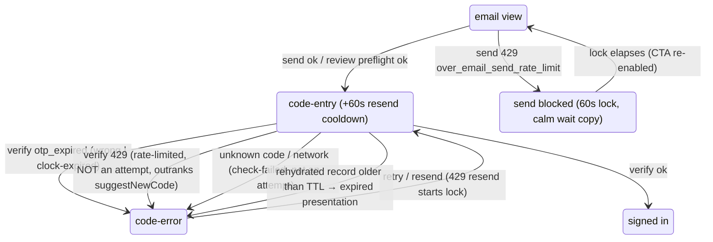

# fix: OTP verification error path + deterministic App Review sign-in

## Summary

Fix the email-OTP sign-in error path that Apple App Review hit under Guideline 2.1(a) — truthful, recoverable UI states for rate-limited, expired, wrong, and dead-end verification outcomes, classified by structured GoTrue error codes — and add a deterministic review sign-in: a fixed verification code accepted only for one designated review address (value deliberately held out of the repo — it lives only in the App Review notes and the `supabase secrets` deploy step; "the review address" below), minted server-side by a new guarded edge function, disclosed in App Review notes. Both fixes ship on the 1.0 build 4 resubmission train for macOS and iOS.

---

## Problem Frame

macOS 1.0 (3) was rejected under Guideline 2.1(a) twice over the same flow: App Review saw "an error message was displayed when we entered the verification code" during email-OTP sign-in, and reviewers need working demo credentials because they cannot receive OTP emails (they never access the demo account's inbox — Apple's own App Store Connect guidance says to provide any auth code "in advance in the Notes field"). The pending iOS submission shares the identical flow and will hit the identical wall.

Research established the likely failure mechanisms, ranked: (1) an email template containing a confirmation link lets mail-scanner prefetch consume the token — Supabase email OTP and magic link share **one single-use token**, so the 6-digit code dies before the reviewer types it and renders as "wrong code" forever; (2) a second send invalidates the first email's code, and the built-in SMTP sender allows ~2 emails/hour project-wide; (3) rate-limit responses (HTTP 429) are currently indistinguishable from generic failures in our client — the copy says "Try again," which invites hammering the limit. Separately, the current classification treats **every** 403 as "wrong code" (dead-ends conditions like `otp_disabled`), and expired-vs-wrong is judged only by the client clock.

The fix is three-layered: honest client-side error classification and wait states (code), a deterministic no-email review sign-in (code + one new edge function), and hosted-config remediation gates (operational, human-gated) — because a perfect client still cannot sign users in if the template or SMTP config is wrong.

---

## Requirements

**Error-path classification and UI (Item 1)**

- R1. `verifyCode` and `requestCode` outcomes are classified by GoTrue's structured `error.code` (`otp_expired`, `over_email_send_rate_limit`, `over_request_rate_limit`), never by message text and never by a status-code catch-all. A 403 without `error.code === "otp_expired"` no longer renders as "wrong code."
- R2. A rate-limited send (initial or resend) renders a truthful wait state: calm copy that is honest for both the 60-second per-user cooldown and the hourly SMTP cap, with the send/resend affordance disabled for a fixed 60-second lock. The lock state is independent of `codeRequestedAt` so expiry classification is never corrupted.
- R3. A rate-limited verify renders wait copy, does not count as a code attempt, and takes precedence over the "send a new code" suggestion (requesting a new code during an IP verify-lockout is bad advice). The verify button locks for the wait window (fixed 60 s, or the genuine retry-after when the outcome carries one) and re-enables automatically — mirroring the send/resend locks so the verify side can't be hammered either.
- R4. A failed resend never leaves the resend button instantly tappable; a rate-limited resend starts the 60-second lock.
- R5. Unknown or absent `error.code` maps to the calm non-attempt retry outcome (`verify-failed` / `send-failed`), never to "wrong code."
- R6. Rehydrating a pending code-entry older than the OTP TTL lands directly in the expired presentation (offer a new code), not on a dead code-entry form.
- R7. Port-level classification has direct test coverage (currently zero): the full matrix of `otp_expired`, both 429 codes, `otp_disabled`, code-absent 403, code-absent 500, and network throw, for both send and verify.

**Deterministic review sign-in (Item 2)**

- R8. Sign-in with the designated review email plus the fixed verification code succeeds on every supported surface wired with review config, without any email being sent, and yields a normal Supabase session (refresh, sign-out, account deletion all behave identically to an OTP-minted session).
- R9. The review path is fail-closed at every layer: absent client config → normal OTP for everyone; the edge function refuses when its secrets are unset; and the client falls back to the normal OTP path on the function's not-configured refusal for BOTH actions — send (a real email goes out) and verify (the emailed code verifies via normal GoTrue) — so removing the server secret genuinely degrades the review address to ordinary OTP end to end, without a client release. The fallback guarantee is for someone with inbox access (the account owner); for App Review itself, config drift still reproduces the un-reviewable state — which is why R14's client/server cross-check is a hard pre-submission gate.
- R10. The review branch requires an exact, normalized (trimmed, lowercased) email match in both the client and the edge function; the fixed code is compared constant-time server-side and never appears in the client bundle or the repo; the review address never appears in committed artifacts either (it reaches the Apple build only as a build-time env value and reaches the server only via `supabase secrets`).
- R11. The review verify path is rate-limited per IP and per email via the existing fixed-window RPC, using the writer-role client (the RPC's EXECUTE grant is role-scoped); an RPC failure fails closed (429).
- R12. The review account is a privilege-less normal user, auto-created on first review sign-in; it carries no admin role and no pre-granted entitlement. The mechanism and credentials are disclosed in the App Review notes.
- R13. Review config ships in the Apple build only (extension builds omit the env and fail closed to normal OTP); rotation guidance is documented in the runbook: rotate or unset the code only after ALL in-flight platform reviews that reference it are resolved (approved or withdrawn) — the macOS and iOS submissions are staggered and share one code, so rotating after the first approval would strand the second reviewer; any rotation while a submission is in review requires updating that submission's notes first.

**Hosted configuration and operations (both items)**

- R14. The resubmission runbook gains hard gates, verified against the hosted dashboard before upload: custom SMTP active; BOTH email templates ("Magic Link" and "Confirm signup") contain `{{ .Token }}` only and no `{{ .ConfirmationURL }}`/`{{ .TokenHash }}` link; hosted `otp_length` = 6; `otp_expiry` = 3600 matching the client `OTP_TTL_MS`; resend cooldown 60 s. Client/server review-config agreement (build env ↔ `supabase secrets`) and the post-deploy fixed-code smoke test are HARD upload gates — config drift reproduces the exact un-reviewable dead end for App Review (the fallback email lands in an inbox reviewers cannot read), so these two gates block submission, not merely advise it.
- R15. Client constants that mirror hosted config (`OTP_TTL_MS` ↔ `otp_expiry`, input `maxlength` ↔ `otp_length`) are pinned in the runbook with a same-PR change rule.
- R16. After deployment, one real-inbox smoke test of the normal OTP path (non-review email) passes end to end, and the App Review notes in the runbook include the review email, the fixed code placeholder, the "no email is sent" statement, and the reviewer steps (including the sign-in-optional framing and the Apple relaunch/re-sign-in note).

---

## Key Technical Decisions

- **Review sessions are minted by a new edge function, not a GoTrue hack.** `review-signin` (JWT verification off, like the webhook) validates the pair, then `admin.generateLink({ type: "magiclink" })` + immediate server-side `verifyOtp({ token_hash })` and returns the session tokens; the client calls `setSession`. Rationale: hosted Supabase has no email test-OTP support (SMS only; feature request open since 2023); the community `auth.users` trigger mutates an unsupported schema and is brittle across Postgres upgrades; the session-mint pattern uses only supported admin APIs and the repo's established service-role precedent (the account-deletion function).
- **The review branch lives inside `SupabaseAuthPort`, configured via constructor.** Every host (Apple webview, extension background) already flows through the port; a wrapper or popup-side branch would miss at least one host and bypass the Apple host's `onCodeVerified` side effects. Config absent → the branch is unreachable (gate-production-trust-by-build-mode: explicit config enables, absence fails safe).
- **Review "send code" is a server preflight, and the drift fallback covers BOTH actions.** The port calls the function's `request` action; success renders the normal "code sent" state (no email exists — the reviewer has the code from the notes). Fallback discrimination (code-review refined): ONLY the function's confirmed not-configured refusal (404-shaped) falls back to the real OTP send — a transport failure (no response) or a 5xx does NOT, because sending a real email to the review address the reviewer can't read (or, on verify, routing the fixed code to GoTrue where it reads as "wrong") is worse than a calm retry; those surface `send-failed`/`verify-failed`. A 429 renders the wait state with the function's genuine retry-after (falling back on 429 would convert every throttled review request into a real email, defeating the throttle). On verify, the confirmed 404 falls through to the normal GoTrue `verifyOtp` so a drift-window fallback email's genuine code can complete. The refusal shapes are a stable, tested client-routing contract: 404-shaped = not configured / email mismatch (fall back), 401 = wrong fixed code (invalid-code), 429 = rate-limited (wait state). Rationale: a silent client no-op plus missing server secrets is an unrecoverable reviewer dead end (guaranteed re-rejection); the preflight converts config drift into a degraded-but-working path for the account owner and gives the request side real rate limiting and observability.
- **Rate-limit lock state is new, separate state — never `codeRequestedAt`.** `codeRequestedAt` drives both the resend countdown and expired-vs-wrong classification; overloading it with failed-send timestamps would corrupt expiry judgment. A distinct blocked-until value (send lock; the review verify path can carry a genuine server-provided wait) keeps the two mechanisms independent.
- **One truthful rate-limit copy for two send limits.** GoTrue returns the same `over_email_send_rate_limit` for the 60-second cooldown and the hourly cap, and the seconds live only in message text, which the structured-outcome convention forbids parsing. Copy splits by view, not by limit, because honesty differs by context: the email-view first-send blocked state must NOT reference an existing code (none was ever sent when the hourly cap blocks a first send) — it says only that a code can't be sent right now and to wait; the code-view resend-blocked state may point back at the already-sent code. The button lock is a fixed 60 s in both. The review path is the exception: its 429 carries a real retry-after from the rate-limit RPC, so it may show a genuine countdown.
- **Fixed-code UX contradictions are accepted, not special-cased.** Three mistypes still suggest "send a new code" (a no-op for the review account) and a >1 h-old sheet still says "expired" — both are harmless loops the App Review notes pre-empt ("the code never expires; re-enter it"). Special-casing attempt counting for the review branch adds surface area for no reviewer-visible gain.
- **Review config is Apple-build-only.** The Chrome/Firefox builds omit the review env entirely — the branch is dead code there (fail-closed). Browser-store reviews have not required OTP demo credentials; if AMO ever does, adding the env to that build is a config change, not a code change.
- **Hosted-config remediation is a first-class deliverable.** The template/SMTP/otp-length gates are the actual fix for the original rejection; code changes alone cannot prevent recurrence (a prefetch-consumed token looks like a wrong code to a perfect client). These are human-gated portal steps recorded as runbook gates, per the repo's external-state doctrine.

---

## High-Level Technical Design

Review sign-in sequence (both actions of the new function):

Client outcome classification and new UI states (additions in bold):

Diagrams are directional guidance; prose and per-unit fields are authoritative.

---

## Implementation Units

### U1. Port outcome classification by structured error code

- **Goal:** `SupabaseAuthPort.requestCode`/`verifyCode` classify every GoTrue outcome mechanically by `error.code`, with rate-limited outcomes added to the port unions.
- **Requirements:** R1, R5, R7
- **Dependencies:** none
- **Files:** `packages/core/src/sync/ports.ts` (extend `RequestCodeOutcome` with `send-rate-limited`, `VerifyCodeOutcome` with `verify-rate-limited`, optional `retryAfterSeconds` on the rate-limited kinds), `packages/core/src/sync/auth.ts`, `packages/core/src/sync/__tests__/auth.test.ts` (new describe blocks — file currently pins signOut only).
- **Approach:** Map `otp_expired` → `invalid-code`; `over_email_send_rate_limit` → `send-rate-limited`; `over_request_rate_limit` → `verify-rate-limited`; anything else including code-absent 403/500 and thrown network errors → `verify-failed`/`send-failed`. Delete the `error.status === 403` catch-all. Never read `error.message`.
- **Patterns to follow:** structured-outcome union convention (`docs/solutions/design-patterns/structured-outcome-over-cross-language-string.md`); existing `WebCheckoutOutcome` status mapping in `ports.ts`.
- **Test scenarios:**
  - Covers AE4. verify with `{code:"otp_expired", status:403}` → `invalid-code`.
  - verify with `{code:"over_request_rate_limit", status:429}` → `verify-rate-limited`.
  - Covers AE5. verify with `{code:"otp_disabled", status:403}` → `verify-failed` (not `invalid-code`).
  - verify with code-absent 403 → `verify-failed`; code-absent 500 → `verify-failed`; client throw → `verify-failed`.
  - send with `{code:"over_email_send_rate_limit", status:429}` → `send-rate-limited`; send with unknown error → `send-failed`; send success → `sent`.
  - verify success returns `{kind:"verified", userId}` from `data.user.id`, falling back to `data.session.user.id`.
- **Verification:** new port tests green; no remaining reference to `error.status === 403`; `pnpm --filter @still/core test` passes.

### U2. Controller and sheet: truthful wait states and dead-end removal

- **Goal:** rate-limited send/verify render calm, honest wait states with locked affordances; expired/wrong/unknown keep their existing calm copy; stale rehydration lands on the expired presentation.
- **Requirements:** R2, R3, R4, R6
- **Dependencies:** U1
- **Files:** `packages/core/src/ui/controller.svelte.ts`, `packages/core/src/ui/components/SignInSheet.svelte`, `packages/core/src/ui/strings.ts` (new `codeAuth` wait strings), `packages/core/src/ui/__tests__/controller.test.ts`, `packages/core/src/ui/__tests__/App.test.ts`.
- **Approach:** New blocked-until state (e.g. `sendBlockedUntil`) wholly separate from `codeRequestedAt`; a fixed 60 s lock on `send-rate-limited` in both the email view (new error-kind presentation with disabled CTA + countdown, reusing the existing countdown rendering idiom) and the code view (resend button locked). `verify-rate-limited`: new `CodeErrorKind` that does not increment `codeAttempts`, whose line takes precedence over `suggestNewCode` in `codeErrorLine`, and which locks the verify button (auto re-enabling when the window elapses — fixed 60 s, or `retryAfterSeconds` with a genuine countdown when the outcome carries one, review path). `rehydrateCodeEntry` compares `requestedAt` against `OTP_TTL_MS` and enters the expired presentation when stale. Copy: split by view — the email-view (first-send) blocked line never asserts an existing code; the code-view resend-blocked line may reference the code already sent; never parse seconds from error messages. The lock is deliberately not persisted across popup death (server still enforces; the calm copy simply reappears) — an accepted degradation.
- **Patterns to follow:** existing `resendCooldown`/`resendRemainingMs` countdown idiom; F6 generation guards and F7 in-flight guard; calm-copy conventions in `strings.ts` (never raw backend text; never "link" in code-flow strings).
- **Test scenarios:**
  - Covers AE1. first send returns `send-rate-limited` → email view shows wait copy, CTA disabled, re-enables after the lock elapses (fake timers).
  - Covers AE2. resend returns `send-rate-limited` → resend button locked for 60 s (no instant re-tap), `codeRequestedAt` and persisted pendingOtp untouched (expiry classification unaffected).
  - Covers AE3. three wrong attempts then a `verify-rate-limited` → rate-limit copy shown (outranks `suggestNewCode`), `codeAttempts` unchanged at 3, verify button disabled until the window elapses then re-enabled (fake timers).
  - email-view blocked copy never references an existing code; code-view resend-blocked copy may (two distinct strings pinned).
  - `verify-rate-limited` with `retryAfterSeconds` renders a countdown; without it, static wait copy.
  - Covers AE6. rehydrate with `requestedAt` older than `OTP_TTL_MS` → expired presentation with resend affordance, not the code form.
  - rehydrate with missing `requestedAt` → existing behavior preserved (email-only rehydrate path unchanged, pinned).
  - `send-rate-limited` during a dismissed sheet (generation guard) → no state mutation.
  - existing pins stay green: wrong/expired precedence, `requestNew` at 3 attempts, network-not-an-attempt, cooldown countdown, F6/F7.
- **Verification:** controller + App test suites green; manual sheet walk-through in the fixture host shows the three new presentations.

### U3. `review-signin` edge function

- **Goal:** a guarded Deno edge function that validates the review email + fixed code and mints a real session; `request` action as preflight.
- **Requirements:** R8 (server half), R9 (server half), R10, R11, R12
- **Dependencies:** none (parallel with U1/U2)
- **Files:** `supabase/functions/review-signin/index.ts` (env + deps wiring), `supabase/functions/review-signin/handler.ts` (pure, dependency-injected), `supabase/functions/review-signin/handler.test.ts`, `supabase/config.toml` (`[functions.review-signin] verify_jwt = false`), `supabase/functions/_shared/` reuse only (no new shared code expected).
- **Approach:** JSON POST `{action: "request"|"verify", email, code?}`, plus OPTIONS → 204 with CORS headers as the handler's first branch (the caller is a browser context, so every call is preceded by a CORS preflight — follow the `optionsResponse` pattern the shared auth gate pins; `_shared/token.ts`'s 405-everything idiom is for server callers and would break this function). Both actions: normalize email (trim + lowercase), exact match against `REVIEW_SIGNIN_EMAIL` secret — mismatch or unset secrets → 404-shaped refusal (fail closed, no existence oracle). The response statuses are a stable client contract (see U4): 404-shaped = not configured / email mismatch; 401 = wrong code; 429 = rate-limited with retry-after. Rate-limit per IP and per email via `consume_rate_limit` through the **writer-role** Postgres client (`_shared/pg-store.ts` pattern — the RPC's EXECUTE is granted to `still_entitlement_writer` only; a service-role PostgREST call would be denied); RPC failure → 429 fail-closed; 429 responses include the RPC's wait-seconds as retry-after. Policy pinned here rather than inherited from checkout-tuned values (the gate protects a fixed 6-digit code, not an authenticated user's cost): verify — 10 per email per 10-minute window, 30 per IP per 10-minute window; request — 5 per email per 10-minute window. The per-email verify cap is 10 (not 5) for hand-transcription headroom — a reviewer fat-fingering a hand-typed code must not lock themselves out (that would reproduce the 2.1(a) rejection) — while at 10/10 min against a 1,000,000-value keyspace with a per-submission-rotating code, brute force is still ~decades away; the per-IP bucket stays generous because Apple review traffic can egress shared 17.0.0.0/8 NAT addresses and must not 429 the real reviewer. `request`: return 200 `{ok:true}` (no email side effects). `verify`: constant-time compare (`_shared/token.ts` idiom) against `REVIEW_SIGNIN_CODE` secret → on match, service-role admin client: look up user by email; `createUser({email_confirm:true})` when absent (tolerate already-exists from a concurrent first sign-in); when the lookup finds an existing user with an unconfirmed email (possible artifact of a drift-window fallback send that was never verified), `updateUserById({email_confirm: true})` before proceeding; then `generateLink({type:"magiclink", email})` and server-side `verifyOtp({token_hash, type:"email"})`; return 200 `{access_token, refresh_token, user_id}`. Log every verify attempt (timestamp, IP, outcome) for the audit trail; never log the code. Secrets are set via `supabase secrets set` (deploy step, U5) — a random 6-digit value generated at deploy time; unsetting disables the whole mechanism.
- **Patterns to follow:** `supabase/functions/delete-user` (service-role admin client behind an interface for deno tests), `_shared/rate-limit.ts` + migration `0010` usage, `_shared/token.ts` constant-time compare, fail-closed doctrine (`docs/solutions/security-issues/supabase-edge-function-hardening.md`, `docs/solutions/security-issues/gate-production-trust-by-build-mode.md`), `index.ts`/`handler.ts` split for testability.
- **Test scenarios (deno, DI fakes):**
  - Covers AE7. verify with correct email+code → session payload returned; createUser called only when lookup misses; generateLink/verifyOtp called with the normalized email.
  - Covers AE8. mixed-case, padded email input matches after normalization in both actions.
  - wrong code → 401-shaped refusal, no admin calls; non-review email → refusal, no rate-limit consumption oracle difference from unset-secret case.
  - unset `REVIEW_SIGNIN_EMAIL`/`_CODE` → refusal for every input (fail closed).
  - rate limiter returns blocked → 429 with retry-after; rate-limiter RPC throws → 429 (fail closed).
  - `request` action: correct email → 200 ok, no GoTrue calls; wrong email → refusal.
  - createUser "already registered" race → proceeds to generateLink (both orders tested).
  - OPTIONS preflight → 204 with CORS headers; GET / malformed JSON → 405/400 refusals.
  - refusal-shape contract pinned: unset-secrets refusal and email-mismatch refusal share one 404-shaped status distinguishable from wrong-code 401 (the client's fallback routing depends on it).
  - existing user with unconfirmed email → `updateUserById({email_confirm:true})` called before generateLink; confirmed user → not called.
- **Verification:** `deno lint`, `deno check`, `deno test` green in `supabase/functions`; function listed in `config.toml` with `verify_jwt=false` and a comment citing the in-function gate.

### U4. Client review branch in `SupabaseAuthPort` + Apple-only wiring

- **Goal:** the port branches to the review function for the one configured email; Apple webview build carries the config, extension builds do not.
- **Requirements:** R8 (client half), R9 (client half), R10 (client half), R13
- **Dependencies:** U1, U3
- **Files:** `packages/core/src/sync/auth.ts` (constructor accepts optional review config `{email}`; branch in `requestCode`/`verifyCode`; transport is `client.functions.invoke("review-signin")` — the supabase-js functions transport already carries base URL, headers, and CORS shape, so no URL env is needed), `packages/core/src/sync/ports.ts` (no change expected beyond U1), `packages/app-webview/src/main.ts` (pass review config from `import.meta.env.VITE_REVIEW_SIGNIN_EMAIL` when non-empty), `packages/core/src/sync/__tests__/auth.test.ts`, `.env.example` (document the env NAME only, Apple-build-only, value never committed), `packages/ext-chromium` (no change — asserting absence is the point).
- **Approach:** In `requestCode`: when config present and normalized input equals the review address, invoke `{action:"request"}`; 200 → `{kind:"sent"}`; 429 → `send-rate-limited` carrying the retry-after (wait state — never convert a throttled review request into a real email); not-configured refusal / 5xx / network → fall through to the normal `signInWithOtp` send (drift degrades to a real email for the account owner). In `verifyCode`: same guard; invoke `{action:"verify"}`; 200 → `this.client.auth.setSession({access_token, refresh_token})` → `{kind:"verified", userId}`; 401 → `invalid-code`; 429 → `verify-rate-limited` (carry retry-after); the not-configured refusal (404-shaped) → fall through to the normal GoTrue `verifyOtp({email, token, type:"email"})` so a drift-window fallback email's genuine code can actually verify; 5xx/network → `verify-failed`. Non-review emails never touch the function. Pin with a comment and test that the unwired `signInWithMagicLink` path must never be pointed at the review address (it would send a real email). Fail-closed gating: config object only constructed when both env values are non-empty.
- **Patterns to follow:** gate-production-trust-by-build-mode (explicit config enables; absence → normal path); status-mapped outcome unions; `app-webview/src/main.ts` existing env wiring (`VITE_SUPABASE_URL` pattern).
- **Test scenarios:**
  - Covers AE7. review email + verify 200 → `setSession` called with returned tokens, outcome `verified` with the function's `user_id`.
  - Covers AE9. review address + request not-configured refusal → falls back to `signInWithOtp` (normal send invoked exactly once); a subsequent verify hits the function first, receives the same not-configured refusal, and falls through to normal `verifyOtp` — the emailed code verifies end to end (full drift recovery pinned).
  - review address + request 429 → `send-rate-limited` with retry-after; `signInWithOtp` NOT called.
  - transient request 5xx does not disable the review branch: the next verify still tries the function first while config is present.
  - no review config → review email goes through the normal path end to end (branch unreachable).
  - non-review email with config present → normal path; function never called.
  - mixed-case/padded review email input → branch taken (normalization).
  - verify 429 with retry-after → `verify-rate-limited` carries seconds; verify network throw → `verify-failed`.
  - session parity: after a minted session, a token refresh via the client succeeds (mock `setSession`/`refreshSession` contract) — pinning that the review session is a normal session.
- **Verification:** core tests green. Build assertion on VALUES, not names (Vite erases `import.meta.env.VITE_*` names from every bundle, so a name grep is vacuously green): with the review env set at build time, the app-webview dist contains the review address value and every extension dist does not.

### U5. Hosted-config remediation gates and deploy runbook

- **Goal:** the operational fixes for the original rejection are explicit, checkable gates; the review function is deployable with documented commands.
- **Requirements:** R14, R15, R16 (deploy half)
- **Dependencies:** U3 (function exists to deploy)
- **Files:** `docs/release/extension-purchase-deploy-checklist.md` (upgrade §1 from checklist to hard resubmission gates with verification method per item), `docs/release/01-apple-app-store.md` §7 (cross-reference), `docs/CONNECTIONS.md` (review-signin secrets + deploy commands).
- **Approach:** Document per-item verification: custom SMTP active (dashboard Auth → SMTP; or Management API `GET /v1/projects/kikpgrreradotvvefdgd/config/auth` with a personal access token — include the exact curl and the fields to read); BOTH templates token-only (`{{ .Token }}` present, no `{{ .ConfirmationURL }}`/`{{ .TokenHash }}` anchor); `otp_length` 6; `otp_expiry` 3600 with the same-PR rule for `OTP_TTL_MS` (R15); resend cooldown 60 s; verify-rate-limit defaults noted. Deploy steps: `supabase secrets set REVIEW_SIGNIN_EMAIL=<review address> REVIEW_SIGNIN_CODE=<random 6 digits>` (values from the private submission record — never committed) then `supabase functions deploy review-signin --import-map supabase/functions/deno.json`. Two HARD upload gates: the client env ↔ server secret cross-check (drift reproduces the un-reviewable dead end for App Review), and the post-deploy smoke — one real-inbox OTP sign-in with a non-review address AND one fixed-code sign-in (the only end-to-end proof of the session-mint chain against hosted GoTrue). All portal/dashboard items are human-gated per repo doctrine — the plan documents them; it does not claim to execute them.
- **Test scenarios:** Test expectation: none — documentation/operational unit; the executable checks live in U3's deno tests and the runbook's manual gates.
- **Verification:** checklist items each name a verification method and an owner (human vs automated); `docs/CONNECTIONS.md` lists both new secrets without values.

### U6. App Review notes, reviewer lifecycle, and docs closure

- **Goal:** the resubmission package tells reviewers exactly how to verify optional sync, and the repo's docs reflect the shipped behavior.
- **Requirements:** R12 (disclosure half), R16 (notes half), R13 (rotation guidance)
- **Dependencies:** U2, U4 (behavior must match the notes)
- **Files:** `docs/release/01-apple-app-store.md` §7 (review-notes template + demo-account section rewrite), `docs/release/VALIDATION.md` (reviewer-lifecycle sandbox sequence), `CHANGELOG.md`, `docs/plans/2026-07-15-001-feat-apple-purchase-first-pro-flow-plan.md` (status flip to completed — housekeeping riding this PR).
- **Approach:** Review-notes template: sign-in is optional (purchase works signed out); demo account = review email + fixed code; "no email is sent or needed — the code is fixed for App Review and never expires; if an error appears, re-enter the code"; Apple relaunch may require re-sign-in (in-memory storage fallback) — framed as designed; steps to verify sync. VALIDATION.md gains the full reviewer lifecycle: sign in → sandbox purchase → attach → toggle a setting on a second surface → delete account → re-sign-in (new UUID) → restore purchase → entitlement lands on the new account via reconcile. Rotation guidance: rotate or `supabase secrets unset` the code only once NO submission referencing it is still in review — macOS and iOS run staggered reviews on one shared code, and rotating after the first approval would invalidate the code in the second review's notes mid-flight; any rotation while a submission is in review requires updating that submission's notes first. A pre-submission checklist line verifies the notes carry the CURRENT code and address (both filled from the private record at submission time — neither is ever committed).
- **Test scenarios:** Test expectation: none — documentation unit; the lifecycle sequence is a human-gated on-device checklist by design.
- **Verification:** runbook renders the exact notes text ready to paste into App Store Connect (with the code as a placeholder to fill from the secret at submission time — never committed).

---

## Acceptance Examples

- AE1. **Given** the hosted sender's hourly cap is exhausted, **when** a user requests a first code, **then** the email view shows calm wait copy with the send button disabled for 60 s, and no "Try again" invitation renders.
- AE2. **Given** a code was just sent, **when** the user taps resend twice quickly and the second send returns a 429, **then** the resend button locks for 60 s, and the original code's expiry classification is unchanged.
- AE3. **Given** a user has made three wrong attempts, **when** the next verify returns a verify rate limit, **then** rate-limit wait copy renders (not "send a new code") and the attempt count does not increase.
- AE4. **Given** a mail scanner consumed the token via a template link (server returns `otp_expired`), **when** the user enters the emailed code, **then** the wrong/expired presentation renders with the resend affordance — and the U5 template gate is what prevents this scenario from occurring at all.
- AE5. **Given** GoTrue returns a 403 that is not `otp_expired` (e.g. OTP sign-in disabled), **when** the user verifies, **then** the calm non-attempt retry copy renders — never "That code didn't match."
- AE6. **Given** a pending code-entry persisted over an hour ago, **when** the popup reopens, **then** the expired presentation renders directly with "send a new code."
- AE7. **Given** review config on client and server agree, **when** the reviewer enters the review email and taps send, **then** "code sent" renders without any email being dispatched, and entering the fixed code signs them into a normal session.
- AE8. **Given** the reviewer types the review email with different casing and a trailing space, **when** they proceed, **then** the review branch still matches on every layer.
- AE9. **Given** the server secrets are missing (config drift), **when** the review address requests a code and then verifies the genuinely emailed code, **then** both actions fall through to the normal OTP path (the function's not-configured refusal triggers the fallback on send AND verify) and sign-in completes for someone with inbox access. This guarantee protects the account owner, not App Review — a reviewer cannot read that inbox, which is why the R14 config cross-check is a hard pre-submission gate.
- AE10. **Given** the review account previously attached a sandbox purchase and was then deleted in-app, **when** the reviewer signs in again with the fixed code, **then** a fresh account is created and restore/reconcile lands the entitlement on the new account (sandbox lifecycle sequence in VALIDATION.md).

---

## Scope Boundaries

- **In scope:** the shared OTP error path (all surfaces via `packages/core`), the review-signin mechanism, hosted-config gates and runbook/notes updates, the purchase-first plan status flip.
- **Out of scope (portal-only, already checklisted in runbook §7):** the 2.3.2 promo-image replacement and IAP re-attach.
- **Out of scope:** the unwired magic-link send path (`signInWithMagicLink`) — untouched except a pin that it must never target the review address.
- **Out of scope:** pre-seeding the review account with settings data — the account auto-creates on first sign-in; reviewers verify sync by toggling live settings.

### Deferred to Follow-Up Work

- Persisting the send-lock across popup death (accepted degradation; server enforces the limit regardless).
- Declarative hosted auth config via `supabase config push` (attractive for pinning `otp_length`/`otp_expiry` as code, but push semantics against dashboard-managed SMTP/template state need a careful diff first — do not adopt mid-resubmission).
- AMO/Chrome-store review credentials via the same mechanism (config addition to extension builds if ever required).
- `/ce-compound` solution doc for the OTP/email area once this ships (the learnings search confirmed the area has zero solution docs).

---

## System-Wide Impact

- **Auth boundary:** a new unauthenticated-but-guarded edge function joins the webhook and canary in the `verify_jwt=false` set; its gate is in-function (allowlist + constant-time secret + fail-closed rate limiting), consistent with the hardening doctrine. The review session is a standard GoTrue session — every downstream consumer (SyncService gating, entitlement reconcile, teardown parity, account deletion) treats it identically; no special-casing anywhere outside the port branch and the function.
- **Purchase-first invariants (ADR 0003):** untouched. The review account starts un-entitled; entitlement can only arrive through the normal attach/webhook/reconcile lanes; the stamp matrix and read-only extension lane are not modified.
- **Cross-surface parity:** the classification fix lives in the shared port and controller, so Chrome, Firefox, Safari popup, and the Apple webview all inherit it in one place (mirror-fixes convention satisfied structurally). The review branch is shared code but Apple-config-only.
- **On-device check:** the review branch is the repo's first browser-context call into an edge function from the WKWebView (`file://` origin) — the OPTIONS/CORS handling in U3 covers it by design, but the VALIDATION.md sandbox pass includes one fixed-code sign-in on a real device as confirmation.
- **Privacy posture:** no new data collection; the function logs verify attempts (timestamp/IP/outcome) in Supabase function logs only — consistent with existing edge functions; no browsing data involved.
- **Release train:** these changes ride Apple 1.0 build 4. The already-built build-4 archives predate this work — re-archive both platforms after this lands and before upload. Browser-store 1.0.3 staging is unaffected (no version bump; the shared-core fix will ship with the next extension release naturally).

---

## Risks & Dependencies

- **Hosted-config drift is the top recurrence risk.** The code cannot see the dashboard; the U5 gates plus the real-inbox smoke test are the only defense. Mitigation: gates name verification methods, and the client/server review-config cross-check is explicit.
- **`generateLink` overwrites the recovery token for the review user.** A concurrent real OTP request for the review address and a review verify can race (one one-time token per user); the loser sees a retryable failure. Accepted — single-account, review-window-only traffic.
- **supabase-js `setSession` contract:** the minted tokens must round-trip refresh on both client configurations (extension `autoRefreshToken:false` + lazy `getSession`; webview `autoRefreshToken:true` + possible in-memory storage). U4 pins this; the Apple relaunch/re-sign-in behavior is disclosed in the notes.
- **Apple network anomaly monitoring, not enforcement:** review sign-ins originate from Apple's 17.0.0.0/8 — worth watching in logs, but never enforce an IP allowlist (Apple doesn't guarantee ranges).
- **Dependency:** resubmission timing — U5's portal gates and the re-archive must complete before Organizer upload; the OTP-error fix and the review path must ship in the same build 4 binary the reviewer receives.

---

## Sources & Research

- Supabase structured error codes and `verifyOtp` semantics (wrong and expired both return 403 `otp_expired` by design, anti-enumeration): supabase.com/docs/guides/auth/debugging/error-codes; github.com/supabase/auth `internal/api/verify.go`.
- Shared single-use token between email OTP and magic link; scanner-prefetch consumption and the token-only template mitigation: supabase.com/docs/guides/auth/auth-email-templates ("Email prefetching"); supabase.com/docs/guides/troubleshooting/otp-verification-failures-token-has-expired-or-otp_expired-errors-5ee4d0.
- Rate limits (built-in SMTP ~2/hr project-wide; 60 s per-user resend; 30/5-min/IP verifies): supabase.com/docs/guides/auth/rate-limits.
- No email test-OTP support (SMS only); session-mint via `admin.generateLink` returning `email_otp`/`hashed_token`: github.com/supabase/auth/issues/901; supabase.com/docs/reference/javascript/auth-admin-generatelink.
- Apple: demo account "must not expire"; provide auth codes "in advance in the Notes field": developer.apple.com/help/app-store-connect/reference/app-information/platform-version-information; Guideline 2.1(a)/2.3.1 text at developer.apple.com/app-store/review/guidelines. Fixed-code review accounts as productized precedent: Firebase test phone numbers docs; Authgear passwordless App Review guide.
- Repo grounding: `packages/core/src/sync/auth.ts` (current classification), `packages/core/src/ui/controller.svelte.ts` (`OTP_TTL_MS`, cooldown, attempts), `supabase/migrations/0010_rate_limits.sql` (writer-role EXECUTE grant), `supabase/functions/delete-user` (service-role admin precedent), `docs/release/extension-purchase-deploy-checklist.md` §1 (the four documented failure modes), `docs/solutions/security-issues/*` (fail-closed and build-mode gating doctrine).
