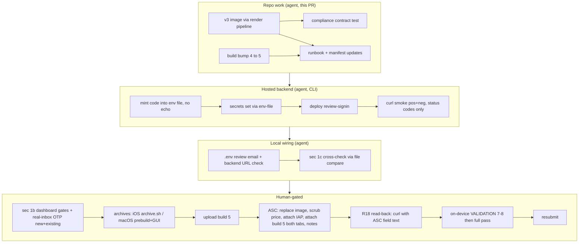

# fix: iOS 2.3.2 promoted-IAP image replacement + full resubmission bundle

## Summary

Replace the rejected promoted-IAP promotional image with compliant v3 brand artwork generated by
the existing render pipeline, pin the compliance rules in a contract test, bring the
`review-signin` defense live (secrets → deploy → smoke, in that order, with no secret values in
agent transcripts or committed files), bump the Apple build number to 5, and update the release
runbooks so every human portal/device step is click-level, correctly ordered, and classified.
Outcome: the open iOS submission (`d8784a58`, 1.0 train) can be resubmitted with both 2.3.2
findings fixed and the 2.1(a) recurrence risk closed.

---

## Problem Frame

Apple rejected iOS 1.0 (3) on July 16 with two Guideline 2.3.2 findings against the promoted
`still_sync` promotional image: it is an app screenshot with small text, and it references the
price. App Store Connect still hosts the v1 paywall screenshot; the in-repo v2 replacement was
never uploaded and still carries a small subline. Independently, the merged 2.1(a) defenses are
not live: `review-signin` is undeployed, the `REVIEW_SIGNIN_*` secrets are unset (verified July 16
via `supabase secrets list`), and `packages/app-webview/.env` predates `VITE_REVIEW_SIGNIN_EMAIL`,
so current archives contain no review branch. Full context: see origin brainstorm.

---

## Requirements

Origin requirements R1–R11 are adopted verbatim (see origin doc). Research and document review
added these:

- R12. The runbook encodes the corrected operational order: secrets set → function deploy →
  deploy verification → curl-level smoke, all **before** any archive upload; on-device
  VALIDATION items 7–8 run **before** the resubmit click, not after.
- R13. A contract test pins the 2.3.2 compliance constraints of the rendered IAP asset (no price
  strings, no sentence-length copy in the IAP variant, the lower-left safe zone — bottom-left
  30% × 30% of the canvas, an internal convention since Apple publishes no figure — kept free of
  content) so a future regeneration cannot silently reintroduce the rejected elements.
- R14. `CURRENT_PROJECT_VERSION` is bumped 4 → 5 across all targets; stale "build 4" references
  in the runbook are updated; the resubmission steps include attaching build 5 on **both**
  platform tabs, replacing whatever build is currently attached (iOS shows 3; macOS may show 3
  or 4 — a local macOS build-4 archive exists with unknown upload state). A metadata-style
  resubmit that leaves an old build selected silently discards the entire backend bundle.
- R15. A change-coupling matrix is documented: review **email** change → re-archive + ASC
  fields/notes update; review **code** change → ASC fields/notes update FIRST on both platform
  tabs, no rebuild (server-side only); the v3 image and the binary are independent.
- R16. The macOS archive procedure documents the mandatory web-bundle prebuild
  (`pnpm --filter @still/app-webview build` and the ext-safari build) before any Xcode GUI
  Product → Archive — a GUI archive without it ships a stale bundle with no review branch and no
  error (highest-consequence silent no-op found in flow analysis).
- R17. The §1c fixed-code smoke also asserts the negative path (wrong code → 401), and the
  real-inbox OTP smoke covers BOTH a brand-new address and an existing address (the two GoTrue
  templates; one-address smoke leaves the "Confirm signup" gate unproven).
- R18. A final pre-resubmit gate verifies the credentials **as saved in ASC**: after the review
  notes and App Review sign-in fields are saved on BOTH platform tabs, the email and code are
  copied back out of the saved ASC field text and the §1c fixed-code curl re-runs with exactly
  those strings. Any code re-mint re-triggers this gate on both platforms. On-device VALIDATION
  item 8 types credentials from the ASC field text, not from the private record — the reviewer
  will type what ASC shows, so that is the string pair that must be proven.
- R19. No secret value (review code, review email pair, minted session tokens) appears in agent
  tool-call arguments or output, committed files, or chat output at any step. Values move via a
  gitignored env file created without printing; smoke checks assert HTTP status codes only;
  committed checklists record pass/fail + date only.

---

## Key Technical Decisions

- **Bump the build number to 5 unconditionally** (`project.pbxproj`, all targets): build numbers
  need only increase, and a repo-side bump removes the unverifiable "was a build 4 ever
  uploaded?" ASC dependency. Both rejected platforms get replacement builds from the same bump.
- **v3 design (replaces the `iap` variant of `promo.html` in place; output renames to
  `still-pro-iap-v3-1024x1024.jpg`; v2 IAP files are deleted — git history preserves them):**
  - **Drop the rounded-square icon badge entirely.** Apple auto-composites the real app icon
    into the lower-left of search placements, and the badge is a literal miniature of that icon
    (`apps/apple/Still/Shared (App)/Assets.xcassets/AppIcon.appiconset/icon-ios-1024.png`) —
    rendering the identical motif twice in one placement is the "confusable with your app icon"
    failure. No small wordmark either: after a "text is small or hard to read" rejection, the
    only text in v3 is the headline.
  - **Add a non-text product motif** so the artwork is not a typographic card: an abstract trio
    of translucent-white rounded-rect device silhouettes (wide / medium / narrow) in the upper
    area, each containing a few short content bars that fade out — "feeds going quiet on every
    screen." No logos, no service marks, no screenshot content.
  - **"Still Pro" is the sole text**, white on Still Blue, headline cap height ≥ 12% of the
    canvas (≥ 120px at 1024) so it survives thumbnail scaling.
  - **Upper-weighted composition, stated as a CSS change:** `body.square main` currently centers
    vertically (`justify-content: center; align-items: center`); v3 replaces this with an
    upper-anchored flex layout (explicit top padding, content block ending above the lower-left
    safe zone) so enlarging content cannot grow downward into the clearance.
  - **Lower-left safe zone: bottom-left 30% × 30% of the canvas stays content-free** (internal
    convention — Apple publishes no exact figure; stated here, in the store-ready README rules,
    and enforced by the U2 test).
  - Keep the existing decorative offset circle; flattened square corners, JPEG or PNG, RGB.
- **`render.mjs` gains a target filter** (positional arg `iap`) so this run renders ONLY the IAP
  promo. An unscoped run would regenerate every store-ready screenshot — explicitly out of scope
  (third-party-marks risk, `docs/release/screenshots/store-ready/README.md`).
- **Contract test beyond the origin's doc-only rule — justified:** origin R3 assigned recurrence
  prevention to a README rule, but this is the second rejection in this asset's lineage and the
  repo convention (`docs/solutions/conventions/codify-cross-platform-visual-contract-in-tests.md`)
  prescribes codifying constraints that manual review enforced once and then forgot. Final visual
  sign-off of the rendered JPEG stays human.
- **Secrets before deploy, smoke after deploy** (`docs/solutions/security-issues/supabase-edge-function-hardening.md`):
  the repo was previously bitten by secrets set after deploy not taking effect. Sequence: mint →
  `supabase secrets set --env-file` → `supabase functions deploy review-signin` → verify ACTIVE →
  curl smoke (positive + negative, status codes only).
- **Mint a fresh random 6-digit code at deploy time from a CSPRNG, without printing it** (§1c:
  "minted now"): generate directly into a gitignored env file (e.g.
  `python3 -c "import secrets; print(f'REVIEW_SIGNIN_CODE={secrets.randbelow(10**6):06d}')" >> <file>`),
  never as a literal CLI argument or tool output (R19). The deployed secret is the single source
  of truth; the human reads the value locally from the env file for the private record and the
  ASC fields, and the R18 read-back gate proves the ASC copy before resubmit.
- **Compliance rules stay canonical in the store-ready README**; runbook §7 and the deploy
  checklist reference it rather than restating
  (`docs/solutions/conventions/mirror-fixes-across-parallel-paths.md`).

---

## High-Level Technical Design

Operational sequence with actor classification (R11, R12):

Prose remains authoritative: the full ordered human runbook lands in
`docs/release/01-apple-app-store.md` §7 (U3).

---

## Implementation Units

### U1. v3 IAP promotional image through a scoped render run

- **Goal:** Produce the compliant v3 asset and make the pipeline capable of rendering it in
  isolation.
- **Requirements:** R1 (origin), R13 partially; AE1, AE5.
- **Dependencies:** none.
- **Files:** `docs/release/screenshots/source/promo.html`,
  `docs/release/screenshots/source/render.mjs`,
  `docs/release/screenshots/store-ready/apple/still-pro-iap-v3-1024x1024.jpg` (new),
  `docs/release/screenshots/v2/apple/still-pro-iap-v3-1024x1024.jpg` (new — `render.mjs` writes
  the concept copy to the `v2/` output root before copying to `store-ready/`; delete the stale
  v2-named concept file there),
  delete `docs/release/screenshots/store-ready/apple/still-pro-iap-v2-1024x1024.jpg`.
- **Approach:** Redesign the `type=iap` branch of `promo.html` per the v3 design KTD (badge
  removed, device-trio motif, sole "Still Pro" headline ≥ 120px, upper-anchored CSS replacing the
  vertical centering, 30% × 30% lower-left clearance). The `iap` changes must not alter the
  rendered output of the `promo` and `store-promo` variants — they share the same markup, so
  scope changes behind the `type=iap` class/branch. Add a positional target filter to
  `render.mjs` (`node render.mjs iap`) that skips the screenshot targets and non-matching promos.
  Rename the IAP promo entry to the v3 filename. Run the scoped render; delete retired v2 IAP
  outputs.
- **Test scenarios:** Covers AE1. (1) Scoped run writes only the IAP files — `git status` shows
  no other `store-ready/` or `v2/` changes; (2) output dimensions are exactly 1024×1024 (`sips
  -g pixelWidth -g pixelHeight`); (3) rendered page contains no `$`, `1.99`, or price-shaped
  text; (4) visual read of the JPEG confirms: no screenshot content, single large headline on
  original artwork, no icon-badge, empty lower-left 30% × 30%; (5) unfiltered `node render.mjs`
  still renders everything (filter defaults to all targets) — then `git restore
  docs/release/screenshots/v2 docs/release/screenshots/store-ready` so only the scoped-run
  outputs are ever committed (JPEG output is not byte-stable and the unscoped set is explicitly
  out of scope); (6) downscale check: resize the v3 JPEG to ~120px (`sips -Z 120` on a copy) and
  confirm the headline is still legible; (7) distinctness check: side-by-side visual comparison
  of v3 against `apps/apple/Still/Shared (App)/Assets.xcassets/AppIcon.appiconset/icon-ios-1024.png`
  confirming the artwork cannot be mistaken for the app icon, recorded pass/fail.
- **Verification:** Rendered v3 present in both output dirs; v2 IAP files gone; scenarios 4, 6,
  and 7 visually checked and noted honestly.

### U2. Store-asset compliance contract test

- **Goal:** Make the 2.3.2 constraints regression-proof at CI speed.
- **Requirements:** R13; AE1.
- **Dependencies:** U1 (asserts the v3 design).
- **Files:** `tests/playwright/store-assets.spec.ts` (new). No `playwright.config.ts` change:
  the fixtures project's `testMatch` (`playwright/.*\.spec\.ts$`) auto-enrolls the new spec.
- **Approach:** Use plain `test` from `@playwright/test` with
  `test.use({ viewport: { width: 1024, height: 1024 } })` and a `file://` URL to `promo.html`
  (same mechanism as `render.mjs`). Do NOT import the `tests/playwright/_extension.ts` fixture —
  it launches a persistent context that loads the built extension from gitignored `dist/`, which
  this spec neither needs nor can rely on. Assert on `?type=iap`: (a) no visible text matches
  `/\$|\d+[.,]\d{2}|price/i`; (b) no sentence-length copy (the subline element is absent or
  empty in `iap` mode); (c) no visible element with content intersects the lower-left 30% × 30%
  safe zone; (d) the sole headline reads "Still Pro".
- **Execution note:** Write the assertions RED against the current (v2) `promo.html` where
  possible — the subline assertion (b) must fail before U1's redesign and pass after.
- **Test scenarios:** The unit IS the tests; scenarios (a)–(d) above, plus: the spec runs green
  in the standard `pnpm exec playwright test --project=fixtures` gate used by CI.
- **Verification:** Spec fails against pre-U1 source for (b), passes against v3; full Playwright
  gate green.

### U3. Release-doc updates: corrected order, click-level portal steps, classification

- **Goal:** Every human step is precise, correctly ordered, and classified; superseded
  instructions are gone.
- **Requirements:** R2, R3, R4, R8–R11 (origin), R12, R14–R19 (doc side).
- **Dependencies:** U1 (references v3 filename), U4 (references build 5).
- **Files:** `docs/release/01-apple-app-store.md`,
  `docs/release/screenshots/store-ready/README.md`,
  `docs/release/extension-purchase-deploy-checklist.md`, `docs/release/VALIDATION.md` (pointer
  only if needed).
- **Approach:** In `01-apple-app-store.md` §7: replace the "delete the IAP promotional image"
  step with the v3 replacement flow (ASC nav: Apps → Still → Monetization → In-App Purchases →
  `still_sync` → App Store Image → Choose File; verify-after-upload — re-open the IAP page and
  confirm the saved image renders as v3; ~24h propagation note; metadata rejection resubmits the
  SAME submission, no new binary required for 2.3.2 alone); add the edit-while-submission-open
  fallback (remove IAP from submission → edit → re-attach → confirm "Ready to Submit"); promoted
  display name ≤30 / description ≤45 with no price references; the build-attach step on BOTH
  platform tabs phrased per R14 ("replace whatever build is attached with build 5 — iOS shows 3,
  macOS may show 3 or 4; do not resubmit either tab until it displays build 5"); the App Review
  Information sign-in toggle decision (enable, Username = review address, Password = fixed code,
  template already explains no email arrives); the R18 read-back gate as the last step before
  resubmit (copy email + code back out of the saved ASC fields on both tabs, re-run the §1c
  fixed-code curl with exactly those strings; any re-mint re-triggers this on both platforms;
  VALIDATION item 8 types the ASC field text); a note to run the on-device items 7–8 on an iPad
  or iPad simulator as well (the rejection's review device was an iPad Air); the change-coupling
  matrix (R15); the macOS prebuild-before-GUI-archive warning (R16); update stale "build 4"
  references to build 5; reference the §1c post-approval code-rotation gate so it isn't dropped.
  In the store-ready README: v3 is the only uploadable IAP image; canonical compliance rules (no
  screenshot, no price, no small text — headline-only ≥ 12% canvas, lower-left 30% × 30% safe
  zone, survives ~120px downscale, distinct from the app icon); other docs reference this
  section. In the deploy checklist: §1b note that the 60s resend cooldown is dashboard-only (not
  covered by the Management API curl); §1c smoke wording covers new + existing address (R17), the
  negative fixed-code path, and records pass/fail + date only — never raw codes, request bodies,
  or session tokens (R19).
- **Test scenarios:** Test expectation: none — documentation; correctness is enforced by U2
  (asset constraints) and by cross-reading in review.
- **Verification:** Falsifiable per-tag checklist — confirm each of: no doc instructs deleting
  the promo image (R4); README carries the canonical rules and both other docs reference rather
  than restate them (R3); §7 carries: image replace flow with verify-after-upload (R4/R9-origin),
  edit-while-open fallback, name/description limits (R2), build-attach wording (R14),
  sign-in-toggle decision, R18 read-back gate, iPad note, change-coupling matrix (R15), macOS
  prebuild warning (R16), build-5 references (R14), rotation pointer; §1b resend-cooldown note
  and §1c new+existing smoke + negative path + redaction rule (R17, R19); every §7 step carries
  its classification (R11).

### U4. Apple build number bump 4 → 5

- **Goal:** Guarantee upload acceptance regardless of ASC history.
- **Requirements:** R14.
- **Dependencies:** none.
- **Files:** `apps/apple/Still/Still.xcodeproj/project.pbxproj`.
- **Approach:** Set `CURRENT_PROJECT_VERSION = 5` in every configuration (currently 8
  occurrences of `4`). `MARKETING_VERSION` stays `1.0` (rejected version accepts a replacement
  build).
- **Test scenarios:** Test expectation: none — build configuration; verified by grep (zero
  remaining `CURRENT_PROJECT_VERSION = 4`) and by the standard build gates.
- **Verification:** Grep clean; `pnpm build` and repo gates unaffected.

### U5. Backend live: mint code, set secrets, deploy, smoke (CLI)

- **Goal:** `review-signin` is live, fail-safe, and proven against hosted GoTrue before any
  archive is uploaded — with no secret value entering transcripts, committed files, or chat
  (R19).
- **Requirements:** R5, R6 (origin), R12, R17, R19.
- **Dependencies:** none (function code is already on main); ordering within the unit is fixed.
- **Files:** no repo diff except honest checkbox/date updates in
  `docs/release/extension-purchase-deploy-checklist.md` §1c (with U3). Secret values live only
  in a gitignored env file (e.g. `packages/app-webview/.env.review-signin`, confirmed
  git-ignored before writing) and the hosted secret store.
- **Approach:** (1) Mint: write `REVIEW_SIGNIN_EMAIL=<review address>` and a CSPRNG-minted
  `REVIEW_SIGNIN_CODE` into the gitignored env file WITHOUT printing values (e.g.
  `python3 -c "import secrets; print(f'REVIEW_SIGNIN_CODE={secrets.randbelow(10**6):06d}')" >> file`;
  the email line is appended from the existing private-record value by the human, or written
  once by the agent without echoing). (2) `supabase secrets set --env-file <file> --project-ref
  kikpgrreradotvvefdgd`. (3) `supabase functions deploy review-signin --import-map
  supabase/functions/deno.json --project-ref kikpgrreradotvvefdgd` from the repo main checkout
  (guarantees post-PR-112 CORS handling). (4) Verify the function lists ACTIVE with `verify_jwt`
  matching `supabase/config.toml`. (5) Curl smoke driven from the env file via shell variable
  expansion with output filtered to HTTP status codes only (tokens never printed): correct
  email+code → 200; wrong code → 401; non-review email → 404/pass-through. §1b Management-API
  read runs only if an access token is available; otherwise the dashboard click-path is handed
  to the human (it already exists in §1b).
- **Test scenarios:** Covers AE2 partially (server half), AE4. (1) Positive: fixed code returns
  HTTP 200 against hosted GoTrue; (2) negative: wrong code returns 401; (3) non-review address
  does not hit the review branch (404); (4) function deployed from current main (version
  increments in `supabase functions list`); (5) transcript audit: no tool-call argument or
  output in this unit contains the code, the minted tokens, or the full email=code pair.
- **Verification:** All smoke statuses recorded as pass/fail + date only; secrets present in
  `supabase secrets list` (names only); checklist §1c items ticked with date or honestly left
  open with reason.

### U6. Local wiring + §1c cross-check

- **Goal:** The next archive build bakes the correct review email and talks to the right
  backend.
- **Requirements:** R7 (origin), R12, R19; AE2.
- **Dependencies:** U5 (the env file written there is the comparison reference).
- **Files:** `packages/app-webview/.env` (gitignored — never committed);
  `packages/app-webview/.env.example` (committed: add `VITE_REVIEW_SIGNIN_EMAIL=` with the root
  `.env.example`'s Apple-submission-only caveat so future archives don't silently omit the
  review branch).
- **Approach:** Append `VITE_REVIEW_SIGNIN_EMAIL` to `.env` by transforming the U5 env file
  (never echoing the value); verify the existing `VITE_SUPABASE_URL` targets
  `kikpgrreradotvvefdgd` and the anon key is current (a stale June 24 value would build a clean
  archive pointed at nothing — flow-analysis gap). Record the §1c cross-check by comparing the
  `.env` value against the U5 env file value with a file-compare exit code (`cmp`/`diff` on
  extracted lines), not by printing either value.
- **Test scenarios:** Covers AE2. (1) Cross-check exit code 0 (values equal byte-for-byte); (2)
  `VITE_SUPABASE_URL` host equals the hosted project ref; (3) a
  `pnpm --filter @still/app-webview build` succeeds with the env present.
- **Verification:** Cross-check recorded in the checklist tick (U3 file); webview build green;
  no value printed.

---

## Acceptance Examples

Origin AE1–AE3 carry forward unchanged. Added:

- AE4. **Covers R12, R17, R19.** Given secrets are set and the function deployed, when the curl
  smoke runs before any archive upload, then the correct code returns HTTP 200, a wrong code
  returns 401, both results are recorded as statuses only, and no secret value appears in any
  transcript or committed file.
- AE5. **Covers R13 via U1.** Given `node render.mjs iap`, when the run completes, then only the
  IAP promo files changed — no other `store-ready/` or `v2/` file is touched.
- AE6. **Covers R18.** Given the ASC review notes and sign-in fields are saved on both platform
  tabs, when the email and code are copied back out of the saved ASC field text and the §1c
  fixed-code curl re-runs with exactly those strings, then it returns HTTP 200 — and only then
  is resubmit clicked.

---

## Risks & Dependencies

- **Image re-rejection (subjective review):** v3 removes every named violation (screenshot,
  price, small text) plus the two review-surfaced risks (icon duplication, text-card read) and
  honors the published safe-zone/scaling guidance — residual risk is Apple taste; mitigation is
  the deletion fallback Apple itself offered. The 30% safe zone and 120px legibility floor are
  internal conventions, not Apple-published figures; a passing test is not proof of Apple-side
  clearance.
- **ASC edit-while-open behavior:** whether the image field is editable with the submission open
  is unverified from the repo; the documented remove → edit → re-attach fallback (U3) covers the
  blocked case.
- **Secrets value channel:** `supabase secrets list` exposes digests only; the env file written
  in U5 is the only local reference. R18's read-back gate is the final defense against the
  ASC-field copy drifting from the deployed secret — the one hop the smoke cannot see.
- **macOS portal state unknown:** a local macOS build-4 archive exists (`apps/apple/build/`);
  whether it was uploaded, and whether the macOS ASC review fields hold stale July 15 values, is
  portal state the repo cannot see — the R14 build-attach wording and the R18 both-tabs read-back
  cover both unknowns.
- **Archive signing:** `archive.sh` needs `ASC_KEY_ID`/`ASC_ISSUER_ID`/`ASC_KEY_PATH`; if absent,
  the documented Xcode GUI path applies (with the R16 prebuild warning). Human-gated either way.
- **Hosted config drift (§1b):** SMTP/template/OTP settings are portal state; the runbook
  requires live verification, not trust in the 2026-07-06 note.
- **Review-device coverage:** Apple reviewed on an iPad Air 11-inch; the registered test device
  is an iPhone. The client normalizes email input (trim + lowercase), but the §7 note asks for an
  iPad or iPad-simulator pass of VALIDATION items 7–8 to convert inference into evidence.

---

## Scope Boundaries

Carried from origin: no app source changes; app screenshots stay as submitted (third-party-marks
risk remains open, tracked in the store-ready README); no new promoted placements or IAPs;
browser-store tracks untouched; ASC portal actions and on-device validation are human-gated.

### Deferred to Follow-Up Work

- `/ce-compound` capture after Apple accepts: 2.3.2 promo-art constraints, secrets-then-archive
  ordering, and the resubmission flow (learnings search confirmed no solution doc covers these).
  The capture must not pull raw secret values out of session transcripts or the private record.
- Scripting the macOS archive/export path in `apps/apple/scripts/` (today: documented GUI
  procedure with mandatory prebuild).
- Post-approval `REVIEW_SIGNIN_CODE` rotation/unset (§1c owns it; §7 references it — execution
  happens after both platform reviews resolve).

---

## Sources & Research

- Origin brainstorm (rejection facts, Apple spec citations, repo state):
  `docs/brainstorms/2026-07-16-ios-iap-promo-metadata-rejection-requirements.md`.
- Apple promoted-IAP spec and ASC flows: developer.apple.com/app-store/promoting-in-app-purchases/,
  ASC Help "Promote In-App Purchases", "In-App Purchase information", "Reply to App Review
  messages" (full citations in origin).
- Institutional learnings applied: `docs/solutions/security-issues/supabase-edge-function-hardening.md`
  (secrets-before-deploy, fail-closed), `docs/solutions/security-issues/gate-production-trust-by-build-mode.md`
  (build-time vs deploy-time trust split), `docs/solutions/conventions/mirror-fixes-across-parallel-paths.md`
  (canonical-doc discipline), `docs/solutions/conventions/codify-cross-platform-visual-contract-in-tests.md`
  (contract-test pattern).
- Flow-gap analysis (23 findings) and six-persona document review (20 findings: transcript
  exposure, ASC read-back gap, icon-duplication and text-card design risks, fixture and
  occurrence-count corrections, scope advisories) — session research, 2026-07-16.
- Mechanics: `apps/apple/scripts/archive.sh` (iOS-only, rebuilds web bundle first),
  `docs/release/screenshots/source/render.mjs` (unscoped side effects; writes `v2/` then copies
  to `store-ready/`), `packages/app-webview/src/main.ts` (build-time review gate),
  `supabase/config.toml` (`verify_jwt = false` pin for review-signin),
  `tests/playwright/_extension.ts` (extension fixture the U2 spec must NOT use).
