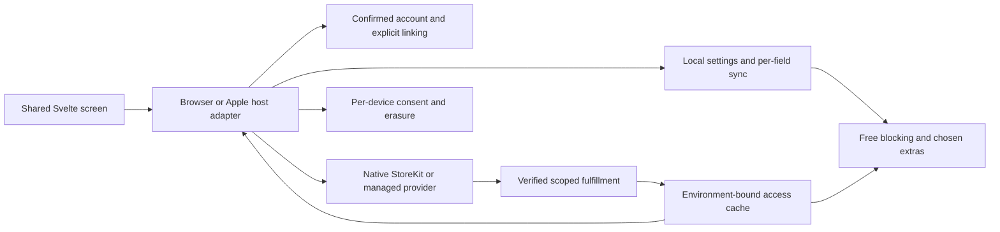
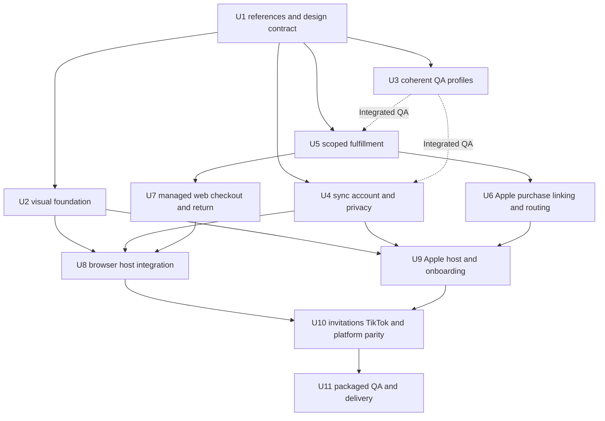

# Still v3.1 redesign across supported surfaces

## Goal Capsule

Deliver integrated QA builds that implement the latest owner-supplied screens and their actual behavior on Chromium browsers, Firefox desktop/Android, Safari iOS/iPadOS/macOS, and the Apple companion apps. Replace earlier V3 visual references with `Still Design System latest.zip` (internal design version 3.0.1). Preserve provenance under `docs/design/Still v3.1 redesign/` and publish the implementation contract in `design.md`.

The owner authorizes autonomous implementation, parallel isolated workers, Apple sandbox and web provider test modes, independent Claude PR reviews, fixes, and protected merges to main. Apple device distribution uses TestFlight. No staging backend currently exists; the owner selected the existing hosted backend with dedicated test accounts. TestFlight does not supply a backend. Delivery remains incomplete until real journeys and packaged candidates are verified.

## Product Contract

### Summary and problem frame

The current Svelte foundation largely matches the latest archive. Existing V3 work already supplies free blocking, real account and sync flows, settings authorities, purchase/Restore infrastructure, consent and erasure pipelines, benefit consumers, and the shared screen components. Preserve those implementations and their recorded QA. Some latest-screen producers and provider/deployment paths are not connected or verified in the candidate. The redesign reconciles the bounded gaps against actual hosts and authorities; the units below are integration and verification areas, not instructions to reconstruct existing features.

### Requirements

| ID | Required outcome |
|---|---|
| R1 | Latest archive governs screen layout, states and interactions; earlier visual adaptations are superseded. Each reference and exception has provenance. |
| R2 | Free Shorts/Reels/TikTok website blocking works immediately without an account. Optional free sync remains independent of purchase. |
| R3 | D01/D02 popups preserve saved choices when global/service switches are Off, retain one-open accordion behavior, show honest capability/access states and reach real settings or Apple Pro destinations. |
| R4 | D03/D04 settings expose actual account, sync/recovery, permissions/setup/help, Pro/Restore/linking and truthful deletion states. |
| R5 | D12/D14 onboarding reports real activation/permissions/pinning, optional sign-in/consent, persistence and relaunch behavior. No demo authentication or success. |
| R6 | D18–D20/D24/D25 purchase, sign-in, Restore, return and linking use authoritative outcomes. Apple signed-out purchase preserves local rights; linking is explicit. Web checkout requires a confirmed account and approved managed-only provider support. |
| R7 | Scoped access distinguishes checking, verification required, owned, protected/free-period, revoked and unavailable. Saved choices survive expiry/refund; no inappropriate Buy affordance while verification/Restore is unresolved. |
| R8 | Combined email-plus-usage consent uses equal Share/Don't share actions, verified purposes/providers, per-device fresh opt-in, immediate withdrawal fencing, and separate account versus analytics-erasure outcomes. |
| R9 | D28 invitations use real owner allowances, timing/once-per-install rules and suppression; at most one invitation with sync/link priority. |
| R10 | D29 TikTok temporary allowance requires confirmation, applies only to the current tab, never persists/syncs, and ends on the defined tab lifecycle. |
| R11 | Light/dark, keyboard/screen reader, reduced motion, safe areas, 320px settings, actual narrow hosts and text scales 1/1.35/1.5/2 remain usable. |
| R12 | Reference tooling/assets remain outside shipped bundles. Retain Svelte and lazy loading; measure download/startup/observer cost against the same baseline profile. |
| R13 | Claude independently reviews each scoped PR; evaluated findings are fixed where valid and verified before protected merge. Deliver exact revision/configuration/artifact evidence and a QA checklist for each supported surface. |

### Key decisions

- Latest source wins for visuals. `session-settled: user-directed`. Governs R1. Rejected alternative: older V3 visual packages or gallery deviations as default authority.
- Integrated functionality is required. `session-settled: user-directed`. Governs R2–R10/R13. Screens with fixture callbacks cannot satisfy release acceptance.
- Existing product/privacy truths remain authoritative: twelve optional Pro extras, approved lifetime offer, free blocking/sync, no native social-app blocking, no history collection, limited hosts. Say "every supported surface" where necessary for truthful scope.
- TestFlight plus sandbox/test modes is the QA lane. `session-settled: user-approved`. Governs R6/R13. No staging service is assumed; target the existing hosted backend with dedicated test accounts, verifying readiness before device delivery.
- Reviewed PRs may merge to main. `session-settled: user-approved`. Governs R13. Public store submission and protected production/provider activation retain applicable operational gates.

### Boundaries and unresolved facts

A corrupted supplied wordmark and an unrelated uploaded macOS Save-dialog screenshot are excluded from usable screen baselines. Replace the broken runtime wordmark using verified existing brand artwork, documenting the substitution. Archive React/Babel/demo framing is reference material only.

No current provider/deployed-state correctness has been established. Managed-only web checkout, scoped proof issuance, localized Apple offerings, explicit account transfer, consent purpose verification and hosted TestFlight backend readiness require implementation plus evidence. Unavailable branches may be used during development but do not count as delivering those requested features. Do not downgrade these requirements to dormant controls.

## Planning Contract

### Existing authorities and design

Reuse `packages/core/src/ui/v3/`, modern per-field sync, access verifier/cache, analytics consent authorities, RevenueCat identity safeguards, native StoreKit/rating sheets, and real account deletion. Modern browser selection uses `VITE_MODERN_SETTINGS_SYNC_ENABLED`; Apple uses `VITE_APPLE_ATOMIC_SETTINGS`. Normal 2.x profiles remain dormant; explicit QA profiles must select a coherent V3 runtime without sandbox trust reaching production.

The initial source audit identified missing host producers, account-confirmation forwarding, legacy consent and Restore outcomes, and unverified managed checkout. Those findings describe the baseline, not the current implementation. Preserve the existing account/sync, purchase, invitation and TikTok route implementations; use demonstrated failures to define repairs. Subsequent isolated packets connect host operations and current account confirmation, refine scoped native/backend authority, and exercise the existing TikTok route. Their checks establish the recorded source behavior; deployment, signed installation and real provider/device journeys remain separate acceptance gates. The retained Web Purchase Link and legacy Boolean reconcile response cannot establish managed-only checkout or scoped V3 ownership.

### Key technical decisions

- KTD1: reuse shared Svelte screens and typed presentation contracts; host adapters own operations, capability and authority. Avoid a second framework or parallel design-system abstraction.
- KTD2: isolated worktrees and scoped PRs; one owner per shared interface. Integrate committed prerequisites before dependent workers start. Serialize native builds and database lifecycle operations.
- KTD3: QA build manifests name surface, revision, runtime, backend target and trust environment without secrets. Local disposable Supabase/Mailpit supports early integration; physical TestFlight targets the existing hosted HTTPS backend using dedicated test accounts and separately verified sandbox fulfillment.
- KTD4: purchase completion is server/native verified ownership, never a return query, closed provider tab or success text. Bind account, environment, offer and observation lineage; preserve historical/protected rights and explicit transfer authority.
- KTD5: archive previews are orientation references; pixel baselines come from exact-size HTML DOM captures with engine/font/environment metadata. Missing references fail the redesign release gate.
- KTD6: combine consent only when purposes and identity handling are verified. Old `answered` or sign-in/purchase must not grant new combined consent. Report erasure requested/pending/completed truthfully.

### Authority and dependency diagrams





### Failure and recovery requirements

Account switches/sign-out fence in-flight settings, access, consent identity and checkout observations. Lost replies cannot replay stale actions. Restore failure remains distinct from no purchases; ownership verification retains checking/verification-required states rather than presenting an offer. Linking failure preserves verified local Apple rights. Withdrawn consent fences queued events immediately. Local/tab allowance cannot become synced preferences. Provider/device gates block only dependent delivery while independent implementation continues.

## Implementation Units

Each unit may contain multiple coherent commits/PRs where justified. Workers provide changes and verification receipts; the coordinator owns canonical integration and commits. No worker overwrites another unit's edits.

| Unit | Goal and ownership | Dependencies | Required proof |
|---|---|---|---|
| U1 | Create `design.md`, `docs/design/Still v3.1 redesign/` source receipt, usable asset/reference inventory, screen-behavior mapping and unresolved-fact register. Own docs/references only. | None | Hash/provenance, image decoding, all145 preview files indexed; no unrelated upload; docs links valid; no production asset imports. |
| U2 | Reconcile shared controls/site/popup navigation against latest, repair central wordmark, retain token/font reuse. Own shared V3 presentation files and targeted visual cases. | U1 | Real rendered controls/keyboard actions, lock destinations and names, narrow/text-scaled layouts; same-engine captures within0.5% or documented justified delta. |
| U3 | Named coherent V3 QA build/verification profiles and artifact manifests; public core import seam only where needed for build ownership. Own build scripts/manifests/export map. | U1 | Build configured and unconfigured modes; sandbox/production trust cannot cross; old build retained; emitted font/dependency sizes measured. |
| U4 | Real account confirmation, sync lifecycle and response-aware deletion; fresh combined consent and withdrawal across browser/native authority boundary. Own sync/analytics/backend erasure contracts; agree host interfaces before shell wiring. | U1 for contracts; U3 for integrated QA | Two real clients converge, account-switch isolation, lost-reply recovery, decline/withdraw prevents identity/events, account versus analytics deletion outcomes distinguished. |
| U5 | Scoped signed access fulfillment and environment-safe transport; preserve historical/protected classifications and owner-policy freeze. Own backend entitlement/proof transport with agreed native interface. | U1 for contracts; U3 for integrated QA | Forged/wrong-account/wrong-environment/expired/refunded proof rejection; legitimate rights and offline deadline behavior; free settings continue. Real sandbox provider evidence required for provider-dependent acceptance. |
| U6 | Native Apple sandbox purchase/Restore, explicit linking/transfer, trusted Pro app route on cold/warm launches and Safari handoff. Own Swift purchase/router/session interface; coordinate shell entry hook with U9. | U5 | Signed-out purchase, cancel, nothing/owned/error Restore, linking conflict/retry preserving local rights, cold/warm URL launch; native tests plus sandbox device journey. |
| U7 | Approved managed-only checkout capability, live D20 route and authoritative return polling/recovery. Own web checkout backend/page adapter; no fallback provider substitution. | U5 | Confirmed intended account, ineligible provider cannot start, managed test checkout/close/cancel/lost return/server success, account-switch rejection; provider capability gate explicit. |
| U8 | Wire D01/D02/D03/D14 live browser entrypoints with real state/actions; replace legacy privacy and inert locks in V3. Own `App.svelte`, browser host wrappers/adapters. | U2/U4/U7 | Packaged browser journeys for free blocking, real OTP/sync/account/delete, permissions/consent/purchase return and every represented action; fixtures alone insufficient. |
| U9 | Wire D04/D12 Apple host/onboarding with real consent/account/Pro/link/Restore/setup. Own app-webview host files and completion persistence. | U2/U4/U6 | Native readback consent, optional sign-in, activation uncertainty truthful, purchase/link destinations, relaunch completion; iPhone/macOS checks and iPad evidence separately. |
| U10 | Invitations/owner policy and real D29 tab allowance across browser/Safari/Firefox Android. Own invitation/tab adapters and platform QA cases, coordinate narrow shell prop additions. | U8/U9 | Timing/owner denial/suppression/priority, one invitation; allowance ends on defined lifecycle; no persisted bypass; actual Android supported behavior verified. |
| U11 | Full visual/functional/accessibility/performance QA, exact release artifacts, Claude review/fixes/merge and owner test guide. Own release evidence/packaging; one native build at a time. | All | All required gates plus browser ZIPs, an unlisted signed Firefox QA XPI paired with reproducible source archive, and Apple signed archives; bind revision/configuration/hashes and installation instructions. Firefox desktop/Android install-time permissions and restart persistence require real proof. Mozilla signing is separate from public listing publication. Reachable TestFlight test backend and sandbox fulfillment; device exceptions explicitly incomplete. |

Execution notes: behavior changes use existing focused tests as red evidence where practical before implementation. Documentation/reference intake and pure style/config edits use integrity/capture/build verification rather than tautological tests. Integration scenarios exercise real boundaries; fixtures cannot supply the outcome being tested. Preserve 2.x dormant purchase checks separately from enabled V3 journeys.

## Verification

Run proportional checks per unit, then final repository gates:

```bash
pnpm lint
pnpm typecheck
pnpm test
pnpm build
pnpm exec playwright test --project=fixtures
```

Also run the named coherent V3 builds, existing visual comparator with new mandatory references, local-backend real OTP/Realtime/account lifecycle journeys, relevant Deno tests/migration checks, StillKit Swift tests and iOS/macOS Xcode builds. Device proof covers Safari blocking, settings, purchases, Restore, linking, OTP/callbacks, text scale and relaunch. Physical iPad or unavailable device evidence remains missing until actually tested.

Capture one matrix per screen family/surface: reference, live entrypoint, authority, normal/failure/recovery outcomes, accessibility, artifact revision/configuration, execution evidence and outstanding gate. Keep support/provider text and localized prices grounded in verified configuration. Record popup initial JS/CSS, total download, settings/native startup and content observer overhead against identical baseline conditions; investigate material regressions before delivery.

Each PR gets a real Claude CLI review of its final relevant source/diff and tests, with provider/model/revision receipt. Evaluate actual issues, fix and recheck; a signed-in CLI status alone is not review evidence. Follow protected-branch checks before merge; never bypass a failed check. TestFlight uses unique version/build and verified test endpoint/product configuration. Prepare artifacts before any remaining external approval; no simulated payments or placeholder success may pass.

## Done When

R1–R13 have recorded evidence against real integrated packaged builds on every supported surface. Latest design references and justified deviations are reviewable. All represented operations work through actual authorities, regressions and valid Claude findings are resolved, required checks pass, reviewed PRs are merged to main, and the owner can install the identified candidates and run the supplied QA journeys. Provider, deployment or device gaps are outstanding work, not completion.

## Execution checkpoint

This checkpoint distinguishes merged foundations, tested private implementation and delivery acceptance. PR350 (visual/reference foundation), PR351 (public core exports) and PR352 (QA profile tooling) have merged. Later host, browser/Safari tab allowance, visual tooling and backend/native packets require their own final review and protected publication. A tested private packet is not a shipped feature.

- Shared host candidate: 5,280 workspace tests passed, 39 skipped; lint, types, ordinary builds and 305 fixture cases passed, 18 skipped. Current-account forwarding is covered by actual registered-background composition tests. Later integration changes require a new combined run.
- Visual coverage: all 33 Gallery frames and the existing owner allowance component are mapped. The frozen shared run measured 128 frames: 105 passed and 23 failed raw comparison; two provider/native placeholders and 14 asset frames remain separately classified in the 144-frame ledger. No failed frame is waived. Production-screen and standalone Gallery CSS contexts differ in several supplied examples; approved checkout-only pricing and truthful capability text retain precedence over demo values.
- Installed visual gate: an unconfigured, paid-disabled Chromium candidate produced two passes, seven raw failures and twelve blocked cases. This is not configured paid, native or provider acceptance. Provenance checks decode actual PNGs, bind source/build hashes and reject stale versions or incomplete inventories; exact Gallery metadata/source pins run in normal CI.
- Reference capture: the portable tool reproduced 144 primary frames plus one separately labeled supplement with verified source/cache inputs and actual loaded Inter font evidence. Of the primary PNGs, 143 were byte-identical to the accepted capture; one had 63 minor RGBA pixel differences with zero thresholded mismatch. The separate startup/cleanup repair passed independent bounded source re-review; final actual Claude coverage and protected integration remain open. Reference capture does not test application functionality.
- Browser/Safari TikTok: existing production routes are retained. Desktop lifecycle repair, Safari sender/port confirmation and macOS/iOS presentation repairs have focused source and controlled installed-bundle evidence. Physical Safari, actual browser lifecycle and Firefox Android acceptance remain open.
- Browser Pro navigation: the existing lazy options screen is being connected as a truthful informational destination. Unverified payment channels and legacy Restore cannot supply paid ownership or a usable checkout. The managed initiation decision remains pending.
- Native/backend work has separate verified unit, cryptographic and unsigned build receipts. Local SQL execution, deployed Edge behavior, sandbox transactions and signed device journeys remain required. Read-only hosted inspection found Auth health reachable and the modern product-policy route absent; no account write or test-account deletion was performed.
- Final actual Claude review remains blocked by the verified CLI weekly quota. Other review providers are supplemental and do not satisfy the owner's Claude requirement. No completed PR may merge on substitute approval.

Keep exact source hashes, commands and outcome receipts in the active work-state lists and release evidence. Preserve immutable packet receipts when integrating a later correction. The final candidate needs coherent checks, actual Claude coverage, protected merges, configured hosted QA, signed artifacts and the owner QA guide before delivery can be marked complete.

## Sources and active evidence

- Product/runtime: `STRATEGY.md`, `CONCEPTS.md`, `docs/PRODUCT.md`, `docs/ARCHITECTURE.md`, `docs/MEMORY.md`, `docs/README.md`.
- Release/QA: `docs/release/README.md`, `tests/qa/README.md`, `scripts/backend/README.md`, existing native release procedures.
- Latest owner source: README/handoff/tokens/screens/components/previews from `Still Design System latest.zip`, recorded by U1 with hashes.
- CodeGraph-first read-only audits of shared UI, live browser/Apple hosts and backend; no deployed provider proof inferred.
- Mem0 shared project context retrieved and scope checkpoint saved; repository/Git remain authoritative over stale memory.
- Active status: six initial local persona reviews completed, followed by three independent Claude plan reviews (verified Claude Opus5.5 at high effort, run `still-v31-plan-approved-20261007`). A subsequent local review independently confirmed the Firefox installability gap; U11 now requires signed persistent QA candidates. Payment environment isolation and exact protected hosted deployment remain required under the existing contract and backend runbook. The first foundation slice (5577dd8f/c4599823/d5b7066a) was protected-merged through PR350 as83e65d51. Its independent nine-perspective code review, including actual Claude Opus5.5, returned no actionable findings; final lint/types/full build,5243 unit passes39 skips, and305 fixture passes18 skips are recorded. The next shared presentation and authoritative account-confirmation changes are isolated and require their own final review. The existing implementation reconciliation is linked from the design reference index. Production and final delivery verification remain open. Work-state list `v3-design-system-20261007` tracks execution and review evidence.
