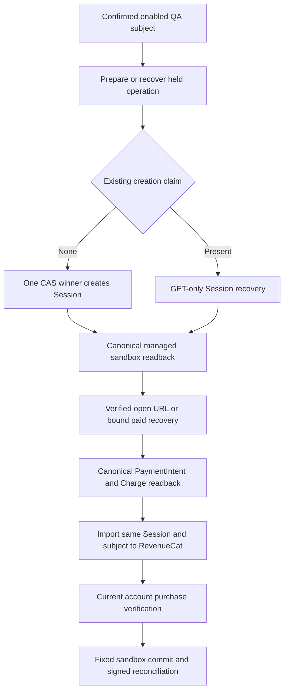
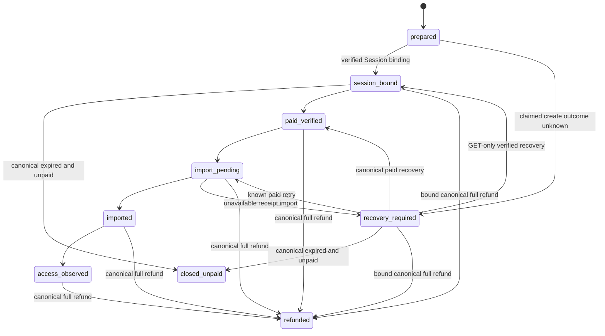

# Shared hosted paid sandbox QA - Plan

## Goal Capsule

Deliver Still v3.1 redesign QA builds that exercise real sandbox purchases, local Apple Restore, explicit account linking, transfers and refund recovery against the existing hosted backend without affecting live users or historical purchases.
Source preparation is authorized. A single concrete approval packet may explicitly authorize the named hosted migrations, secret installation, function deployments and provider configuration writes described below. Unlisted external changes require separately scoped approval; do not re-request approval for an already authorized console action.
The coordinating root owns approval, independent review and acceptance; backend, browser and Apple implementers own separate source scopes.

This plan establishes the paid backend lane. It does not certify the redesign, physical installation, analytics delivery or store release.

---

## Product Contract

### Summary

Dedicated QA accounts use sandbox-only account routes and authority on the existing hosted project.
Native Apple purchases retain accountless local verification through a fixed sandbox verification route.
RevenueCat remains the account purchase authority for web purchases, with Stripe Managed Checkout used as its documented external purchase producer when the retained Purchase Link cannot enforce managed-only checkout.

### Problem Frame

At source baseline `74b5ca946d5dbbf80e86b687daa5e56e4490d3c8`, Apple fulfillment and reconciliation compose signer, provider and store from one global `ACCESS_PROOF_ENVIRONMENT`.
Changing that global value on the shared project would change live execution, rather than isolate QA.
The October 8 read-only hosted inventory did not show modern policy/settings/Apple verification/link routes; source presence does not establish deployment.

`revenuecat-access.ts` accepts Apple and RevenueCat Billing stores and equates store product identity with the canonical benefit identifier.
The imported Stripe price requires a distinct mapping.
The retained `RevenueCatWebPurchaseLink` creates a subject-bound URL, not a server-created, verified Managed Checkout Session.

### Requirements

**Free behavior and native possession**

- R1. Preserve free four-service blocking, optional free sync, live 2.x configuration and historical `still_sync` purchase mappings.
- R2. Native local purchase and Restore remain usable without Still sign-in after independent current Apple sandbox verification.
- R3. Local Apple rights cannot become account rights through settings sign-in; linking and transfer remain explicit operations.

**Isolation and account authority**

- R4. New positive sandbox account grants, links, transfers and checkout initiation require a valid project JWT, live confirmed account and enabled server-controlled QA membership.
Known transaction-bound negative evidence follows R7 even after membership disablement.
- R5. Sandbox transfers require independently confirmed source and destination authorities, both enabled QA subjects, and the expected current ownership revision.
- R6. Route composition, provider verification, proof signing, ledger reads/writes and removals use one fixed sandbox environment; production consumers reject sandbox authority.
- R7. Preserve existing bounded evidence freshness, account/session fences, canonical negative observations, idempotency and monotonic ownership revisions.
Disabled membership stops positive grants but cannot suppress exact known sandbox refunds, removals or tombstones, or allow delayed active evidence to resurrect revoked rights.

**Web payments and acceptance**

- R8. Expose only an actual managed sandbox checkout for the reviewed current lifetime offer; lack of enforceable capability returns unavailable before payment handoff.
- R9. Import a verified completed sandbox Checkout Session to RevenueCat under the server-verified stable subject, then obtain current RevenueCat purchase evidence before issuing access.
- R10. Return URLs, browser parameters, provider Boolean entitlements and payment-completed notifications alone never grant access.
- R11. Refund, delayed delivery, interrupted return and lost acknowledgement recover without duplicate charges or resurrecting revoked rights.
- R12. Acceptance requires deployed route/schema/permission evidence and actual sandbox journeys on the delivered candidate, with untested checks explicitly unverified.

### Scope Boundaries

In scope: a narrow QA route namespace, environment-specific secret configuration, QA-only database role/RPC boundary, Stripe-to-RevenueCat adapter, purchase operation persistence, exact-source deployment instructions and matching client route selection.

Deferred to follow-up work: analytics-enabled candidate and consent acceptance, outstanding visual/capability defects, physical signing/TestFlight, persistent Firefox Android distribution and public production payment rollout. Their existing engineering gates remain open.

Considered and not built: a replacement staging project, new billing engine, generic environment-routing framework, client-held QA secret, broad account impersonation tool and generalized payment queue platform. Existing shared hosting, fixed routes and a bounded operation ledger satisfy this scope; change this decision only if implementation demonstrates an unmet contract.

---

## Planning Contract

### Key Technical Decisions

- KTD1. Target the existing hosted project with dedicated test accounts. (session-settled: user-directed — chosen over staging replacement: owner chose existing shared hosting.)
The proposed technical implementation is additional fixed `qa-sandbox-*` function entrypoints that retain current production routes/configuration; that namespace is subject to source and isolation review, rather than an owner-settled technical choice.
- KTD2. Add a private enabled QA-subject registry and a dedicated QA database login role with access only to fixed-sandbox wrappers and narrowly scoped rate-limit operations. Existing writer credentials remain on live composition. This realizes R4–R6 at both HTTP and SQL boundaries.
- KTD3. Build shared fulfillment dependencies from an explicit validated configuration object. QA entrypoints supply the constant sandbox environment and a closed prefixed secret set; production entrypoints preserve their existing configuration. Missing QA inputs fail closed and never fall back to global live values.
- KTD4. Keep `qa-sandbox-verify-apple-access` accountless under the existing independently verified Apple transaction contract and bounded anonymous abuse controls. It signs local sandbox possession only; account linking uses separate authenticated routes. This realizes R2/R3 rather than adding a login wall.
- KTD5. Select a server-created Stripe Managed Checkout adapter with explicit RevenueCat receipt import for QA. RevenueCat remains the purchase/entitlement authority; the adapter does not become a second benefit issuer. Preserve the live RevenueCat Billing path. This realizes R8/R9 with the owner's RevenueCat-led management preference.
- KTD6. Store a server-owned purchase operation keyed by the verified subject, sandbox environment and immutable operation identifier, with the returned Stripe Session bound to that row. Client identity/price/session fields are untrusted. This realizes R7/R9/R11 without guessing a RevenueCat metadata field.
- KTD7. Reuse existing native/HTTP return recovery and access consumers. Add one closed build-selected route profile covering product policy, free settings sync, scoped reconciliation, Apple verification/linking and web checkout/completion. This realizes R1/R6/R10 without runtime-selected endpoints or changed live paid flags.
- KTD8. Extract the existing ledger mutation logic into private internal SQL cores through a forward-only migration, then retain production-authorized and fixed-sandbox public wrappers. The current SECURITY DEFINER functions also check `session_user` writer authority; wrapper-owner EXECUTE alone cannot admit a QA login. This realizes KTD2 without adding QA writer-role membership, weakening the production guard or duplicating the full ledger implementation.
Replacing existing production RPC bodies is a live-path change immediately upon migration apply, even while every QA route is disabled.
KTD8 therefore requires exact prior definitions/owners/ACL baselines, production-writer pre/post characterization and reviewed forward-restore SQL; it is not an additive inert change.

### Account and environment boundaries

| Proposed route | Authority before provider work | Fixed output authority | Ledger boundary |
|---|---|---|---|
| `qa-sandbox-verify-apple-access` | Current independently verified Apple sandbox JWS; no Still account | Local `paid_apple_local` proof and native binding only | Sandbox original-transaction identity; accountless wrapper permits no holder/link parameters |
| `qa-sandbox-link-apple-access` | Destination JWT, live confirmation, enabled QA membership | Explicit account proof plus existing local proof/binding | Sandbox link operation; transfer additionally checks source token/membership |
| `qa-sandbox-reconcile-entitlement` | Current JWT and live confirmation; enabled membership for positive work, existing bound account/right for removals | Positive sandbox account proofs when enabled; closed removal-only response otherwise | Account + sandbox observations; known removals remain readable after disablement |
| `qa-sandbox-product-policy` | Existing bounded public policy-read contract; fixed sandbox environment | Existing sandbox policy row with the same closed schema | Refuse production or unknown environment; no generic channel or policy/admin mutation |
| `qa-sandbox-sync-settings` | Existing authenticated own-account free-sync contract | Modern settings revision/merge responses | Existing subject-owned settings rows; no purchase or enabled-paid-membership requirement |
| `qa-sandbox-create-web-checkout` | Current JWT, live confirmation, enabled QA membership and reviewed offer context | Verified managed sandbox checkout URL; no proof | Server-owned QA operation and Session binding |
| `qa-sandbox-complete-web-checkout` | Current JWT, live confirmation and existing operation ownership; enabled QA membership additionally required for positive work | Bound operation status/recovery after disablement without a grant; positive access still uses enabled reconciliation | Exact existing sandbox Session binding; no new operation or positive right when disabled |
| `qa-sandbox-stripe-webhook` | Raw-body Stripe signature under dedicated sandbox endpoint secret | Delivery/operation status only | Existing server-owned Session binding; unmatched subjects/sessions rejected |

Apple transfer remains the existing link request with source authority; do not create an invented `transfer-apple-access` route.
A separate new web transfer endpoint is unnecessary unless the existing source contract actually exposes web transfer; do not imply the SQL transfer helper supplies a complete public HTTP flow.

The QA registry contains UUID subjects, enabled state and operator-managed revision. No email address belongs in the public plan, source fixtures or build configuration.
Positive admission is checked before expensive provider calls, rechecked after provider latency and enforced atomically by database wrappers at commit/transfer.
Canonical negative processing instead requires a pre-existing server-bound sandbox transaction/operation/right and its exact provider/account scope; it never creates a new positive right or substitutes another holder.
Disable and commit use a common row-lock order so a disabled QA account cannot race a new grant.
Transfer commits validate both subjects in deterministic UUID order.

The QA database login cannot call general production-capable access/entitlement RPCs, directly update private ledgers, mutate membership or write the legacy public entitlement projection.
Fixed-sandbox security-definer wrappers have explicit safe search paths and reviewed owners.
The forward migration moves seven unchanged ledger bodies to private cores and makes two narrowly reviewed Auth checks use a private confirmation helper; the remaining mutation logic stays identical. Core execution is limited to the reviewed wrapper owners, including the existing production owner; the dedicated QA login has no direct core authority.
Existing general RPC wrappers retain their `session_user`/role-usage production-writer guard and current grants; QA wrappers admit the separate QA session only to their fixed sandbox contract.
Do not grant the QA login membership in the production writer or wrapper-owner roles.
The wrappers validate `environment = sandbox` internally and admit positive account holder arguments against the locked QA registry.
Dedicated negative wrappers require an exact existing sandbox binding, permit only revoke/tombstone/removal transitions and remain callable for disabled subjects.
Replayed active observations cannot overwrite a newer canonical negative revision.
Client `anon`, `authenticated` and unrelated service roles receive no table or wrapper execution grants.
Existing live writer grants remain unchanged.
The QA policy route reuses the existing sandbox/production grammar and reads only the existing sandbox policy row under the reviewed read-only contract.
It refuses other environments, introduces no generic policy channel and cannot call policy administration.
QA settings reuse existing own-account free-sync authority and row/revision semantics; the QA purchase writer never becomes the settings writer.
Normal explicitly validated shared Auth/free-sync inputs are separate from the prefixed paid-authority namespace, rather than a fallback for missing QA payment configuration.

Anonymous verification intentionally accepts an authentic matching Apple sandbox transaction without a Still account.
It has no private token embedded in the app and cannot mint production authority.
Reuse existing real-peer rate limits, byte/read/provider deadlines, Apple certificate/OCSP checks, configured bundle/product checks, original-transaction ledger and negative tombstones.
Use a QA-specific rate-limit namespace to avoid consuming live purchase limits.
Family Sharing remains local-only and cannot link or transfer.
A refund observed during a failed link can revoke the exact sandbox transaction without authorizing the rejected link.

### Private configuration contract

Introduce a closed `STILL_QA_SANDBOX_` server namespace containing the existing factory input suffixes `ACCESS_PROOF_KEY_ID`, `ACCESS_PROOF_PRIVATE_KEY_PKCS8_BASE64`, `ACCESS_PROOF_PUBLIC_KEY_HEX`, `ACCESS_APPLE_PRODUCTS_JSON`, `APP_STORE_SERVER_PRIVATE_KEY`, `APP_STORE_SERVER_KEY_ID`, `APP_STORE_SERVER_ISSUER_ID`, `ENTITLEMENT_WRITER_DB_URL`, `REVENUECAT_PROJECT_ID`, `REVENUECAT_ACCESS_SECRET_API_KEY` and `ACCESS_PROVIDER_PRODUCTS_JSON`.
There is no QA environment selector secret: sandbox is fixed by the entrypoint.
The prefixed database URL identifies the dedicated QA role, not the live writer.
Shared project Auth URL/public key/JWKS remain the normal project identity, independently verified by existing auth code.

Freeze the following proposed adapter names in U1; implementation and deployment use exactly the reviewed names, never alias discovery or global fallback:

| Full server input name | Closed meaning |
|---|---|
| `STILL_QA_SANDBOX_STRIPE_SECRET_API_KEY` | Selected sandbox credential; independently verified sandbox account context |
| `STILL_QA_SANDBOX_STRIPE_ACCOUNT_ID` | Exact approved sandbox account identity for credential/readback binding |
| `STILL_QA_SANDBOX_STRIPE_WEBHOOK_SECRET` | Dedicated endpoint raw-body signature verifier |
| `STILL_QA_SANDBOX_STRIPE_API_VERSION` | Exactly `2026-09-30.endive`, sent as `Stripe-Version` on QA adapter requests only; no global upgrade |
| `STILL_QA_SANDBOX_STRIPE_PRICE_ID` | Exact approved one-time price; never supplied by a client |
| `STILL_QA_SANDBOX_STRIPE_PRODUCT_ID` | Exact parent product for that price and eligibility readback |
| `STILL_QA_SANDBOX_REVENUECAT_STRIPE_PUBLIC_API_KEY` | Selected RevenueCat Stripe-app receipt-import key |
| `STILL_QA_SANDBOX_WEB_RETURN_ORIGIN` | Exact reviewed HTTPS origin with no credentials, query, fragment or non-root path |
| `STILL_QA_SANDBOX_WEB_RETURN_PATHS_JSON` | Exactly `success` and `cancel` absolute paths from the existing HTTP-return contract; reject alternate origins, traversal and unreviewed paths |

U1 freezes the provider-version contract as a documented request/readback pair and a synthetic fixture schema with mandatory environment, account, product/price, operation and managed authority fields.
Freeze the QA adapter version at `2026-09-30.endive` and require response `managed_payments.enabled === true`.
The official [Endive changelog](https://docs.stripe.com/changelog/endive) grounds the version; the [pinned Stripe Session model](https://github.com/stripe/stripe-java/blob/ce9777b6af496ae8b7251c04597bd89209fbb140/src/main/java/com/stripe/model/checkout/Session.java) grounds the nullable Boolean response field.
The pinned Session model contains the minimal response declaration `Boolean enabled` within `ManagedPayments`, consumed as `managed_payments.enabled`; its source SHA-256 is `2cbabfe6dc8a22455e6445e7cf6d5ec4721ecda4d12a64df8d079a4298f080b2`.
These primary contracts do not establish actual account capability or actual provider Session readback, which remains an activation gate.
Return URLs are assembled server-side from the approved origin and existing fixed paths with bounded operation context, never request-provided URLs.
Preserve native return recovery rather than inventing a new callback scheme.
The RevenueCat native Apple public SDK key is not the Stripe-app receipt-import key.
Validate the receipt-import key as one nonempty bounded token of at most 1,024 ASCII letters, digits, underscore or hyphen; reject whitespace, control characters, native Apple/Google SDK keys and known secret/server credential forms.
No verified Stripe-app key prefix is published in the current evidence; do not invent a `strp_` prefix requirement.
A matching actual RevenueCat app/environment readback remains required before import activation; token syntax alone proves no provider identity.
Missing provider permissions remain unavailable; do not replace an authorization failure by accessing customer APIs through another credential route.

Provision only the actual matched local sandbox signer already prepared and operator-reviewed provider values.
Verify the derived public key against the build trust fingerprint before enabling routes.
A production private key is never copied into the QA namespace.
Secret values, owner/test subjects, transaction IDs and raw provider payloads stay in restricted local operational records, never plans, review exports or Mem0.

### Managed checkout and RevenueCat contract

RevenueCat's managed integration explicitly permits fallback to unmanaged checkout; a configured checkbox or hosted link is insufficient for R8. [RevenueCat Managed Payments](https://www.revenuecat.com/docs/web/integrations/stripe/stripe-managed-payments).

The selected adapter creates a one-time Checkout Session for the exact server-owned sandbox offer with Managed Payments enabled and an explicitly pinned supported Stripe API version.
It uses `mode=payment`, the configured exact price, quantity one and `managed_payments[enabled]=true`.
It omits the documented unsupported tax, adaptive-pricing, payment-method override, invoice and Connect parameters rather than attempting to enable Stripe Tax separately. [Stripe Managed Checkout](https://docs.stripe.com/payments/managed-payments/update-checkout).

Before returning its URL, independently retrieve the created Session in the same sandbox account and validate its environment, exact product/price, mode, operation binding and actual managed status under the documented pinned response contract.
The Session reference exposes nullable `managed_payments`; a create-request flag alone is not evidence of the resulting authority.
Missing, null, false or non-Boolean `managed_payments.enabled` fails closed under the pinned QA-only contract. [Stripe Session reference](https://docs.stripe.com/api/checkout/sessions/object).
U1 must bind the frozen primary response contract to actual sanitized sandbox Session readback. Until then the new producer returns unavailable and no payment handoff is enabled.

After verified paid completion, post the exact Session ID as `fetch_token` to RevenueCat `/v1/receipts`, with the same server-bound UUID as `app_user_id`, `X-Platform: stripe` and the selected Stripe-app public API key. [RevenueCat external purchases](https://www.revenuecat.com/docs/web/integrations/stripe/track-external-purchases).
Keep automatic new-purchase import off until this stable subject contract is demonstrated; provider notifications update known imported purchases without becoming anonymous first-import authority.

Mapping separates actual store product identity from canonical Still benefit identity.
The mapping grammar retains each existing exact five-field legacy mapping unchanged.
A Stripe entry has exactly `product_id`, `app_id`, `store_identifier`, `entitlement_lookup_key`, `store` and `benefit_product`; `store` is `stripe` and `benefit_product` is the canonical `still_pro_v3`.
Its store identifier is the exact provider-backed product identity verified against the configured Stripe price, separately from RevenueCat product ID and entitlement lookup key.
Unknown fields, duplicate product identities and absent/ambiguous bindings are rejected.
Do not assume a purchase store identifier such as `si_*` is the product store identifier or Session ID.
New Stripe mapping identifiers are nonempty ASCII letters/digits/underscore/hyphen, bounded to 128 characters; RevenueCat project/app/product identifiers retain their existing 96-character bound.
The Stripe entry entitlement lookup key is exactly `still_pro_v3`.
Require exact configured product/store-identifier equality and actual provider readback before activation, rather than accepting an identifier because its syntax matches.
Preserve `rc_billing` and historical `still_sync` mappings without forcing their store identifiers into the new Stripe shape.
Require current RevenueCat v2 owned purchase evidence with matching subject/environment/mapping, genuine positive canonical payment and active entitlement before issuing a web right.
A refund is an authoritative negative for its known transaction, not proof of absent unrelated purchases.
Missing/partial/unknown provider responses remain unavailable and never renew access clocks.
Real RevenueCat Stripe purchase shape and permissions are acceptance gates; synthetic fixtures alone cannot establish them.

### Operation lifecycle and recovery

The ledger persists exactly these states. Provider payment-pending is a readback result, not a separate ledger state. Only canonical expired-unpaid evidence releases an existing claimed checkout slot.

Persist operation state before external work and attach its recovered Session before handoff.
Persist only the SHA-256 fingerprint of the complete private producer/authority configuration and acquire the one-way `creation_started_at` claim before any creation POST. The hash is safe to compare; its input includes credentials and remains private.
Only the successful claimant may create a Session; an already claimed attempt uses read-only Session recovery or bounded read-only discovery in its persisted creation-time window.
Never replay a creation POST after a claimed unknown outcome: Stripe may prune an idempotency key after 24 hours and treat its reuse as a new request. [Stripe idempotent requests](https://docs.stripe.com/api/idempotent_requests).
After a valid creation response, a failed canonical readback returns an explicit unknown result retaining its validated Session ID; no checkout URL or proof accompanies it.
Unknown creation without an ID retains the operation and uses bounded exact-account Session listing, matching its server-owned operation/holder metadata before independent canonical validation. [Stripe Session listing](https://docs.stripe.com/api/checkout/sessions/list).
Absence, ambiguous matches or incomplete discovery never prove that a new charge is safe.
Do not rotate the sandbox account, offer, amount or return configuration while an unresolved operation uses its fingerprint.
The deployment packet must check unresolved fingerprints against the proposed configuration and retain the exact approved private configuration for recovery; a mismatch stops deployment or restores the original reviewed configuration before recovery.
No credentials or configuration payloads enter the operation ledger, public evidence or memories.
Same-operation retries recover the same immutable scope and provider idempotency key; changed subject, environment, offer or operation meaning is rejected.
Concurrent initiation has one active attempt under the existing purchase orchestration contract.
A cancelled or closed browser return cannot reinterpret paid completion as cancellation.
Do not create another Session while creation/payment/import state is unknown.
Exhausting one request's import retry budget records `recovery_required`, retains the paid Session and operation, and permits a later bounded retry of that same import through authenticated recovery or reviewed delivery processing.
It does not release the paid attempt or authorize another charge.
Only canonical expired-and-unpaid Session readback closes a claimed unpaid attempt. Missing configuration before creation returns unavailable and does not justify closing an unresolved operation.
An unknown create outcome retains its idempotency key for recovery and never releases the active attempt.
Canonical refunds can reach the same revocation/tombstone path from any known paid phase, including before import/access observation or after membership disablement.

Completion and webhook processing converge on the same persisted operation.
Create accepts only `{access_schema: 1, operation_id?: UUID}`; an explicit identifier resumes an existing owned operation. Complete requires `{access_schema: 1, operation_id: UUID}`. Responses use `operation_id`, `status`, an independently verified open `checkout_url` when applicable, and the existing signed `access` envelope. Clients never provide holder, Session, offer, provider or return configuration.
Before import, read the latest immutable operation and canonical PaymentIntent/latest Charge; a full-refunded Charge prevents receipt POST even if its Session remains paid. Read the operation again after import and before positive reconciliation and proof publication. These checks prevent known concurrent refunds from granting access.
A refund arriving after the provider preflight or during the external receipt POST still requires verified RevenueCat propagation. The current schema does not establish a Session-to-RevenueCat-purchase correspondence; do not invent one, revoke unrelated purchases or create unknown-key tombstones. Actual concurrent import/refund tests and provider identity correspondence remain activation gates. Unavailable or residual canonical rights produce a retryable delivery failure.
Webhook signatures authenticate delivery, but the operation row supplies subject authority.
Unknown Sessions cannot register an arbitrary holder from a metadata value.
A client switching accounts cannot complete/import another subject's operation; provider delivery may finish the already bound operation independently without granting the current browser account.
A disabled subject cannot obtain a new positive grant, but a canonical refund/removal on its already bound transaction must still persist and prevent late resurrection.
Keep delivery/reconciliation for known paid operations distinct from membership-gated new initiation.
Keep checkout return presentation driven by authenticated reconciliation, existing account/session generations and independently verified proofs.

---

## Implementation Units

### U1. Freeze provider and isolation contracts

**Owner:** Backend/provider coordinator; root independently reviews.
**Requirements:** R1/R4–R10; KTD1–KTD8.
**Dependencies:** None.
**Files:** This plan; `docs/research/2026-10-07-managed-web-checkout.md`; `docs/CONNECTIONS.md`; new `docs/release/shared-hosted-sandbox-qa.md`; new `supabase/functions/_shared/qa-sandbox-config.test.ts` for the implementation that follows.
**Approach:** Freeze the exact adapter input names, legacy/Stripe mapping grammar, return origin/path grammar and pinned provider request/readback contract specified above. Fix one modern QA product-policy/settings/access route set and its matching closed TS/Swift/helper profile. Review KTD8 SQL compatibility before implementation. Capture sanitized actual provider readback through the coordinator's approved access route; unavailable evidence keeps activation held.
**Test scenarios:** Missing/ambiguous managed response contract prevents checkout activation. Native SDK public key cannot substitute for the Stripe receipt-import key. An unsupported store identifier remains ungrantable.
**Verification:** Reviewable contracts and unresolved runtime facts named explicitly; no plan-created provider fields or configuration values. Source work for U2/U3 may proceed while provider gates remain held; U4 grant/checkout activation requires resolved managed contract.

### U2. Add fixed sandbox database boundaries

**Owner:** Database implementer, exclusive migration and SQL-test scope.
**Requirements:** R4–R7; KTD2/KTD8.
**Dependencies:** U1 isolation contract.
**Files:** New `supabase/migrations/0021_qa_sandbox_access.sql` against the frozen source through 0020, subject to hosted-history reconciliation; new reviewed forward-restore `scripts/backend/deploy/rollback/0021_qa_sandbox_access.sql`; new `supabase/tests/qa_sandbox_access_test.ts`; matching new `scripts/backend/deploy/verify/` catalog/invariant SQL; existing `supabase/migrations/0019_scoped_access_rights.sql` and `0020_apple_scoped_access.sql` as patterns, not edits to applied history.
**Approach:** Implement KTD8 with one private core per reused ledger operation, production-guarded compatibility wrappers and fixed-sandbox positive/negative wrappers. Add QA registry and the operation ledger with environment/subject/Session uniqueness. Preserve production ledgers and legacy projection. Freeze actual names/argument maps for private cores and namespace-specific wrappers in the implementation interface before runtime consumers use them. Integrate positive membership locks and transaction-bound negative processing without duplicating whole ledger bodies. Capture exact prior production function definitions, owners, ACLs and security properties, and bind reviewed forward-restore SQL to that baseline. Missing hosted prerequisites follow the explicit U6 stop rule; source preparation may target frozen repository 0020 without implying hosted installation.
**Test scenarios:**

- A valid admitted QA session succeeds through the fixed wrapper despite the original session_user guard
- Direct general RPC and production core execution remain denied
- Nonmember and disabled subjects cannot positively commit
- Production environment arguments fail
- One non-QA transfer subject fails without mutation
- Concurrent disable/transfer cannot leak a grant
- Anonymous Apple wrapper cannot supply an account link
- Retry preserves original scope
- A canonical refund after membership disablement persists its tombstone/removal
- Delayed active evidence cannot resurrect it
- Client and QA roles cannot call general writer RPCs or SET/inherit privileged wrapper-owner authority
- Production-writer pre/post characterization preserves existing successful and rejected RPC behavior, definitions' owner/ACL/security properties and historical rows.
- Existing production Edge bundles work against the new SQL wrappers without deploying new production bundles.
- Reviewed forward-restore SQL recovers prior RPC definitions/owners/ACLs and existing Edge compatibility without erasing ledger/operation rows.
- Rollback preserves all existing production/historical rows and grants.
**Verification:** Actual catalog/grant/RLS/transaction/concurrency behavior in the approved rehearsal plus reviewed forward migration and additive rollback strategy. Source SQL parsing alone is insufficient.

### U3. Compose sandbox Apple and reconciliation routes

**Owner:** Backend runtime implementer; no overlapping U2 SQL edits.
**Requirements:** R1–R7; KTD1–KTD4/KTD7.
**Dependencies:** U2 wrapper contract.
**Files:** `supabase/functions/_shared/apple-access-runtime.ts`, `apple-fulfillment.ts`, `apple-account-access.ts`, `apple-access-store.ts`, `pg-access-store.ts`; new `qa-sandbox-config.ts`, `qa-sandbox-config.test.ts`, `qa-sandbox-auth.ts`, `qa-sandbox-auth.test.ts`; new QA verify/link/reconcile/product-policy/sync-settings entrypoint directories with composition tests; `supabase/config.toml`; existing fulfillment/reconcile tests.
**Approach:** Extract validated dependency composition while retaining production defaults. Bind QA stores to fixed-sandbox wrappers. Account routes add membership/confirmation gates; accountless verification retains actual Apple evidence checks. QA reconciliation must not read or write the legacy Boolean entitlement lane as an authority bridge. Disabled membership returns no positive proof but preserves scoped known removals and canonical negative processing. Add fixed-sandbox QA product-policy composition using the existing policy grammar/row and free sync-settings composition without changing production policy or paid flags.
**Test scenarios:**

- A valid local sandbox transaction verifies signed out
- Production/Xcode-test evidence fails
- Native Family Sharing cannot link
- Destination/source token expires during provider wait
- Membership is withdrawn before commit
- A failed link preserves local active rights
- Canonical refund still updates its exact sandbox transaction
- Removal-only responses retain current-account fences
- Missing QA inputs never borrow live signer/provider values
- Disabled membership cannot suppress an exact known refund/removal
- QA policy cannot mutate live flags
- Free own-account settings sync succeeds without purchase or enabled paid membership
- Ordinary production routes remain behaviorally identical.
**Verification:** Real entrypoint composition, handler/crypto/store tests and complete served Edge import closure. Authenticated and accountless routes use the appropriate platform JWT setting while maintaining their own verified contracts.

### U4. Produce managed checkout and import verified purchases

**Owner:** Web payment/backend implementer, exclusive new adapter and operation transport scope.
**Requirements:** R7–R11; KTD5/KTD6.
**Dependencies:** U1 frozen managed/readback/mapping/input contract, U2, U3.
**Files:** `supabase/functions/_shared/revenuecat-access.ts` and tests; new `supabase/functions/_shared/qa-sandbox-managed-checkout.ts` and `qa-sandbox-managed-checkout.test.ts` combining the bounded producer and RevenueCat import; new `qa-purchase-operation-store.ts` and tests; QA create/complete/Stripe webhook entrypoints and tests; `supabase/config.toml`. Preserve current `create-web-checkout` live composition and `web-billing.ts` behavior.
**Approach:** Implement only documented pinned provider fields; bind Session creation/readback/import to the operation ledger. Add separate canonical-benefit mapping for Stripe. Reuse existing subject, rate-limit and current-right checks before handoff. Delivery updates operations; only existing reconciliation issues access.
**Test scenarios:**

- Managed capability absent/false/unknown yields unavailable
- Sandbox credential sees live Session or wrong price and rejects it
- Same operation repeats without another charge
- Changed offer/subject fails
- Lost acknowledgement recovers same Session
- Unpaid/zero/unknown payment cannot import/grant
- Duplicate and reordered notifications converge
- Altered raw-body signature fails
- A foreign Session cannot import to a QA subject
- RevenueCat timeout retries same import without granting
- Exhausted request retries retain the paid Session as recovery_required; a later bounded retry uses the same operation and cannot create another charge
- Refund before import or after disabled membership reaches the known transaction tombstone without requiring access_observed
- Canonical expired/cancelled unpaid Session closes its attempt; unknown creation or payment state does not
- Canonical refund revokes one right and late active delivery cannot resurrect it
- Legacy Apple/RC Billing fixtures retain classifications.
**Verification:** Contract tests plus actual managed sandbox Session, RevenueCat import/current purchase readback and refund delivery. No raw provider data enters public evidence. Appearance configuration is not a testing prerequisite.

### U5. Bind QA clients to reviewed routes and trust

**Owner:** Browser implementer owns core/extension files; Apple implementer owns Swift/config files; packaging coordinator owns helper/profile files. Work on separate branches/worktrees.
**Requirements:** R1–R3/R6/R10/R11; KTD7.
**Dependencies:** U3 route contract; U4 operation response contract.
**Files:** `packages/core/src/entitlement/account-access-transport.ts` and tests; existing `packages/core/src/sync/extension-session.ts` and purchase/return tests; `apps/apple/StillKit/Sources/StillKit/NativeAccessConfiguration.swift` and matching StillKit tests; actual native access transport/host files surfaced through CodeGraph before editing; `scripts/qa/v3-profile.mjs` and tests; `apps/apple/scripts/paid-sandbox-qa.mjs`; compiled app/extension configuration producers.
**Approach:** Add one closed QA route profile, `production` or `shared-hosted-sandbox`, to existing helper/profile validation, TS packaged configuration and Swift app/extension compiled configuration. The profile resolves a reviewed fixed table for policy, modern free settings, reconciliation, Apple verification/link and checkout/completion; no transport falls back across profiles. Carry operation context through existing authenticated transport and return flow. Preserve paired transient QA paid flags, default production routes, sandbox trust checks and native possession/session fences. Safari still obtains authority from its native host.
**Test scenarios:**

- QA build selects the same QA policy/settings/access/payment profile on every TS/Swift/native/helper transport
- Source and production policy/paid flags remain unchanged
- Production build cannot choose them from request/JS/query input
- App and extension disagree on profile/trust and fail closed
- Sandbox proof fails in production TS and Swift
- Signed-out Apple Restore works
- Sign-in alone does not link
- Pending checkout survives worker restart/account switch without wrong-account unlock
- No provider/server credential appears in packaged resources.
**Verification:** Shared TS/Swift behavioral tests and installed browser/native smoke checks, followed by one coordinated exact-source paid cohort. Preserve earlier phase-1 package receipts rather than relabeling them as the new source.

### U6. Rehearse, review and activate only the sandbox lane

**Owner:** Deployment/package coordinator; root owns approval and acceptance.
**Requirements:** R1/R6/R12.
**Dependencies:** U2–U5 source review and gates.
**Files:** `scripts/backend/deploy/deploy.mjs`, `operations.mjs`, existing deployment tests/verification SQL; `scripts/backend/prepare-access-fixture.mjs` and `access-runtime.test.mjs`; `docs/CONNECTIONS.md`; new `docs/release/shared-hosted-sandbox-qa.md`; applicable existing solution docs after verified outcomes.
**Approach:** Extend the protected backend workflow for the QA deployment and explicitly reviewed KTD8 live SQL wrapper change. Verify the entire enabled Edge source/import tree, pinned runtime, catalog/ACL baseline and preservation evidence. Present the exact external-write packet before target changes. If required hosted 0015/0016/0019/0020 schema, policy row or RPC prerequisites are missing, stop deployment and present a separately reviewed prerequisite-write scope with preservation and rollback evidence. Do not silently fold those migrations into the QA packet. Produce truthful installed QA cards and operation monitoring.
**Test scenarios:**

- Missing modern/import dependency blocks deployment
- Missing prerequisite 0015/0016/0019/0020 objects stop deployment before apply and require separately reviewed prerequisite scope
- Existing production Edge bundles and production-writer RPC behavior are characterized before/after the SQL change while QA activation remains off
- Unexpected target/schema/history/role/grant fails before apply
- Absent sandbox signer/map blocks issuance
- QA disabled state preserves live reconcile/free sync
- Deployed nonmember/live-environment probes deny
- Duplicate provider event is harmless
- Rollback disables new initiation and preserves records for bounded reconciliation.
**Verification:** Required CI and actual Claude review with retained findings fixed, protected merge, approved bounded deployment, fresh readback and the acceptance matrix below. Source merge alone never establishes hosted readiness.

U2 and U3 composition preparation can advance together after their interface freezes.
U4 provider work and U5 client configuration may proceed in parallel after contracts are fixed.
Only the packaging coordinator may run a new compiler cohort; database/provider experiments must not run on the owner's Mac or consume live customer transactions.

---

## Source Preparation Evidence (2026-10-08)

Local source preparation is in progress; external activation is held. Runtime preparation through `fc7d5a44` includes the dedicated QA routes, existing-handler extraction, fixed stores, checkout recovery, signed webhook and complete raw import maps. Its actual cloud settings rehearsal passed at run `37836609991`, including whole-CLI startup and termination cleanup. Required PR #363 checks passed on that frozen source. The full independent specialist/Claude review retained two P2 findings: duplicated live authorization beside an unused facade, and expired-token proof publication after final Auth/database latency. Repair units `b852cc17`, `72827181` and `5bb7ba26` retain current token deadlines through publication, share the actual confirmed-account gate across Apple/reconciliation/checkout, and remove the unused facade. Eight expiry regressions failed before repair while healthy controls passed. The final repaired full Edge suite passed **558 tests and 143 steps**, with **one existing ignored test**; affected source/test lint and diff checks passed. Repaired-source review and new-head cloud checks remain pending.

SQL draft PR #362 repaired head `9fd58a714fda0d7825c92df3fc65a9e46fe9929c` passed disposable GitHub-hosted Linux migration and behavioral checks at run `37838074907`: **19 steps each** for clean and upgrade fixtures, head-creator permission audits, **33 pgTAP assertions**, scheduled expiry cleanup after emergency stop, and the unchanged old access-served suite in both gateway modes against migration 0021. Earlier full review findings are repaired; a fresh independent specialist/Claude review of those repairs is running. This is not hosted target or purchase evidence.

The separate combined client cohort integrates browser/WebView route selection, native profile and account authority, free modern sync, account-only Restore and successful native identity publication. Actual local checks passed **4,756 core tests**, with **39 existing skips**, all workspace type checks, scoped lint, ordinary workspace builds and 12 maintained WebView entry tests. Both ordinary unsigned Debug Apple targets compiled and 436 StillKit tests passed before the final WebView-only composition. Final combined client review, signed sandbox packaging, hosted/provider acceptance and installed device journeys remain pending; ordinary build size is not a signed download-size measurement.

U5 client/profile wiring, native signing, actual provider credentials/bindings, hosted deployment and installed payment/refund/sync journeys remain incomplete. The compiled client profile is closed to `production` or `shared-hosted-sandbox`; coordinating client and packaging owners freeze the matching TS/Swift/helper inputs before cohort creation.

## Verification Contract

| Boundary | Required evidence | Negative control | Owner |
|---|---|---|---|
| Source | Repository lint/type/unit/build/fixture gates; focused Deno and StillKit suites | Remove isolation or profile binding and the targeted behavioral regression fails | Component implementers |
| Shared database | Actual reviewed schema, function definitions/owners/ACLs, production-writer pre/post characterization, old Edge/new SQL compatibility, membership locking and environment keys | QA login cannot execute a production-capable mutation; failed transaction leaves rows unchanged; forward restore recovers prior guarded RPC contracts | Database/deployment coordinator |
| Native local purchase | Current Apple sandbox JWS/API response, matching local proof/binding, signed-out Restore | Production/wrong bundle/product evidence and counterfeit authority rejected | Apple coordinator |
| Account linking/transfer | Both live authenticated QA subjects, ownership revision and former-holder removal readback | One nonmember/expired subject cannot transfer; ordinary sign-in leaves ownership unchanged | Backend/owner QA |
| Web purchase | Actual managed Session, stable operation, RevenueCat import and current v2 purchase, signed sandbox account access | Unmanaged/unpaid/foreign Session cannot reach handoff/import/grant | Payment coordinator |
| Delivery/refund | Verified signatures, duplicate/order handling, canonical revoke and existing proof-expiry behavior | Lost response and delayed active observation do not recharge or resurrect | Backend/owner QA |
| Production preservation | Existing route behavior, live configuration-name separation, historical mapping and free settings writes | Production TS/Swift reject the sandbox proof; sandbox operations never write live entitlement projection | Root reviewer |
| Candidate installation | One common source/config/trust/build identity and actual installed transport paths | Deliberately mismatched native extension/resources/profile rejected | Packaging/owner QA |

Existing repository gates are `pnpm lint`, `pnpm typecheck`, `pnpm test`, `pnpm build` and `pnpm exec playwright test --project=fixtures`, plus applicable frozen Deno/StillKit and hosted SQL checks.
Use targeted test evidence during implementation; broaden once for the final combined source rather than repeating unchanged compilers.
Actual provider, device and database checks remain separate from synthetic tests.

### Acceptance scenarios

1. Signed-out Apple QA purchase/Restore grants only a matching local sandbox right; the Safari host sees the same trusted right.
2. Optional free sign-in syncs settings without a purchase and does not silently associate that local purchase.
3. Explicit link to an enabled QA subject carries the same right to another installed QA surface after authenticated reconciliation.
4. Explicit Apple transfer between two enabled QA subjects updates one ownership revision and removes former-holder account access while preserving legitimate local possession.
5. A non-QA subject, client-selected environment or mismatched route/proof cannot receive sandbox account authority or alter production rows.
6. A managed sandbox web purchase reaches RevenueCat under the verified subject and unlocks the current account after current authoritative readback.
7. A lost checkout acknowledgement, closed return or account switch recovers the original operation without another charge or wrong-account unlock.
8. Refund and duplicate/out-of-order delivery revoke the exact transaction without renewing unknown evidence or suppressing unrelated current rights.
9. Missing configuration/provider permissions shows unavailable honestly; free blocking and optional sync remain usable.

---

## External Approval, Rollout and Recovery

### Concrete approval packet

Before external writes, provide the exact target project, protected source commit/tree, function bundle/import hashes, migration plan/catalog baseline and role-owner/grant diff.
For KTD8 include exact prior production function definitions/owners/ACLs/security properties, the characterized old-Edge/new-SQL compatibility matrix and reviewed forward-restore SQL.
Include modern QA policy/settings/access/payment route names/JWT settings, the common closed client profile, secret **names** and local fingerprints, privately held approved QA-subject list, provider sandbox/app/product binding, webhook delivery changes and bounded positive/negative probe scope.
Show the live routes/configuration/rights preserved, expected monitoring and executable disable/recovery procedure.
The owner approves that bounded packet; existing permission for local build preparation does not authorize changing global live secrets or running live charges.

Account registry insertion and QA-role creation are external database writes covered by the same packet.
No destructive migration, broad schema grant, production data export or production billing change is included.
The same concrete packet can explicitly authorize enumerated provider writes, including the named sandbox webhook endpoint, RevenueCat Stripe-app settings and required permission installation.
Authorization carries through those listed execution actions; it does not require a fresh question for each console step.
Unlisted provider changes and signed package/store operations outside the packet require their own concrete approval scope.

### Rollout

1. Read actual hosted schema/history/routes/configuration-name presence and provider sandbox state again; old inventory is not a deployment baseline. Stop if required 0015/0016/0019/0020-era schema/RPCs or the sandbox policy prerequisite is missing; review and approve that prerequisite-write scope separately before resuming this packet.
2. Capture exact current production RPC definitions, owners, ACLs and security properties. Characterize production-writer success/denial and existing production Edge compatibility on the approved preserved fixture scope before apply; distinguish rehearsal evidence from actual target readback.
3. Apply the approved QA schema/role changes and KTD8 live-wrapper migration through the protected workflow, keeping QA activation off. Immediately repeat production-writer characterization and old-production-Edge/new-SQL compatibility before QA secrets or activation; restore the prior reviewed SQL definitions if it fails. No production Edge bundle deployment is implicit.
4. Install prefixed QA inputs and deploy only the exact named QA bundles. Execute any provider writes explicitly authorized by this same packet, then read back composition readiness and failure responses without minting arbitrary rights.
5. Enable the approved QA subjects and named sandbox lane. Run membership/environment/production-preservation negatives before any purchase.
6. Exercise one real sandbox purchase, import, reconciliation, local/link/transfer and refund/recovery path with minimum bounded test traffic.
7. Deliver the new verified source cohort and update the local owner QA programme with actual PASS/FAIL/UNVERIFIED evidence.

Monitor fixed reason codes, latency/timeouts, unavailable responses, operation backlog, webhook signature failures and environment/subject denials without logging receipts, JWTs, personal identities or browsing data.
Any QA-attributable write to production-environment paid ledgers, the legacy entitlement projection or non-QA-owned rows is a stop condition.
Expected subject-owned free-settings writes for the designated QA accounts are permitted.
Cross-environment acceptance and unmanaged checkout handoff are also stop conditions.
Compare approved schema/grant/configuration fingerprints after rollout and rollback.

### Rollback

Disable QA initiation and new account grants first; do not remove live routes or change global configuration.
Stop new purchase creation while allowing reviewed processing of already paid, bound sandbox operations and canonical refunds.
If grant authority is unsafe, disable the QA signer/route and return unavailable; existing bounded signed-proof validity is the documented residual window.
Retain operation/transaction/revocation rows and audit evidence; do not delete paid operations to make rollback appear clean.
Restore only QA function bundles changed by the approved packet and revoke added QA-role execution grants where safe.
If KTD8 live wrappers regress, apply the reviewed forward-restore SQL at `scripts/backend/deploy/rollback/0021_qa_sandbox_access.sql` to recover the exact prior production definitions, owners, ACLs and security properties, then rerun production-writer and existing Edge compatibility checks.
Restoring production SQL does not implicitly authorize deploying or replacing production Edge bundles.
New QA-only objects may remain inert, but the changed production RPC bodies require explicit restoration when faulty; QA disablement alone is insufficient.
Destructive down migrations, prerequisite migration reversal and broad row cleanup need separately reviewed approval.
QA rollback does not revoke production keys or erase historical/live purchases.

---

## Deferred Technical Facts and Release Gates

| Fact still required | Resolve in | Blocks |
|---|---|---|
| Actual managed sandbox Session readback matching the pinned `2026-09-30.endive` contract and `managed_payments.enabled === true` | U1 | Checkout handoff activation |
| RevenueCat v2 `stripe` purchase/product/revenue shape, permission scope and exact imported store identifier | U1/U4 | Web grant activation |
| Hosted 0015/0016/0019/0020 prerequisites, sandbox policy row, current production definitions/owners/ACLs and narrow QA role provisioning authority | U2/U6 | Deployment stops on missing prerequisites; separate reviewed prerequisite scope required |
| Existing native fulfillment, policy/settings transport call sites and identical closed TS/Swift/helper profile propagation | U1/U5 via CodeGraph | New candidate route completeness |
| Exact sandbox provider notification endpoints/secrets and one-time refund delivery | U4/U6 | Delivery/refund acceptance |
| Actual signed Apple identity/profiles/unused build numbers and persistent signed Firefox route | Separate release programme | Physical/store installations |

These are engineering verification gates, not architecture questions for the owner.
If a provider cannot expose enforceable managed-only authority, keep checkout unavailable and report the concrete limitation before selecting a different producer.
Do not weaken R8 or silently enable a hosted fallback.

---

## Definition of Done

Source is reviewed, required checks pass and protected PRs are merged with retained Claude findings resolved.
The approved shared-hosted sandbox lane has verified routes, schema, roles, secret-name isolation and current provider evidence.
Actual local purchase, link, both-subject transfer, web import, refund and recovery scenarios pass on the named installed candidate surfaces.
Production routes, free outcomes and historical rights retain their verified behavior.
Every receipt names actual source/configuration/package provenance and distinguishes synthetic, hosted, installed and physical evidence.
Outstanding devices, analytics, capability defects and store-release work remain named in the separate owner programme.
Promote verified reusable environment/identity/deployment lessons into the appropriate existing `docs/solutions/` entries.

## References

- [Strategy](../../STRATEGY.md), [product specification](../PRODUCT.md), [architecture](../ARCHITECTURE.md), [V3 direction](../release/history/v3/README.md).
- [Managed checkout research](../research/2026-10-07-managed-web-checkout.md).
- [Apple transaction authority and native binding](../solutions/security-issues/verify-apple-transaction-before-issuing-scoped-access.md).
- [Complete served imports](../solutions/logic-errors/include-enabled-function-imports-in-served-fixtures.md).
- [Managed catalog owners and role rehearsal](../solutions/security-issues/match-supabase-catalog-rehearsal-roles-and-managed-owners.md).
- [Source-bound QA artifacts](../solutions/security-issues/bind-qa-receipts-to-isolated-source-and-packaged-bytes.md).
